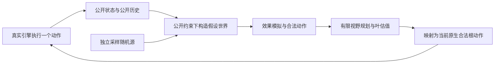

# 公开信息搜索：成熟项目与工作区旧实现的方案分析

日期：2026-09-26。性质：研究建议，不改变父规格、ADR、默认策略或工单状态。目标和验收仍以 [修复规格](../spec.md) 为准。

## 结论

**如果优先目标调整为低工程成本地产出可用于 Bootstrap 的成功示范，并接受教师使用试走所得的真实未来，那么推荐恢复并评测旧的可回溯原生搜索路线。** 它复用已有战斗求解与整局分支搜索，不需要先完成公开信息世界构建器。数据仍标记为未验证公开可见性的监督示范，学生真实对局能力另测。详见第 8 节。这是对目标变更的方案建议，本轮没有修改 ADR 或切换生产入口。

若继续坚持原“公开信息教师”要求，建议采用分阶段的混合路线：先修复高频效果交互造成的搜索截断，同时做一个边界明确的成熟模拟器接入验证；有了可信的公开信息模拟后，再比较束搜索与信息集搜索。在这个约束下，不建议直接恢复旧 MCTS，也不建议先投入全游戏 Python 重写或完整 POMCP。第 1–7 节均按原约束分析。

最需要回答的工程问题是：能否把成熟的效果模拟核心变成一个只接收公开状态、公开历史和独立假设随机源的服务，而不是让它从真实对局捕获隐藏状态。该问题的验证结果决定中期路线，不能通过更换算法名称跳过。

当前证据指向覆盖不足，但没有证明它单独导致零通关；跨回合估值和局外决策仍需分别验证。旧固定种子搜索与新公开教师解决的不是同一任务，不能直接比较通关秒数。

## 1. 本次新增的可重复证据

历史脚本保存在 [audit_current.py.txt](audit_current.py.txt)，依赖现已退役的 `public_*` 模块，不能在当前主线上运行。复现实验需使用退役前版本 `5415362`，保留对应的本机原始实验产物，并将脚本副本恢复为原记录的 `.py` 文件名；该版本还原是否足以复现本次未重新验证。

脚本只读取 11 号实验 fixed 配置、每个开发种子的第一次重复，共四局的历史公开帧；调用实验当时的公开规划器重新评分，不启动原生引擎，不执行备选动作，不接触 holdout。源码与输入 SHA-256 保存在 [current-audit.json](current-audit.json)。

| 指标 | 本次结果 | 可以推出什么 |
| --- | ---: | --- |
| 重算公开帧 / 与历史候选分数不一致 | 894 / 0 | 当前默认规划器与这批证据一致 |
| 战斗公开帧 | 656 | 覆盖分母，不是独立胜率样本 |
| 存在未支持钩子的战斗帧 | 476，72.6% | 大量局面触发全局效果边界 |
| 出牌／药水根候选 | 3378 | 不包含结束回合及局外动作 |
| 其中 unsupported_hooks | 2612，77.3% | 主要截断来源是状态／遗物交互 |
| 无截断原因的根候选 | 561，16.6% | 这批候选中可继续建模的比例有限 |
| 深度 1 → 3 改变动作的战斗帧 | 48 / 656 | 当回合组合搜索确实影响部分选择 |
| 深度 3 → 6 改变动作的战斗帧 | 2 / 656 | 在这批既定输入上继续加深影响很小 |
| 深度 3 → 6 的展开数 | 16813 → 23940，+42.4% | 展开量上升，不等同于墙钟同比上升 |
| 未支持钩子帧中的两种加深动作变化 | 均为 0 | 这些边界前的覆盖问题不能靠本轮加深解决 |

高频阻断实体为 THORNS_POWER 253 帧、BRONZE_SCALES 250、PAELS_HORN 140、ODDLY_SMOOTH_STONE 104、MINIATURE_CANNON 78。它们会共同出现，频次不能相加，也不能认定移除一个阻断就能恢复该帧搜索。效果诊断中已执行动作有 modeled 123、unknown 356、approximate 2；它与全部根候选的分母不同。

限制：深度变体只在基线访问过的状态上评分，没有生成自身后续轨迹；动作变化不证明更好，动作不变也不证明搜索永远无价值。此审计是定位工具，不是新的胜率实验。

## 2. 旧实现说明了什么

旧调用链是：A*/MCTS 选择历史分支 → `ReplayWorker.restore` 用同一 seed 新建原生对局并重放前缀 → 战斗交给 `SolverAdapter` → 从 live `CombatState` 捕获 `CombatRootSnapshot` → 求解并执行 → 将真实结果回传到搜索树。

| 旧机制 | 证据 | 迁移判断 |
| --- | --- | --- |
| 同种子历史树、恢复和分支回跳 | [astar.py](../../../combat_solver_cli/astar.py)，`ReplayWorker.restore`；[mcts.py](../../../combat_solver_cli/mcts.py) | 不可直接作为公开教师：真实未来的试走结果会影响当前标签 |
| UCT、平均回传、逐渐减弱的动作先验 | `mcts.py:62–78` | 算法调度可复用；转移源、节点含义和叶值必须更换 |
| 按早期路线分散搜索、保留其他分支 | [diversity.py](../../../combat_solver_cli/diversity.py)、[mcts_lanes.py](../../../combat_solver_cli/mcts_lanes.py) | 可以借鉴多样性配额；并不证明公开教师的策略收益 |
| 当前回合计划队列，失配后重规划 | [SolverAdapter.cs](../../../combat_solver_cli/SolverAdapter.cs)，`Step` | 可借鉴执行验证；旧计划本身仍来自未经信息审计的求解器 |
| 完整动作记录、独立重放、错误分类 | [trajectory.py](../../../combat_solver_cli/trajectory.py)、现有 `public_generate.py` | 保留；验证已选路线不等于允许据重放未来反向选择动作 |
| 恢复时校验公开摘要 | `astar.py:33–43,438–459` | 只能验证重放观察；不能把这个摘要当成完整潜在状态的 transposition key |

[历史 MCTS 报告](../../../docs/archive/search/MCTS_COMPARISON.md)记录 v1 五种子平均 715.06 秒，v2 平均 319.38 秒；两者均最终通过旧任务的独立重放。v2 的 F1 由 smoke 与续跑拼接、计时口径略有差异；每种子只有一个完整搜索样本，且两项策略同时变化。它证明“这套原生战斗能力配合历史分支搜索，能找到这五局的通关路线”，不证明 UCT 单独带来该提升，也不证明现有公开教师可达到该速度。旧成功动作不能未经审计就改标为 public demonstration。

旧性能剖析中 `solver_step` 占约 81%、恢复占约 17%，而现有公开搜索 11 号固定实验的规划约占批次生成墙钟 9%。两组条件不同，瓶颈结论不能搬用。[旧剖析](../../../docs/archive/search/COMBAT_SEARCH_ANALYSIS.md)、[当前预算证据](../evidence/11.md)。

## 3. 成熟项目提供的是不同层面的能力

其他项目的固定版本与一手来源详见 [外部项目研究](mature-projects.md)。不能把这些项目统称为已经验证适用于 STS2 的公开信息教师。

### CombatSolver：最相关的模拟核心，当前入口不是公开信息入口

本次检索固定公开仓库 commit `d231e9e51a0e58d6bfa1373c6265cce13ffd9a45`，其 csproj 标记 0.46.4；工作区旧适配器声明使用 0.44.0。网页索引中的 README 版本更旧，不能据索引断言已安装二进制就是最新源码。这里的上游能力是源码研究，不是本机编译或兼容性验收。

另核对上游 `v0.44.0` tag 对应 commit `42e0902874f5f3c329ef13dccf30eb694375ca17`：同样有 live 根捕获、九条 RNG 捕获和 Windows-only 的战前 API。因此信息边界问题并非仅在新版本出现；但本次未证明本机 DLL 与该 tag 构建二进制完全一致。[0.44.0 根捕获](https://github.com/Torch1230/CombatSolver/blob/42e0902874f5f3c329ef13dccf30eb694375ca17/src/Runtime/CombatRootSnapshot.cs)、[0.44.0 RNG](https://github.com/Torch1230/CombatSolver/blob/42e0902874f5f3c329ef13dccf30eb694375ca17/src/Engine/InCombat/Simulation/CombatPredictionRngSet.cs)。

上游采用束搜索，并有分支状态、效果钩子镜像、跨回合推进和 transposition 的多维支配比较。这使它比逐卡补面板公式更值得研究；例如荆棘按伤害钩子处理，涉及触发对象、攻击属性和反伤来源。[荆棘镜像源码](https://github.com/Torch1230/CombatSolver/blob/d231e9e51a0e58d6bfa1373c6265cce13ffd9a45/src/Engine/InCombat/Mirrors/Hooks/Damage/BeforeDamageReceivedMirrors.cs)、[状态支配源码](https://github.com/Torch1230/CombatSolver/blob/d231e9e51a0e58d6bfa1373c6265cce13ffd9a45/src/Search/CombatBeamSolver.Transpositions.cs)。

但 `CombatRootSnapshot.Capture` 接收 live CombatState；`SimulatedCombatState` 捕获 run RNG 和历史；`SimPlayerCombatState` 从实际手牌、抽牌、弃牌等牌堆创建分支；`CombatPredictionRngSet` 捕获九条原生 RNG 流。因此，复制独立状态、不污染真局，并不能证明未读取隐藏信息。[根捕获](https://github.com/Torch1230/CombatSolver/blob/d231e9e51a0e58d6bfa1373c6265cce13ffd9a45/src/Runtime/CombatRootSnapshot.cs)、[状态构建](https://github.com/Torch1230/CombatSolver/blob/d231e9e51a0e58d6bfa1373c6265cce13ffd9a45/src/Search/SimulatedCombatState.cs)、[RNG](https://github.com/Torch1230/CombatSolver/blob/d231e9e51a0e58d6bfa1373c6265cce13ffd9a45/src/Engine/InCombat/Simulation/CombatPredictionRngSet.cs)、[牌堆](https://github.com/Torch1230/CombatSolver/blob/d231e9e51a0e58d6bfa1373c6265cce13ffd9a45/src/Engine/InCombat/Simulation/SimPlayerCombatState.cs)。

上游另有 `SimulateAsync` 的独立样本种子与 `SimulatePlanningAsync` 的规划存档入口，说明假设世界接入不是毫无基础；但它们是战前接口，仍涉及完整跑局序列化，且 `IsAvailable` 明确要求 Windows。本机 macOS 不能把它当作可直接调用的任意战斗帧构建器。换 seed 或洗牌并不足以自动消除其他真实隐藏字段，也不保证与当前已观察手牌、敌人状态和历史相容。[API 源码](https://github.com/Torch1230/CombatSolver/blob/d231e9e51a0e58d6bfa1373c6265cce13ffd9a45/src/Api/PreCombatForecastApi.cs)、[样本契约](https://github.com/Torch1230/CombatSolver/blob/d231e9e51a0e58d6bfa1373c6265cce13ffd9a45/src/Api/PreCombatForecastContracts.cs)。

可借鉴/复用的边界：效果与分支复制核心、局部去重、停止规则、执行验证；不能直接复用的边界：live 根捕获、真实牌序/RNG、以已知完整未来选择的一整条计划。移植须固定版本并保留源码许可/署名；本次不升级或安装上游。

### STS1 项目与信息集方法

STS1 模拟器的主要价值是快速可复制状态、测试方法及搜索与规则模型的分离；其卡牌、怪物、遗物语义不能直接替代 STS2。种子求解器的成就也不是公开信息玩法的胜率证据。

OpenSpiel 的 IS-MCTS 和 POMCP 方法提供另一块参考：从当前信息所允许的状态分布采样，在行动/观察历史上组织决策。它们不自带 STS2 状态重建、效果模型、正确的条件分布或有用的叶值。参见 [OpenSpiel IS-MCTS 实现](https://github.com/google-deepmind/open_spiel/blob/master/open_spiel/algorithms/ismcts.cc) 与外部研究中的固定版本链接。

## 4. 推荐架构：公开输入的模拟服务 + 有限视野规划

下面是建议接口职责，不是已存在的 API：

建议保留 Python 采集、预算与独立重放，将更完整的模拟放在一个隔离 C# worker 内。先验证能否在同一进程内部批量推进分支，避免每展开一个节点都跨 Python/.NET 管道或重启游戏。只有经过测量后才决定具体进程并行方式。

需要明确三个契约：

| 边界 | 必要内容 | 禁止用来补缺口的方式 |
| --- | --- | --- |
| 公开输入 | 已公开实体、完整根合法动作、公开顺序、必要历史、当前可知计数 | 直接反射读取真实隐藏字段 |
| 假设状态构建 | 保持当前手牌、公开已知顶部/底部约束；未知牌序、AI 隐状态和随机结果来自相容模型 | 从真实快照复制后只清理最终网络输入，或只替换一条 RNG |
| 模拟返回 | 下一公开观察、分支合法动作、覆盖与截断原因、局部代价 | 把未模拟部分当作零效果，或把叶估值当作真实胜利 |

内部模型可以知道某个假设世界的隐藏牌序，以生成符合该世界的抽牌结果；**策略选动作时不能提前看到该牌序**。根决策必须汇总多个假设世界，后续决策按实际在模拟中已经观察到的信息分支。

公开帧目前不一定包含完整战斗历史和所有公开遗物计数。先做字段可得性清单；缺字段时区分“玩家可知但协议没导出”和“本来隐藏”。前者可提出最小协议扩展并做兼容验证，后者只能采样或截断。不要假定当前 JSON 足以无损创建任意原生 CombatState。

### 防止一种容易忽视的乐观估值

对每个假设牌序分别调用全信息 solver 求出最佳完整路线，再平均这些最佳路线分数，会让不同样本在尚未看到抽牌时就作出不同后续选择。这是策略融合风险：例如两个样本在当前观察完全相同，却提前分别选了只适用于各自未来的准备动作。

这不一定泄漏本局真实未来，因为样本可以完全独立；但它可能高估可执行策略的价值。不要把“与真实 RNG 无关”与“是可靠的公开信息策略评估”混为一谈。第一版可用公开信息规则策略作短 rollout，在每个已模拟的新观察上重新规划；中期再比较共享行动/观察树的 IS-MCTS/POMCP。全信息求解结果仅能作诊断参照，有限预算找到的路线也不能声称严格数学上界。

### 先比较两种小范围规划，不先上整局 MCTS

1. 当回合确定性组合继续用束搜索；到未知结果边界，使用少量相容样本和同一公开信息后续策略估值。首轮固定采样数/预算用于公平比较，再研究自适应分配。
2. 效果模拟稳定后，在相同转移模型、相同叶估值、相同预算下比较信息集树。把旧 UCT 的 selection/backup 作为可借鉴部分，而不是把固定种子的 restore 搬进去。

根动作全部得到基础评分，昂贵评估可以分配不均但不得让不支持动作消失。比较多个动作时可使用共同随机样本来减小差分噪声；动作改变牌堆或随机调用次数时，必须维护正确的分布，不能强迫不同轨迹逐字节消费同一 RNG 序列。

### 估值目标与缓存

近期规则叶值应先区分可靠的即时致死/斩杀判断，再比较预计整场战损、药水、成长与风险；在未知未来中用死亡风险而不是把一个样本的致死当作必死。不要宣称固定 HP 权重已经校准为通关概率。奖励、路线策略和战斗策略应使用一致的牌组能力描述，避免奖励策略选出的成长牌在战斗中始终被低估。继续遵守“失败轨迹保留但不训练”；学习价值网络属于另行讨论的扩展。

缓存分两类：同一假设世界内的精确模拟状态去重，和公开信息条件下的统计估值缓存。前者需要假设 RNG、牌堆、计数与历史；后者需要公开历史/信念约束、合法动作、策略/模型版本和采样配置。当前 `state_key` 不是通用的替代品。先量出命中率和代价，再决定是否引入；HP 多、药水多不自动意味着支配另一状态，因为卡牌、状态和条件钩子可能改变价值。

## 5. 四条候选路线的取舍

| 路线 | 能解决的主要问题 | 主要成本/限制 | 建议 |
| --- | --- | --- | --- |
| A：继续局部增强当前 Python 模型 | 高频钩子截断、当前回合组合 | 长期可能重复实现越来越多引擎规则 | 近期实施的稳妥候选；按轨迹缺口补，不追求全覆盖 |
| B：公开输入驱动成熟模拟核心 | 更完整效果、跨回合、动态合法性 | 根构建、历史字段、平台/版本适配与独立审计 | 最值得做有上限的接入验证；通过后作为中期主线 |
| C：直接把当前模型换为 MCTS | 更灵活的计算分配 | 无法补齐未知转移与错误叶值 | 暂不优先；模型稳定后做同条件对照 |
| D：恢复旧固定 seed 搜索 | 已知历史任务有成功路线 | 违反当前教师的信息边界 | 不用于当前示范标签；只保留诊断价值 |

B 与 A 不是一次性二选一：接入验证期间 A 可继续提供可审计基线；若 B 需要大规模重建原生运行时，先停止扩大集成，保留具体阻塞清单，再按 A 的局部模型推进。不要把可行性验证悄悄扩大成整套引擎重写。

## 6. 建议的实施顺序与判断门槛

以下是研究建议，不新增已批准工单，也不修改 12/13 的依赖。

| 步骤 | 最小可审阅产物 | 通过依据 / 停止扩大范围的条件 |
| --- | --- | --- |
| 1. 冻结诊断集 | 从现有 dev 与新增 dev 中分层挑出普通战斗、精英、Boss、抽牌、补能、荆棘、成长、选牌帧；保存来源和版本 | 当前评分可重放；对状态变体的差异有明确预期；不使用 holdout |
| 2. 高频钩子补齐 | 按事件类型定义相关交互；先补荆棘/格挡/攻击触发等真实高频组合 | 生产模型与原生即时转移对照一致，条件正反例通过；未知效果仍明确截断 |
| 3. 成熟模拟器接入验证 | 一类真实捕获战斗公开帧 → 相容假设根 → 若干动作 → 新公开观察；支持荆棘及一个抽牌边界 | 不依赖真实 seed/牌序/RNG；改变真隐藏状态不改变固定样本下决策；能在本机运行。无法构造独立根就报告缺字段/耦合点，不用 live snapshot 代替 |
| 4. 验证模型收益 | 相同搜索与估值，仅替换效果覆盖；另做同模型下估值替换 | 同场战斗损血/存活与整局阶段结果均报告；不能只报预测覆盖或更少损血的早死局 |
| 5. 验证短视野采样 | 固定样本配置和模型后，比较短 rollout 与当前束搜索；必要时加信息集树 | 同预算、独立 dev 种子对照，报告质量与新增总成本；无收益保持实验开关 |
| 6. 吞吐与最终验收 | 质量配置冻结后执行 12 的并行度实验，再按 13 跑 holdout | 成功重放、失败/未完成成本全部计入；最终门槛不变 |

模型验证要分开两种对照：确定性已知效果可以逐项与原生一致；未知未来的假设抽牌不应强求命中本局真实牌序，而应验证多重集合、公开约束、分布及各假设转移语义。用于测试的特定假设世界可以有已知随机种子，但它不能来自部署对局的真实隐藏未来。

建议策略收益评测扩展为预先选定的更大开发种子集，例如 24–32 个独立种子起步；数量不是统计保证，零成功时需要继续根据区间与成本判断。配对差异按 seed 汇总，重复同一 seed 只用于波动/确定性检查。新增种子不能按发现是否容易通关筛选。奖励与路线修改独立做消融，避免同时改模型、评分、预算后无法归因。

## 7. 成本目标与当前能下的结论

稳定运行下可用 `平均每次尝试成本 / 成功概率` 理解串行成功成本；并行时还受有效吞吐、资源竞争、验证和停止开销影响。实际验收只认 `批次实际墙钟 / 验收成功条数`。增加 worker 只能改变尝试吞吐，不能自动弥补极低的成功率；但当前零成功小样本也不能证明真实成功概率为零。

11 号实验的自适应预算只让批次墙钟降低约 0.6%，且没有成功成本改善证据。优先投入模型覆盖与动作排序更有依据；具体能否达到五分钟仍未知。旧原生求解器的较高单次成本也不能被忽视：即使覆盖强，也必须通过接入后的端到端测量决定每根样本数和搜索视野。

本轮完成源码、一手来源与离线评分分析；没有执行新原生完整对局、编译或集成外部项目，没有证明任何候选提高胜率。工作区既有 `public_generate.py`、其测试和 `PUBLIC_SEARCH.md` 的未提交改动保持原样。

## 8. 若接受真实引擎回溯：更低工程成本的备选主线

### 8.1 实际改变的是教师的知识约束

原 ADR 已允许在假设未来中回溯。能大幅降低工程难度的新选择，是允许对同一个真实 seed 试走、恢复，再利用已经看到的战斗、奖励和抽牌结果修改更早的决策。这使任务成为**预算内的固定种子路线求解**。它是合理的另一种任务，不再满足原 public teacher 定义。

| 选择 | 需要独立公开模型吗 | 教师可利用试走未来吗 | 工程现状 |
| --- | --- | --- | --- |
| 仅对公开假设世界回溯 | 需要可信的生成/转移模型 | 不可利用本局真实未来 | 当前较难的路线 |
| 使用 CombatSolver 战斗搜索，局外只向前 | 不需要另造完整公开模型 | 战斗计划可能依赖真实隐藏未来 | 可作为恢复旧搜索前的低成本对照 |
| CombatSolver 战斗 + 原生局外历史回溯 | 不需要另造完整公开模型 | 可以，须在数据 provenance 中如实保留 | 旧 A*/MCTS 已有端到端实现 |

第三种最接近旧实现已完成的能力。第二种对照有价值：先区分强战斗教师本身能带来的胜率，与局外反复试走带来的收益，避免恢复复杂树后仍不知道时间花在哪里。

### 8.2 可以复用什么，还剩哪些难点

可复用 CombatSolver 战斗模型、`mcts.py`/`astar.py` 的历史分支、早期路线多样性、完整动作前缀、独立重放与导出。旧 MCTS v2 可作首个基线，v1/关闭失败修正的配置作对照；不能因为历史均值较好就假定本机仍有稳定收益。

省掉的是“从公开 JSON 重建全部相容隐状态”及其全面效果建模。仍要处理原生版本兼容、求解预算、失败分支调度、恢复成本、候选/选择过程覆盖及状态污染审计。原生求解器某次有限预算路线死亡只证明这条尝试失败，不证明该战斗入口无解；不能据此对全部其他战斗方案作永久死状态剪枝。

恢复的首选基线是现有 `reset(seed) + replay(prefix)`，因为工作区已有验证路径；随后再测地图/房间检查点减少长前缀重放。当前 `RunSimulator.SaveCheckpoint` 在非地图房间会回到房间前，**不是任意战斗动作的快照**。战斗内回溯继续交给 CombatSolver 的分支状态；不要把普通磁盘存档当成廉价且精确的战斗 clone。[检查点实现](../../../sts2-cli/src/Sts2Headless/RunSimulator.cs)、[旧恢复剖析](../../../docs/archive/search/COMBAT_SEARCH_ANALYSIS.md)。

真实 seed、RNG 与牌序可以存在于这个新任务的求解内部；教师与学生输入的界限仍应保持可追溯，不能因教师权限扩大就把全部内部状态加入学生特征。

### 8.3 对 Bootstrap 数据的影响

这类数据并非完全不能用于训练。它可以提供出牌组合、选牌和资源管理的监督信号；但标签可能依赖学生看不到的信息。相同公开信息下，知道不同未来的教师可能选择不同动作，学生无法逐例重现这种先知式优势。单纯挑成功轨迹还会带来成功条件筛选偏差。

仓库已经存在一个诚实表达该区别的通路：`trajectory.py` 将旧 solver 数据导出为 `source=recorder_bc`、`teacher_visibility=unverified`、`bc_only=true`；原生完整胜利保存在 provenance，顶层沿用 recorder 的 `status=partial`、`victory=null` 契约。`model/data.py` 允许这类数据用于监督学习，但禁止将它当作 PPO on-policy 数据。无需为了接回旧路线把它伪装成 public demonstration，也无需未经讨论先扩展共享 schema。[旧导出器](../../../combat_solver_cli/trajectory.py)、[数据验证器](../../../model/data.py)。

因此需保留两个独立结果：搜索器是否能低成本找到并重放成功路线，以及学生是否能在**新种子、无回溯、公开输入**的真实对局中受益。离线标签准确率和搜索器通关率都不能代替后者。此处提出评测方向，不授权启动长期训练，也不改变失败数据暂不训练的约定。

### 8.4 最小推进方案

1. 明确新任务允许教师使用真实引擎试走结果；后续实施时再记录 superseding ADR 和调整成功产出规格，保留原公开教师实验作为基线，不改写旧实验结论。
2. 固定本机游戏/solver/适配器版本，用小规模新开发种子重建旧 MCTS 的基线；同时有“强战斗教师 + 局外单向规则”对照，量出回溯的边际成本与收益。
3. 先测每场实际 solver 搜索次数、回合计划复用、恢复/重放秒数、同类失败重复数与未支持选择；仅优化主要成本。失败回跳优先考虑能改变牌组/资源的决策，但保留未探索候选，不把楼层当作充分状态。
4. 每个 seed 设置总预算与公平续跑/放弃规则，可以按目标允许转向新 seed；报告所有失败、未完成、续跑、验证和停止成本，不能只对已成功种子算平均。
5. 成功仍要求全新原生进程重放和三幕 Boss/终局检查；输出留在 unverified 的 BC 路径。再决定是否做一个小规模学生收益实验。

这条路线有较强的实现复用依据，但旧五种子的 319.38 秒不能当作新机器的五分钟承诺。原目标的 300 秒门槛可以继续作为产出指标，**其教师信息约束和训练数据类别需要重新表述**。在尚未确认目标变更前，本轮仅记录备选方案，不切换入口、不启动生成或训练。
