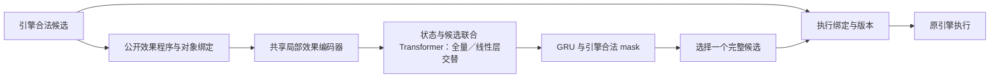

# 动作、效果与目标的结构化编码方案

状态：**表示层设计 v1，供审阅；不是已接入引擎的实现。** 以当前约 1B Transformer＋GRU 架构为准。相关文档：[架构](ARCHITECTURE.md)、[动作边界与接口](ACTION_CATALOG.md)、[事件规则核对](EVENT_ACTIONS.md)、[远古之民](ANCIENT_ACTIONS.md)。可机读示例见 [action_semantics_v1.examples.json](specs/action_semantics_v1.examples.json)。

## 1. 结论：一个候选动作，对应一个带绑定的效果程序

原清单回答“此时能选择哪条分支、引擎怎样执行”，尚未充分回答“模型怎样理解这条分支”。表示层应以可组合的操作原语为主体，使事件、卡牌、药水和遗物共享“治疗”“获得”“消耗”“升级”等含义。

用户举的“回血＋26＋自己”可以直接使用，但字段名需要稳定：**回血是操作类型，26 是带单位的数值参数，自己是作用对象；三者合在一起才是一项完整效果。** 药水种类是获得对象的属性，不能占用一个什么都往里塞的“效果”字段。

```text
候选动作 = 当前决策操作 + 来源/已绑定参数 + 一个效果程序
单项效果 = 操作原语 + 角色化对象绑定 + 数值/内容参数 + 时机/原因/作用域
效果程序 = 顺序 + 条件 + 随机 + 后续选择 + 延迟触发等组合结构
```

| 例子 | 操作原语 op | 参数 args／物品 spec | 作用对象 bindings |
| --- | --- | --- | --- |
| 回复 26 生命 | `HEAL` | `amount=26, unit=hp` | `recipient=self` |
| 获得一瓶指定药水 | `ACQUIRE` | `object_kind=potion, count=1, content=已公开种类` | `recipient=self, destination=potion_inventory` |
| 获得一瓶随机药水 | `ACQUIRE` | `object_kind=potion, count=1, generator=公开生成规则` | 同上；结果种类未知 |
| 失去 50 金币 | `RESOURCE_CHANGE` | `resource=gold, delta=-50, cause=spent/lost` | `owner=self`；原因取真实规则 |
| 升级这张牌 | `UPGRADE_CARD` | 实际升级规则／等级变化 | `subject=card_ref, owner=self` |
| 对某敌人造成 8×3 伤害 | `REPEAT` 内含 `DAMAGE` | `times=3, per_hit=8` | `source=card_ref, recipient=enemy_ref` |

最后一例不能只编码成 24 伤害：多段触发、格挡和死亡时机可能不同。同样，伤害自己不能自动改写成负数治疗。

**效果拆分不会拆开玩家的承诺。** “支付金币、治疗、获得诅咒”仍是一个不可任意删掉成本的候选；局部效果编码器读取其中多个节点，GRU 对完整候选评分。后续真正需要玩家选择牌时，才按原规则产生子会话。

## 2. 同一候选的三个层面

| 层面 | 保存什么 | 模型如何使用 |
| --- | --- | --- |
| 执行绑定 | `candidate_ref → opaque_handle → 原引擎命令`、版本与会话路由 | 只作查找，不学习句柄的数字或字符串 |
| 决策语义 | 提交事件分支、出牌、使用药水、购买、选择元素、结束选择、跳过等 | 小型类别 embedding；表达承诺与控制含义 |
| 效果语义 | 原语、数值、来源、目标、物品、顺序、条件、随机与子选择 | 候选的主要内容表示，和状态实体共享编码 |

`CHOOSE_EVENT_OPTION` 保留作接口路由，不再充当事件动作的全部语义。事件名字和按钮标题留作调试；内容 ID 可作补充特征，不能代替效果节点。采用以下对应关系，不新增自由生成命令的模型头：



本方案的效果程序是**供模型理解的公开规则表示**。不在 Python 中运行它来代替游戏，不根据它另造合法动作，也不在候选生成时试跑未来结果。

## 3. 对象角色：目标不只有一个 target

“用一瓶药水攻击商人”和“获得一瓶药水”中的药水承担不同角色。全部塞进 `target` 会混淆消耗对象、受影响对象与所有者。

| 角色 | 含义 | 例子 |
| --- | --- | --- |
| `actor` | 做出决策的玩家 | 本玩家 |
| `source` | 导致效果的来源 | 某张牌、药水实例、事件选项、遗物 |
| `recipient` | 接收生命／伤害／能力等的实体 | 自己、敌人、奥斯提 |
| `subject` | 被操作的物品或对象 | 被升级牌、交出的药水、丢弃遗物、揭示格子 |
| `owner` | 被操作对象的拥有者 | 被移除牌所属玩家 |
| `destination` | 物品进入的位置 | 永久牌组、手牌、药水库存、奖励集合 |
| `context` | 约束和生命周期所属对象 | 事件、奖励组、选择会话、地图 |

不是每个节点都有全部角色。省略表示该操作不适用；适用但未知必须显式写 unknown。静态规则中的 `self` 在候选实例化时绑定当前 actor，并保留 `self` 关系语义。

### 3.1 目标／对象表达式

| 形式 | 使用场景 | 必须保留 |
| --- | --- | --- |
| `entity(ref)` | 已公开且确定的对象 | 实例引用与角色关系，不嵌入 ref 数字 |
| `content(kind,id)` | 已知种类、尚未生成的物品 | 种类与规则定义；不是已拥有实例 |
| `set(refs)` | 同时涉及多个已公开实例 | 无序／有序语义、数量、重复次数 |
| `query(scope,predicate)` | 所有敌人、全部基础打击等规则目标 | 范围、公开过滤式、取集合的时点 |
| `area(board,center,shape)` | 水晶球 3×3 等空间目标 | 中心引用、边界裁剪、形状，不能只有中心 embedding |
| `variable(binding)` | 后续选择／随机步骤产生的对象 | 绑定来源及适用范围，不能预填未来实例 |

“所有敌人”与“这些敌人”有区别：前者通常在效果发生时取集合，后者可能绑定选择时的对象。随机敌人应为随机节点从真实规则目标集中取样；`REPEAT(RANDOM_TARGET(DAMAGE))` 与 `RANDOM_TARGET(REPEAT(DAMAGE))` 也不同。

## 4. 操作原语的划分

划分依据是**规则作用的领域、执行语义与触发差别**。不为“治疗 26”“治疗 30”分别建动作 ID；也不把升级、永久移除、战斗消耗都压成通用“修改卡牌”。以下是 v1 建议注册族，数量允许随内容审计扩展，不宣称仅凭这些名称已覆盖所有卡牌规则。

| 编号 | 原语 | 主要参数／绑定 | 需要区分的规则 |
| --- | --- | --- | --- |
| P01 | `HEAL` | recipient；生命数值或表达式 | 回满、固定值、比例；实际恢复可受上限／钩子影响 |
| P02 | `DAMAGE` | source、recipient；每段数值与 damage flags | 能否格挡、是否受力量等修正、来源与分段 |
| P03 | `LOSE_HP` | recipient；生命数值、原因 | 仅原规则确为直接失去生命时用；文案“失去生命”可能实际调用 DAMAGE |
| P04 | `CHANGE_MAX_HP` | recipient；有符号变化、原最大生命规则 | 是否同步改变当前生命按原实现编码，不另凭印象补治疗 |
| P05 | `GAIN_BLOCK` | recipient；格挡数值与修正条件 | 当前格挡／跨回合保留规则 |
| P06 | `RESOURCE_CHANGE` | owner；资源、delta、cause | 金币／能量／星星／次数；支付、丢失、获得的钩子不同 |
| P07 | `APPLY_POWER` | recipient、source；能力定义、层数 | 有益／有害只是属性，不按偏好分开 opcode |
| P08 | `CHANGE_POWER`／`REMOVE_POWER` | subject；层数变化／移除 | 递减与清空不能等同 |
| P09 | `ACQUIRE` | recipient、destination；对象描述、数量、取得方式 | 卡牌／遗物／药水／钥匙；直接获得和提供可拒绝奖励不同 |
| P10 | `LOSE_OBJECT` | subject、owner；原因 | 丢药、消费、交付、移除遗物不混淆；选到的物品身份已绑定 |
| P11 | `DRAW_CARDS` | owner；数量 | 抽牌属于原抽牌过程，可能触发洗牌；不可按未知牌序实例化 |
| P12 | `MOVE_CARD` | subject、destination；位置语义 | 回手、放顶部／底部；保留 from/to 与顺序 |
| P13 | `DISCARD_CARD`／`EXHAUST_CARD` | subject、owner；原因 | 弃牌／消耗各自的钩子与去向 |
| P14 | `REMOVE_CARD` | subject、owner | 永久移除；不是本场消耗 |
| P15 | `UPGRADE_CARD`／`DOWNGRADE_CARD` | subject；等级规则 | 对已指定牌执行；随机挑选属于外层 RANDOM |
| P16 | `TRANSFORM_CARD` | subject；目标 content 或生成规则 | 随机变化与指定变化；升级／附魔保留规则 |
| P17 | `COPY_CARD` | subject、destination；份数与复制规则 | 单牌、全副牌组；保留修正、是否生成新实例 |
| P18 | `ENCHANT_CARD` | subject；附魔定义、层数 | 附魔自身的效果定义必须可访问，不只有名称 |
| P19 | `CHANGE_CARD_PROPERTY` | subject；属性、算子、值、有效期 | 本回合免费、战斗内改费、关键词变化；set/add/multiply 分开 |
| P20 | `CREATE_CARD` | recipient、destination；内容或组合配方 | 定制 MadScience 等；实例的 rider 程序随物品定义编码 |
| P21 | `CHANNEL_ORB`／`EVOKE_ORB`／`CHANGE_ORB_SLOTS` | owner、orb/slot；数量与规则 | 球槽次序、被动／激发是规则语义；不是任意手动操纵 |
| P22 | `SUMMON`／`CHANGE_SUMMON` | owner、subject；类型与数值 | 奥斯提等主体独立引用；与玩家自身生命分开 |
| P23 | `FORGE` | owner、相关牌；锻造值与规则 | 保留角色机制，不降成无标签的攻击力加法 |
| P24 | `REVEAL` | subject/area；可见性规则 | 揭示信息与获得物品分开；部分片段也是信息 |
| P25 | `OFFER_REWARDS` | recipient、context；奖励组与发放规则 | 能否离开、组数、alternatives、容量、领取时才发生的效果 |
| P26 | `REROLL` | subject；生成规则与次数成本 | 实际重掷后才有新内容；与重看 UI 区别 |
| P27 | `ENTER_COMBAT` | context；公开遭遇规则与战后 continuation | 不提前填隐藏敌人或假定必胜奖励已获得 |
| P28 | `TRAVEL`／`ADVANCE_PHASE` | destination/context；阶段与承诺 | 前往未知问号不等于已知将进入哪个事件 |
| P29 | `END_TURN` | actor、context | 后续敌方结算与已知触发；不能当空效果 |
| P30 | `FORGO` | subject/context；放弃的机会与范围 | 单奖励、整个奖励页、剩余购物机会；不是 UNKNOWN 或 NONE |
| P31 | `END_RUN` | context；胜负／放弃原因 | 仅真实的终局承诺；无菜单任意放弃候选 |
| P32 | `CHANGE_RULE`／`INSTALL_TRIGGER` | scope；修改／触发器的结构化定义 | 后续折扣、奖励改动、下一战触发、改变事件路由等 |
| P33 | `UPDATE_SELECTION`／`COMMIT_SELECTION`／`CANCEL_SELECTION` | selection、subject；操作及前缀 | 修改选择缓冲区不等于已经升级／删牌 |

`CHANGE_RULE` 不是丢弃具体语义的兜底。其定义必须说明触发点／过滤器／修改算子／子效果／持续时间。例如“前 3 回合多抽 1 张”包含 `turn_start`、`turn_number≤3`、`DRAW_CARDS(1)`；只给 `special_rule_id` 不算完成结构化。

临时未支持的规则标记 `OPAQUE_RULE(content_id, public_description_ref, coverage=partial)`，不能伪装成空效果，也不能因此从合法候选中删去它。实验可明确允许部分表示，但不得据此宣称效果编码已覆盖全部内容。

## 5. 组合结构：容纳成本、随机、选择和持续效果

原语是叶节点，控制结构是内部节点。结构是一棵带引用的规则树／图，不是没有顺序的词袋。

| 节点 kind | 含义 | 例子与注意事项 |
| --- | --- | --- |
| `effect` | 一个带完整绑定的原语 | `HEAL(self,26)` |
| `sequence` | 按规则顺序执行子节点 | 获得遗物后再加诅咒；不得按“成本先、收益后”重排 |
| `conditional` | 依公开规则条件决定分支 | 条件实际真值未知时保留 unknown，不读取隐藏状态补 bool |
| `repeat` | 依规则次数重复子程序 | 三段伤害；次数、每次是否重选随机目标显式保留 |
| `for_each` | 对一个集合逐个执行 | 复制每张牌；集合是否有序、是否中途更新取原规则 |
| `random` | 环境按某生成规则绑定变量 | 随机牌、随机遗物、随机挑目标；不是玩家新动作 |
| `choose` | 后续由玩家决定变量 | 从可升级牌恰选 1，含会话约束和 continuation |
| `trigger` | 将子程序安装到未来触发点 | 受伤时、下回合、战斗结束后；含次数／有效期 |
| `call` | 引用已定义的公开规则模板 | 共享卡牌／遗物规则；参数替换与覆盖状态必须明确 |

`role=cost/consequence` 是节点标签，**不是好坏价值标签**。掉血既可能是成本也可能触发收益；模型结合状态判断。整个程序只有一份实际顺序：`public_costs` 只是其中成本节点的索引视图，不能与 `public_effects` 各写一份而重复计数。

### 5.1 选择权和不确定性正交编码

| 情况 | 对象是谁决定 | 当前是否知道结果 | 表示 |
| --- | --- | --- | --- |
| 升级当前点选的牌 | 当前玩家已绑定 | 已知对象 | `UPGRADE_CARD(entity(card_ref))` |
| 进入“任选一张升级” | 后续玩家选择 | 目标尚未绑定 | `choose(bind=selected) → UPGRADE_CARD(variable(selected))` |
| 随机升级 1 张 | 游戏随机 | 未知对象 | `random(公开可选域) → UPGRADE_CARD(variable(sample))` |
| 升级全部牌 | 规则确定集合 | 可公开计算则已知 | `for_each(query(upgradable_deck)) → UPGRADE_CARD` |
| 交出事件指定药水 | 引擎之前已抽取并展示 | 已知实例 | `LOSE_OBJECT(entity(potion_ref),cause=trade)`；不另开药水选择 |

将后续玩家选择误编码为随机，会让模型学不到选择权的价值。将随机结果展开成玩家候选，则直接改变了游戏。

### 5.2 随机对象的编码

随机性至少包含：`object_kind`、数量、公开池的定义、公开过滤条件、抽取是否放回、公开的权重规则、结果何时揭示。每个字段都有已知／未知状态。

```text
random potion ≠ random uncommon potion ≠ random potion from an already revealed set
random relic ≠ choose one of three relics ≠ obtain the publicly specified relic
```

池 ID 是**公开生成规则的引用**。运行时实际遗物袋、RNG、已经抽中但未展示的结果不得随该引用进入模型。只有能从当前公开信息确定的池成员／概率才可展开；不知道权重时不擅自标为均匀，也不把可能结果的平均属性当实际物品。

内部是否已经随机采样也可能是隐藏信息。两个玩家不可区分的状态，都应显示相同的 `identity=unknown` 和公开生成规则，不能用 “已经 roll／尚未 roll” 标志泄露内部进度。

此处区分玩家选择与环境随机的概念也见 OpenSpiel 的 [legal_actions](https://openspiel.readthedocs.io/en/stable/api_reference/state_legal_actions.html) 与 [chance_outcomes](https://openspiel.readthedocs.io/en/latest/api_reference/state_chance_outcomes.html)。本项目仍由原游戏完成随机结算；并不把其概率枚举 API 直接照搬为玩家观测。

### 5.3 获得对象与获得对象的未来能力

“获得一瓶治疗药水”本次只改变库存；“使用这瓶药水”才消耗它并治疗。编码为：

```text
获得：ACQUIRE(potion_spec, self.inventory)
          └─ 物品定义的 use_program：HEAL(user, amount)
使用：原药水使用程序：消耗对象 + HEAL(user, amount)，按原时序
```

`use_program` 是物品的能力，不能被标为本次立即发生。获得遗物则要区分 `on_acquire_program` 与 `passive/trigger_programs`：领取时删牌属于即时子流程，下场战斗加力量属于持续能力。获得随机遗物只引用未知物品的公开分布，不能预展开实际抽中遗物的隐藏子程序。

附魔、能力和定制卡的 rider 同样引用公开规则定义；只编码“获得某名字”仍会退回到依赖内容 ID 记忆，无法实现共享效果学习。

## 6. 数值与公开信息状态

### 6.1 数值表达式

不把所有数值转换成孤立整数。保留公式和当前可公开求得的数值：

| 表达式 | 需要编码的结构 |
| --- | --- |
| 固定回复 26 | `literal(26,hp)` |
| 回复最大生命的 30% | `floor(mul(read(self.max_hp),0.30))`；舍入方式取真实实现 |
| 回满生命 | 回复到上限的公开规则／表达式，和固定数字治疗区别 |
| 失去全部金币 | `neg(read(self.gold))`，读取时点取源规则 |
| X 费 | `x_paid(resource)`，不能填成普通固定费用 0 |
| 每张选牌获得 3 点收益 | `mul(count(selection),3)`；count 的单位保留 |
| 每轮伤害递增 1 | 事件公开计数／当前伤害字段＋更新规则 |

表达式算子采用有限注册表：literal、公开字段读取、加减乘除、min/max、round/floor/ceil、count、比较、逻辑组合及已付 X 值。复杂计算用已核对模板引用，不能在字符串中嵌任意可执行代码。

数值输入包括 `unit`、适用／已知 mask、线性幅值和压缩幅值；生命还可带当前生命／上限比例。数值 26 不作为离散 token ID，`26 hp` 与 `26 gold` 共用数值网络但使用不同单位／资源 embedding。参数位也要区分：数量 3、持续 3 回合、重复 3 次不能只有同一个数字。

原语、资源、单位、原因、时机等有限类别各自登记稳定整数 ID，整数只作 embedding 查表索引，不带大小关系；不能让 gold 的 ID 比 hp 大就暗示价值更高。注册表变更必须带版本／哈希，训练轨迹与部署一致。对象实例引用只用于张量索引和关系连接，不能进入这类词表。

### 6.2 名义效果、预览与实际结果

| 字段 | 定义 | 禁止的混用 |
| --- | --- | --- |
| `nominal` | 公开规则要求的基础效果／公式 | 治疗 26 不表示一定净增 26 |
| `public_preview` | 引擎无副作用地按公开信息提供的当前预览 | 不能试跑动作、抽 RNG、读取未来 state 来补齐 |
| `observed_result` | 真正执行后产生的公开轨迹 | 只能进入下一观测／历史，不能回填选择前候选 |

例如 70/80 生命时，名义治疗 26；没有相关修正时公开可判断上限仅剩 10。但存在治疗钩子时不能由表示层固定写 `min(26,10)` 作为实际结果。缺少可靠预览就保留未知，让模型结合规则和状态估值。

所有原语包含 `coverage=complete/partial/opaque`。某字段不适用可以省略；适用但不知值用 `{known:false}`，不可用数字 0 或 NONE 代替。

## 7. 候选结构与公共引用

```text
ActionSemanticV1
  decision_kind                  # commit_option/play/use/buy/select/finish/skip/...
  source                         # 公开来源实体，不是隐藏引擎 handle
  bound_roles                    # 此刻已经绑定的目标、物品、奖励等
  program                        # 当前承诺的公开效果程序
  context_ref                    # 父会话／奖励／事件的公开关系
  coverage                       # complete | partial | opaque

EffectNode
  kind = effect
  op                             # 注册原语
  bindings: role -> ObjectExpr
  args: name -> TypedValue/ObjectSpec/PublicRuleExpr
  role: cost | consequence
  timing: on_execute | on_selection_commit | on_trigger | ...

ObjectSpec
  object_kind                    # card/potion/relic/power/enchantment/...
  identity                       # known content 或 unknown
  properties                     # 已公开稀有度、升级、附魔、rider 等
  definition_ref                 # 经审计的公开能力定义
  acquisition_method             # 直接给予/购买/复制/奖励领取等
```

组合节点使用第 5 节的 kind；`random` 具有生成规则、bind 与 body，`choose` 具有域／选择约束、bind 与 continuation，`sequence` 具有有序 steps。示例 JSON 给出这些节点的一致写法；它是设计样例集合，尚非覆盖全部字段约束的正式 JSON Schema。

原有 `verb/operation` 可保留作兼容字段，新增 `semantic_program`。原有 `public_costs` 改为指向程序节点的索引，避免同一成本被编码两遍。协议增加 `effect_schema_version`、`effect_registry_hash` 与每个候选的 coverage。运行时句柄、来源源码路径、校验版本放审计／路由区，不进入神经网络。

父效果的 `choose.requested_count` 记录源规则要求，尚未到该子阶段时不冒充已经计算完成的合法会话。真正进入选择后，按源选择器的不足处理得到 SelectionContext 和当前合法候选；例如请求恰选1但实际无可用牌时原函数可能返回空集，不能仅凭父模板强制制造一个目标。示例中的 `selection.on_commit` 等外部引用由对应公开会话补齐，并非未声明的隐藏回调。

效果局部节点 ID、变量名、实体 ref 都只用于重建关系，不直接作为类别特征。变量改名、节点编号变化、实体编号变化，不应改变映射回语义对象后的分布。

### 7.1 多选前缀与已支付成本

父候选可以描述“先扣 55 金币，再选一张牌附魔”。实际扣费后进入子选择时：

1. 父成本记入 committed/history，子候选不再包含会再次执行的扣费节点。
2. `SELECT_ONE(card_ref)` 编码为 `UPDATE_SELECTION`，绑定该牌，并指向 `on_selection_commit` 的附魔后果。
3. 当前前缀、还需几张、是否可结束由 SelectionContext 提供；逐项选择本身不立即附魔。
4. `FINISH_SELECTION` 提交整个前缀，`CANCEL` 依原规则处理；不从名称推断退款。
5. 若原效果每选一张就执行一次，则采用 incremental；下一次形成真实新状态。

子选择仍须能读到共同的剩余后果，例如选牌完成后还会受伤。已发生成本仅作为历史上下文；不把同一成本复制到每一个待选牌的本次效果上。

## 8. 与现有 Transformer＋GRU 的连接

不让 GRU 分别自由生成“回血”“26”“自己”，否则还要解决非法拼接和多项成本约束。**引擎继续给完整候选，模型在输入侧分解理解，在输出侧选择完整候选。** 已绑定目标不同的候选仍分别评分。

一个效果节点先融合其角色化输入：

```math
z_i = \operatorname{NodeEncoder}(\operatorname{Emb}(op_i),
\{(role, E(object))\}_i,
\{(parameter, unit, N(value), known)\}_i,
timing_i,cause_i).
```

随后用当前架构中的局部效果编码器处理整个程序。**先在每个节点里绑定对象和参数，再汇聚效果节点。** 不先分别平均所有效果和所有目标，否则“伤敌＋回己”与“伤己＋回敌”可能得到相同表示。

局部效果编码采用宽 256、2 层作为现有架构起点；每个程序有 root token，加入以下关系：父子、顺序前后、条件分支、重复体、变量定义→使用、效果→角色对象、即时／潜在物品能力。node kind、角色、参数名、单位、时机分别编码。真实顺序才使用顺序特征；JSON 键序、无序目标集序、候选打包位置不编码。

root 表示与 decision_kind、来源／目标实体引用融合成 action token，再投影到主干宽度。叶节点不是新增的策略动作，也不要求把全部效果叶节点送入全局 Transformer；25 层全局主干按 13 个全量层、12 个线性层交替，由全量层保留候选与各公开实体之间的角色化关系偏置，线性层聚合已有表示。局部 2 层效果编码器维持全量注意力，保留程序节点的顺序与绑定。对象复用共享实体编码器，不能只读取一个完全不含属性的随机 ref embedding。

主干看到例如“治疗26”和“治疗30”的相近结构，也能通过 recipient 关系关注各目标的生命状态。GRU 继续使用当前合法 mask 和实际前缀，输出候选分布；价值头维持当前架构。

缓存继续遵守原架构：静态规则模板与内容定义可以缓存；玩家生命、价格、已公开预览或效果绑定变化后，需要刷新相关表示。buffered 多选只有前缀变化时可复用基础 action bank，并通过 GRU 的前缀输入反映组合效果；若原规则导致某槽自身的公开效果变化，必须重编码，不能假装缓存仍有效。

大程序用模板／子程序引用共享结构，保留节点数、重复数与展开覆盖标记。不可静默截掉尾部成本、诅咒或后续选择。2 层是否足够表达深层关系是实验问题；先通过绑定／顺序的对照任务，再决定局部深度，不以文档声明学习能力已成立。

## 9. 具体事件怎样拆

下列是规则核对后的代表性结构，不是按按钮文字做分词。`→` 表示真实顺序，`choose` 与 `random` 的主体不同；省略的数值一律引用当前公开参数。

| 事件／分支 | 结构化后果 | 编码重点 |
| --- | --- | --- |
| 蓝宝石种子 EAT | `HEAL(self,Heal) → choose(upgradable_deck,1) → UPGRADE_CARD(selected)` | 本版基础 Heal=9；父候选已经能表达升级机会，子选择不再回血 |
| 蓝宝石种子 PLANT | `choose(Sown-compatible,1) → ENCHANT_CARD(selected,Sown,1)` | 附魔定义和合法目标域各自保留 |
| 深渊浴场 IMMERSE/LINGER | `CHANGE_MAX_HP(self,+2) → DAMAGE(self,current_damage,flags) → 更新下一次代价 → 后续选择` | 最大生命增加的原规则、逐次伤害与后续退出权；不是净生命差一个数 |
| 长者兰伟德 POTION | `LOSE_OBJECT(已指定药水,trade) → ACQUIRE(random relic,self)` | 交的是已绑定实例；不能变为自由选药水 |
| 低语空谷 HUG | `choose(transformable_deck,1) → TRANSFORM_CARD(selected,random) → DAMAGE(self,HpLoss,flags)` | 受伤在变化后，不能把成本表统一提前执行 |
| 这个还是那个 ORNATE | `ACQUIRE(random relic,self) → ACQUIRE(card:Clumsy,self.deck)` | 固定 DLL 先得遗物再加诅咒；若遗物拾取需选牌，该子流程也在诅咒之前 |
| 水漫缮写室付费附魔 | `RESOURCE_CHANGE(gold,-cost,spent) → choose(compatible,N) → ENCHANT_CARD(selected,Steady)` | 成本前置，N 与兼容域来自当前规则 |
| 修禅织网者移除分支 | `choose(removable,N) → REMOVE_CARD(selected) → RESOURCE_CHANGE(gold,-cost,spent)` | 删牌在付款前；和上一行不能共用硬编码交易顺序 |
| 满屋芝士 GORGE | `生成并展示8张 → choose(公开网格,恰选2) → ACQUIRE(selected,self.deck)` | 当前展示之前不公开具体8张；不能改成可跳过奖励 |
| 药水的未来 | `LOSE_OBJECT(本选项指定药水,trade) → OFFER_REWARDS(已约束的升级牌奖励)` | 奖励稀有度／类型按公开交易参数；获得某牌由后续决定 |
| 镜中倒影 SHATTER | `COPY_CARD(整副牌组)＋获得BadLuck`（顺序按完整模板） | “全副”是 query＋for_each，不让玩家任选复制哪张 |
| 打造时间 | `choose(已展示类型) → choose(后来展示rider) → CREATE_CARD(recipe)` | rider 的伤害／抽牌等属于新卡的 on_play 能力，此时不立即结算 |
| 水晶球一次大幅占卜 | `RESOURCE_CHANGE(uses,-1) → REVEAL(area3x3)`＋原揭示／完成规则 | 即时完整揭示诅咒、最终奖励分开；未见物品身份未知 |
| 假商人购买 | `真实付款／移除库存／ACQUIRE(指定遗物)`＋拾取子程序 | 交易顺序按源方法；商品能力和库存实例必须绑定 |
| 假商人投药水 | `使用/消耗污浊药水 → ENTER_COMBAT`＋战后 continuation | 药水目标是商人；不是向普通敌人应用其战斗伤害模板 |

这些结构只把**公开可知的规则**放进父候选。随机事件后面将展示哪些选项、哪些牌，必须等真实展示后才实例化；公开后续选择的存在和范围可以先表示。

### 9.1 57 个事件的表示覆盖清单

下表核对“这套表示需要哪些原语和组合能力”，不替代逐分支的完整模板注册。集合项不表示执行顺序；顺序须从相应方法及 continuation 登记。各事件的按钮范围、锁定与子阶段仍以 [事件表](EVENT_ACTIONS.md) 为依据。

| 事件 | 必需效果／结构族 | 最易错误的绑定 |
| --- | --- | --- |
| E01 AbyssalBaths | HEAL、CHANGE_MAX_HP、DAMAGE、阶段循环 | 本次伤害与下一次代价 |
| E02 Amalgamator | choose、REMOVE_CARD、CREATE_CARD | 两张 Basic Strike/Defend 实例 |
| E03 AromaOfChaos | choose、TRANSFORM_CARD、UPGRADE_CARD | 变化／升级的不同目标域 |
| E04 BattlewornDummy | ENTER_COMBAT、conditional、OFFER_REWARDS、random upgrade | 胜利／超时 continuation |
| E05 BrainLeech | choose、ACQUIRE、DAMAGE、OFFER_REWARDS | 强制网格与可跳过奖励区别 |
| E06 Bugslayer | ACQUIRE(card)、物品规则定义 | 指定 Exterminate/Squash |
| E07 ByrdonisNest | CHANGE_MAX_HP、ACQUIRE(relic)、trigger | 蛋的后续孵化能力 |
| E08 ColorfulPhilosophers | choose(pool)、OFFER_REWARDS | 当前展示卡池与三个奖励组 |
| E09 ColossalFlower | DAMAGE、RESOURCE_CHANGE、ACQUIRE、阶段链 | 当前层费用／金币，最终遗物 |
| E10 CrystalSphere | RESOURCE_CHANGE、ACQUIRE(curse)、REVEAL、conditional、OFFER_REWARDS | 图块范围、即时诅咒／延后奖励 |
| E11 DenseVegetation | DAMAGE、HEAL、RESOURCE_CHANGE、ENTER_COMBAT | 休息承诺后的战斗 |
| E12 DollRoom | DAMAGE、random、choose、ACQUIRE(relic) | 当前抽中玩偶，付款后选择 |
| E13 DoorsOfLightAndDark | random upgrade、choose remove | 随机目标与玩家目标 |
| E14 DrowningBeacon | CHANGE_MAX_HP、ACQUIRE、OFFER_REWARDS | 药水槽与遗物获得方式 |
| E15 EndlessConveyor | 当前菜子程序、RESOURCE_CHANGE、choose、random、循环 | 本次菜已公开，下道菜未知 |
| E16 FakeMerchant | 交易、药水使用、ENTER_COMBAT、FORGO | 指定库存和非生物商人目标 |
| E17 FieldOfManSizedHoles | choose、REMOVE_CARD、ACQUIRE(curse)、ENCHANT_CARD | 恰选2与附魔单选 |
| E18 GraveOfTheForgotten | ACQUIRE(curse/relic)、choose、ENCHANT_CARD | 先得诅咒，附魔兼容域 |
| E19 HungryForMushrooms | ACQUIRE(relic)＋on_acquire/trigger 子程序 | 最大生命、抽牌代价、随机升级 |
| E20 InfestedAutomaton | random card、ACQUIRE | 能力牌／基础0费非X牌的池过滤 |
| E21 JungleMazeAdventure | RESOURCE_CHANGE、DAMAGE | 当前公开金币，单人无队友目标 |
| E22 LostWisp | ACQUIRE(curse/relic)、RESOURCE_CHANGE | 诅咒种类与鬼火定义 |
| E23 LuminousChoir | RESOURCE_CHANGE、ACQUIRE、choose、REMOVE_CARD | 公开供奉价格、删牌与后续诅咒 |
| E24 MorphicGrove | RESOURCE_CHANGE(all gold)、choose、TRANSFORM_CARD、CHANGE_MAX_HP | buffered 两张原牌，变化结果未知 |
| E25 PotionCourier | OFFER_REWARDS(random/fixed potion) | 指定污浊药水与随机罕见药水 |
| E26 PunchOff | ACQUIRE(curse)、ENTER_COMBAT、OFFER_REWARDS | 已承诺战斗及额外奖励 |
| E27 RanwidTheElder | LOSE_OBJECT、RESOURCE_CHANGE、random relic、ACQUIRE | 已指定药水／遗物，不能任选 |
| E28 Reflections | random DOWNGRADE/UPGRADE、COPY_CARD、ACQUIRE(curse) | 整副牌组与随机目标，非自由选牌 |
| E29 RelicTrader | LOSE_OBJECT、ACQUIRE | 预先展示的 owned→new 配对 |
| E30 RoomFullOfCheese | choose、ACQUIRE、DAMAGE | 8选2强制网格 |
| E31 RoundTeaParty | ACQUIRE(relic)、HEAL、DAMAGE、random relic | 名为斗殴的分支没有实际战斗 |
| E32 SapphireSeed | HEAL、choose、UPGRADE_CARD、ENCHANT_CARD | 已治疗后的子会话 |
| E33 SelfHelpBook | choose、ENCHANT_CARD、ADVANCE_PHASE | 三种附魔的牌类／兼容域 |
| E34 SlipperyBridge | REMOVE_CARD、DAMAGE、random、循环 | 移除当前指定牌，不新开自由删牌 |
| E35 SpiralingWhirlpool | choose ENCHANT_CARD、HEAL | DRINK 用最大生命×0.33计算Heal后取IntValue；保留数值转换规则 |
| E36 SpiritGrafter | HEAL、ACQUIRE(card)、DAMAGE、choose upgrade | 先受伤再升级 |
| E37 StoneOfAllTime | LOSE_OBJECT、DAMAGE、choose enchant、ACQUIRE | 已指定药水及药水冻结权限 |
| E38 SunkenStatue | ACQUIRE(relic)、DAMAGE、RESOURCE_CHANGE | SwordOfStone 的规则定义 |
| E39 SunkenTreasury | RESOURCE_CHANGE、ACQUIRE(curse)、互斥分支 | 两个宝箱分支不是可全部领取 |
| E40 Symbiote | choose、ENCHANT_CARD、TRANSFORM_CARD | 攻击附魔域与变化数量 |
| E41 TabletOfTruth | CHANGE_MAX_HP、random/for_each UPGRADE、阶段链 | 五段代价、末次全升级 |
| E42 TeaMaster | RESOURCE_CHANGE、ACQUIRE(relic)＋规则定义 | 三种茶的即时／持续效果 |
| E43 TheFutureOfPotions | LOSE_OBJECT、OFFER_REWARDS | 指定瓶实例、公开奖励约束 |
| E44 TheLanternKey | RESOURCE_CHANGE、ENTER_COMBAT、ACQUIRE、CHANGE_RULE | 钥匙及未来问号替换规则 |
| E45 TheLegendsWereTrue | ACQUIRE(card)、DAMAGE、OFFER_REWARDS | 任务牌与未来地图能力 |
| E46 ThisOrThat | DAMAGE、RESOURCE_CHANGE、ACQUIRE(relic/curse) | ORNATE 先遗物后诅咒 |
| E47 TinkerTime | 分阶段 choose、CREATE_CARD、物品能力程序 | rider 是未来出牌效果 |
| E48 TrashHeap | DAMAGE、RESOURCE_CHANGE、random ACQUIRE | 旧日牌／遗物池，不等于普通池 |
| E49 Trial | 案件揭示、ACQUIRE、HEAL、RESOURCE_CHANGE、choose、END_RUN | 案件未展示不填结果；放弃确认 |
| E50 UnrestSite | HEAL、ACQUIRE(curse/relic)、CHANGE_MAX_HP | 事件休息不生成普通营火选项 |
| E51 WarHistorianRepy | LOSE_OBJECT(card:key)、ACQUIRE、OFFER_REWARDS、conditional | 多钥匙后续分支与宠物／奖励 |
| E52 WaterloggedScriptorium | CHANGE_MAX_HP、RESOURCE_CHANGE、choose、ENCHANT_CARD | 先付费，后续恰选数量 |
| E53 WelcomeToWongos | RESOURCE_CHANGE、ACQUIRE、trigger、random DOWNGRADE | 神秘票据延迟收益，离开也有代价 |
| E54 Wellspring | choose REMOVE_CARD、ACQUIRE(curse)、OFFER_REWARDS | 先移除再加诅咒；药水奖励非直接覆盖 |
| E55 WhisperingHollow | RESOURCE_CHANGE、OFFER_REWARDS、choose TRANSFORM、DAMAGE | 变化后的伤害顺序 |
| E56 WoodCarvings | choose、TRANSFORM_CARD(fixed)、ENCHANT_CARD | 固定目标牌种与随机变化区别 |
| E57 ZenWeaver | RESOURCE_CHANGE、ACQUIRE(card)、choose REMOVE_CARD | 删牌后扣金币 |

远古之民和商店获得物品同样通过 `ACQUIRE → on_acquire/trigger` 表达，不另建 102 个互不相通的动作类型。营火选项映射 HEAL、choose UPGRADE、choose REMOVE＋CHANGE_MAX_HP、ACQUIRE 等；出牌／药水使用引用各自公开程序；路线、结束、跳过保留 TRAVEL、END_TURN、FORGO 的控制语义。

## 10. 落地方式与验收

### 10.1 规则模板从哪里来

1. 从固定版本引擎／经人工核对的内容方法登记公开规则模板。事件按钮、卡牌、药水、遗物使用同一原语注册表。
2. 每条模板写清源码符号、内容版本、参数读取路径和可见性依据；审计元数据不输入模型。禁止只把本地化字符串送 LLM 自动解析后直接当真。
3. 运行时引擎把当前公开参数、目标引用、已展示对象和会话约束绑定进去；不重新抽样、不运行效果。
4. 静态模板保留公开规则，实例化只暴露玩家当前有权知道的内容。隐藏结果通过 unknown 与生成规则表达。
5. 完整候选执行仍进入原命令；真实执行后的公开事件用于检验模板顺序与后果类型，不反向泄露到当前帧。

不尝试从任意 C# 方法自动推导完整效果程序；自动提取命令调用、动态变量和本地化 key 可以辅助审计，但条件、钩子、异步和 UI 规则需要逐条核对。

### 10.2 覆盖度不能只数按钮

每条内容分支记录以下维度：`执行绑定已核对`、`全部效果节点已登记`、`角色/目标完整`、`数值与随机域完整`、`顺序/时机完整`、`后续选择/持续能力完整`、`公开信息检查通过`。按事件分支、卡牌、药水、遗物分别报告 complete/partial/opaque 的数量。

现有 57 事件清单是注册索引，本文件是编码规范与覆盖设计；示例 JSON 只覆盖代表结构。**本次没有把全部事件分支及全部卡牌／遗物注册成可运行模板，也没有验证模型已学会这些结构。** 不能把“57行表示需求”或“有一个通用 op”当作完整实现。

### 10.3 必过的表示对照

- [ ] 治疗 26／30 只改变数值通道；更换按钮文案不改变效果结构。
- [ ] 治疗玩家／敌人改变目标关系；交换“伤敌回血”和“伤己回敌”不能得到相同表示。
- [ ] 单次24与8×3伤害、随机每次选敌与先选一个敌重复打，表示不同。
- [ ] 伤害／失去生命／失去最大生命、spent／lost金币、消耗／永久删牌分别可区分。
- [ ] 指定药水、随机药水、随机罕见药水、三瓶中任选一瓶分别可区分。
- [ ] 更换隐藏 RNG 或未展示随机物品，当前公开程序完全相同。
- [ ] 已知物品的取得、使用、被动触发分开；获得治疗药水不被标为立即治疗。
- [ ] 原语相同但顺序相反，编码不同；规则确定无序的集合换序，编码等价。
- [ ] 父成本已支付后，子选择不重复带入待支付成本；后置成本仍可见。
- [ ] `SELECT_ONE`、`FINISH`、`SKIP`、`CANCEL` 保留各自提交／放弃语义。
- [ ] 修改 JSON 键顺序、局部节点编号、变量名、实体句柄不改变语义；修改真正的执行顺序则改变。
- [ ] 控制／持续／未知规则不会编码为零向量假装无后果；长程序不截尾。

建议第一轮比较“仅内容ID”和“内容ID＋完整结构化程序”的跨事件、跨数值、跨目标组合表现。验证标准是未见组合上的自主选择与游戏结果；不能只凭字段看起来合理就宣布泛化已解决。
