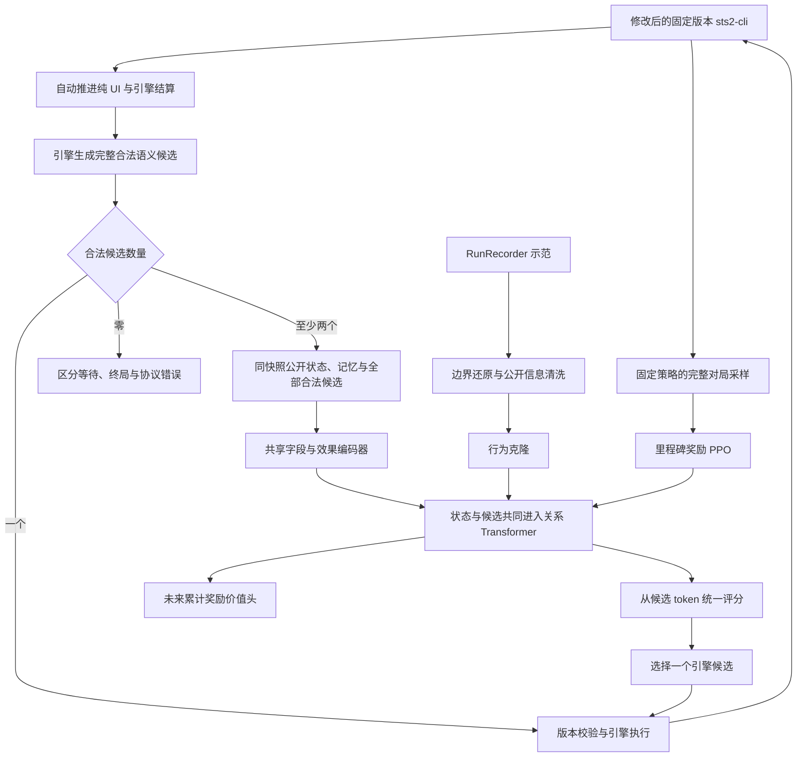

# STS2 新版架构设计

状态：待实现的架构提案，不是已验证的训练结果。

本方案围绕游戏任务与结构化轨迹设计。**明确使用并修改 sts2-cli 作为训练和部署的游戏执行引擎：由引擎提供完整合法候选动作列表，模型只在存在多个语义候选时选择。** 固定 A10 难度、五角色共享约 0.5B 模型、严格玩家视角、采用局内里程碑奖励，最终验收目标是击败第三幕 Boss。难度只在数据契约中校验，不输入模型。

## 1. 先确定架构的主线

**修改后的 sts2-cli 推进到语义决策边界 → 自动执行唯一合法动作 → 多候选时将公开状态与合法候选交给共享模型 → 候选 token 评分＋整局价值估计。** 纯 UI 操作由环境自动完成；选牌、出牌、路线、购买、事件交互，以及结束／跳过等有游戏后果的选择属于语义动作。进入模型的状态实体与动作候选共同进入主干，共享每层的 Q/K/V、输出投影和 FFN 参数。

训练采用少量示范行为克隆，再进行分阶段奖励的整局 PPO。战斗、幕 Boss、整局胜利产生不同级别的奖励，所有决策使用同一条整局回报。约 10 条轨迹是启动预算，模型容量与样本覆盖分别验收。即使尚无通关样本，也可以通过不同进度的阶段奖励进行 PPO 试点；是否有效由新种子上的进度和通关表现判断。



第一版采用一个策略、一个整局累计奖励 V。分阶段指奖励的结算时机，不表示切断战斗与战略的回报。模型输入决策阶段，用于理解相同选择在不同场景的含义。

## 2. 示范数据要求与审计边界

示范可由 RunRecorder 等记录器采集。游戏版本、记录 schema、难度、角色和完整性需要逐局校验；数据存储位置由运行环境配置，不写入公开文档。

| 检查项 | 要求 |
| --- | --- |
| 覆盖范围 | 五角色、固定 A10，覆盖战斗与局外决策 |
| 初始规模 | 约 10 条完整轨迹，每角色约 2 条，尽量覆盖不同牌组和路线 |
| 整局边界 | 从开局开始，具有明确终局；未完成操作需要单独审计 |
| 片段处理 | 文件数不等于独立对局数；同一对局的多个片段不能未经检查直接拼接 |
| 决策完整性 | 检查序号、重复操作、状态捕获错误、父子选择关系与候选覆盖 |
| 来源标记 | 保留人类、求解器和系统行为的类别，具体对局标识仅用于内部数据管理 |

`uncommitted_operations` 是完整性标记，不直接等于丢失的有效决策数。即使片段的 `run_id` 相同，也需要证明边界连续、没有回退或重叠，才可传播完整对局标签。

原始操作条数不等于可训练样本数。纯 UI 和唯一候选的自动步骤保留为环境轨迹，不计入策略样本；重复语义、候选无法恢复和状态含选择答案的记录应隔离。JSON 结构检查通过，也不证明每个快照都是正确的决策时刻。

胜利轨迹帮助启动；失败轨迹中的每步动作并不一定错误。只有成功结局的数据不能用于声称价值模型已经校准。原始日志、具体对局标识及逐文件审计记录应独立存储，公开文档保留数据要求和审计方法。

## 3. 系统边界与公开信息契约

将系统拆为六个职责明确的模块：

| 模块 | 输出 | 不承担的职责 |
| --- | --- | --- |
| sts2-cli / EngineAdapter | 引擎内的决策边界、完整合法候选、选择会话、执行校验和公开事件 | 不在 Python 或模型侧另写一套合法性规则，不为模型挑选“好动作” |
| EnvironmentRunner | 推进纯 UI／结算、执行唯一候选、仅将多候选分支送推理队列、收集转移 | 不替模型决定购买、跳过、提前结束或事件结果 |
| PublicObservation | 白名单公开状态、可见性与公开历史摘要 | 不直接序列化整个游戏对象 |
| Representation | 实体、实体引用、地图关系、候选特征 | 不读取 seed 或预测实际随机结果 |
| PolicyValue | 候选分布和当前策略未来累计奖励估计 | 不生成自由格式引擎命令 |
| Dataset/Learner | BC 样本、当前策略 rollout、训练与评测 | 不把示范伪装成 on-policy 数据 |

### 3.1 sts2-cli 的使用方式与必要修改

在 sts2-cli 的受控分支中实现环境协议，复用其 `Sts2Headless → sts2.dll + GodotStubs` 执行链。修改范围包括 C# 命令路由、决策检测、选择器与特殊事件的 headless 桥接；必要的桥接补丁必须保持原版规则、成本、随机结算和效果顺序。模型侧只消费协议，不根据卡牌文本、CLI 帮助或 UI 按钮自行拼候选。训练与部署使用同一个修改后的引擎及协议版本。

本次静态核对的 sts2-cli 基线为提交 `084d1aa3d8e118ca7ce8d8774ad16d6be9c92367`；对应源码位置相对于 sts2-cli 仓库。以下是待实现差异，不表示已经修改或完成游戏兼容性验证：

| 基线位置与现状 | 必要修改 |
| --- | --- |
| `src/Sts2Headless/Program.cs`、`RunSimulator.cs::ExecuteAction` 按动作名和参数分发 | 新增版本化决策帧、引擎生成的候选句柄及原子执行接口；普通动作枚举完整的合法参数绑定，如出牌与目标的组合 |
| `DetectDecisionPoint` 分别导出各阶段状态；`HeadlessCardSelector` 暴露 `min_select/max_select` | 增加统一候选提供器，覆盖卡牌、药水、路线、商店、奖励、营火、事件及子选择；候选生成与执行共享规则校验入口 |
| `DoSelectCards`／`ResolvePendingByIndices` 过滤无效索引后提交，未完整验证数量与重复；`DoSkipSelect` 直接清空选择 | 新增逐项选择会话，校验前缀、数量、重复、可完成性、结束及取消权限；非法命令不得悄悄截断、补选或转为跳过 |
| `HeadlessCardSelector` 已自动处理“单张且必须选”的局部情况 | 将唯一候选自动执行扩展到所有语义阶段，完整计入 STOP／跳过等备选；绕过整个 PolicyValue 推理 |
| `DoChooseOption` 已处理部分选牌／奖励／卡包等待；基线未见水晶球专用语义交互协议 | 统一挂起与恢复机制，补齐特殊事件候选提供器；不能把一般 `event_choice` 支持视为小游戏已兼容 |

游戏 build、sts2-cli 上游提交、修改后引擎提交、DLL／补丁哈希、协议版本和自动推进规则版本一起固定。原有调试命令如设置玩家属性、指定抽牌顺序、强制进入房间不进入合法候选。首版实现接口名称见第 7 节，均为新增设计。

### 3.2 公开信息边界

观测 $`x_t=(o_t,m_t)`$：$`o_t`$ 是当前公开信息，$`m_t`$ 只由此前公开观测、公开事件和自己的动作更新。外部摘要不保证完全消除部分可观测性；后续只有发现明确历史缺失时，才增加学习式记忆。

**允许输入：**当前可见卡牌及数值、公开状态、资源、公开遗物计数、当前敌人意图、已揭示地图、已观察敌人行动、已知抽牌堆组成，以及公开效果明确揭示且尚未失效的牌序。

**禁止输入：**随机 seed／RNG、未揭示牌序与房间结果、引擎隐藏 AI 状态、对象分配 ID、未来结果、下一状态、老师搜索树与分数。Actor 和 critic 使用相同的信息边界。对未知字段使用明确的 unknown/known mask，不能用零代替未知。

RunRecorder 原始记录含 seed，且明确标注 `draw_pile_order=engine_internal`。清洗时不仅要去掉顺序，还要审计每个字段及其上下文：

- 抽牌堆中的内部实例编号、数组下标不能成为排序的替代通道。仅对公开可区分的实例保留引用；无法公开区分的副本表示为数量或可交换实体。
- `saved_properties`、怪物 `move`、UI 反射对象不因出现在日志里就视为公开。逐类白名单到具体语义，默认不传入。
- 记录里奖励按钮对象可能已经包含尚未打开的牌面。只有实际揭示或历史中见过的奖励内容才能进入观测；若适配器自动查看免费信息，必须真实执行对应查看流程并统一训练／部署语义。
- `selected`、最终 `result`、动作携带的已选实体只能作为标签或解码前缀，不能反向填入选择前状态。尤其要检查选择提交钩子是否已包含答案。
- `actions_disabled` 可能反映求解器正在执行，而非规则不允许出牌。统一决策边界应在引擎稳定等待玩家时生成；不能把执行锁当作牌的合法性。
- 角色是输入；A10、版本、run_id、segment_id、teacher_source 是校验或审计元信息。老师来源不作为部署时缺失的特征。

为实体建立仅用于引用的局部句柄。模型读取“来源是第几个实体”的 gather 关系，不学习句柄整数的 embedding；重编号必须只改变引用，不改变输出语义。

验收原则：在相同公开历史下，两个玩家无法区分的内部状态，应产生相同公开观测、候选可见语义与策略分布（允许实体置换）。测试应包含隐藏牌序置换、内部 ID 重编号、隐藏 RNG 变化和未揭示奖励变化；当前公开合法性也必须保持相同。

## 4. 输入表示：先类型化，再做交互

不把整份 JSON 展开为长文本。一个可交互对象对应一个实体表示；每个当前合法候选也对应一个 action 实体。两者共用字段 embedding、数值编码器、局部效果编码器和到主干的投影，用 entity_type、field_type 与关系角色区分语义。同一对象的不同用途通过关系表达。

| 实体 | 核心内容 |
| --- | --- |
| 全局与玩家 | 角色、幕、楼层、阶段、生命／上限、金币、能量、当前回合等 |
| 卡牌 | 内容 ID、升级等级、基础／当前能量与星星费用、X 费、升级预览、附魔／负面修改、临时关键词、目标相关公开预览、区域与引用 |
| 遗物／状态／药水 | 内容 ID、公开计数、层数、触发周期、剩余次数、耗尽状态、药水槽位与容量、所属实体与可用条件 |
| 敌人／召唤物 | 稳定公开引用、生命、格挡、能力、意图的单段／次数／总量、已观察行动与目标关系 |
| 角色机制 | 充能球及槽位顺序、星星、奥斯提等实际公开状态 |
| 地图节点 | 类型、层数、当前／已访问、图关系、规则下可选状态 |
| 决策选项 | 事件页／子阶段、奖励组、商店价格／库存、删牌服务、选择 min/max、已选前缀、剩余次数、来源／去向／范围、选后费用、结束／跳过／取消权限 |
| 特殊事件交互实体 | 公开图块／格子及位置关系、已揭示内容、可选模式、公开计数与已承诺待结算结果；未揭示内容保持 unknown |
| 历史摘要 | 精确公开计数器、已知牌序及有效期、已看奖励、选择来源链、必要行动历史与完整性标记 |
| 数值关系 | 带 known/applicable 的名义伤害／格挡余量、能量／星星／金币余量；不声称是模拟结果 |
| 奖励进度 | 当前幕非 Boss 奖励已用额度、已完成 Boss 里程碑；由公开历史维护，支持恢复 |
| 合法动作实体 | verb、operation、公开成本、候选相关效果／预览、来源／目标／选项引用；由共享编码器产生 action token |

实体表示：

```math
\begin{aligned}
e_i &= E_{\mathrm{type}} + E_{\mathrm{content}} + E_{\mathrm{zone}} \\
    &\quad + \mathrm{MLP}_{\mathrm{num}}(n_i,k_i) \\
    &\quad + \mathrm{EffectEncoder}(F_i)
           + \mathrm{ContextEncoder}(c_i).
\end{aligned}
```

数值按字段语义归一化，同时保留适当的线性幅值与压缩幅值，例如生命比例和绝对生命、费用数值与 X 费标志。未知、零、不可用必须分开。计数与数量要显式保留，避免集合平均把一张牌和多张牌编码成一样。

效果表示先实现小而明确的语法：`操作、数值/表达式、目标角色、条件、触发时机、顺序、重复方式`。例如“伤害敌人后给自己格挡”是两个带目标绑定的有序节点；不能先把效果集合和目标集合分别求平均。

第一版用 **内容 ID＋动态数值＋少量结构化效果**。只从已核对的公开规则构建静态内容表，复杂效果保留 ID 和公开描述引用，不伪造解析结果。原始 `vars` 的字段值不是完整效果语义，需要显式映射。旧 `CardEffects` 主要导出费用、关键词、保留／消耗等动态修改，不等同于完整效果图。

静态描述文本向量作为后续消融项，不作为首版依赖；固定版本下，先判断类型化表示与少量效果是否足够。静态描述不包含本局隐藏信息。内容表、效果表与规则版本都要记录哈希。

战斗手牌、充能球等只在顺序具有公开规则意义时加入位置。**抽牌堆、弃牌堆、消耗牌堆均完整纳入观测，默认按无序多重集合表示。** 第一版保留每张公开卡牌的实例 token 和所属牌堆标记，另有各堆的数量／完整性摘要；不先平均成一个向量，也不丢掉重复牌数量。同内容但升级、费用或修改不同的牌是不同实体。

三个牌堆都不使用数组顺序、列表下标、全局绝对位置编码或 RoPE 表示先后。明确揭示的抽牌顺序单独作为公开关系；已观察的“上一张弃掉／消耗的牌”属于事件历史，不把整个底层牌堆变成有序输入。未知内容只给公开数量和 unknown 标记。

牌堆中卡牌与手牌使用同一个内容／数值／效果编码器，并同样参与主干注意力。移入不同牌堆会改变 zone 特征；检索、回收或选牌候选通过关系引用对应实例。地图使用图关系；历史使用公开时间关系；实体在打包张量中的位置没有游戏语义。集合注意力与置换性质的背景见 [Set Transformer](https://arxiv.org/abs/1810.00825)。

## 5. 地图：保留完整 DAG，区分结构与实际可选性

任意两地图节点采用六类互斥关系：自身、正向直接、正向间接、反向直接、反向间接、互不可达。再编码带符号的层差：

```math
\begin{aligned}
\mathrm{score}_{ij}^{(h)} &= \frac{q_i^\top k_j}{\sqrt{d_h}} \\
 &\quad + b^{(h)}_{\mathrm{relation}(i,j)} \\
 &\quad + c^{(h)}_{\mathrm{bucket}(\mathrm{floor}_j-\mathrm{floor}_i)}.
\end{aligned}
```

这是针对本任务的设计，借鉴 [Graphormer 的结构注意力偏置](https://arxiv.org/abs/2106.05234)，不代表论文验证了 STS2 的这个关系划分。主干中的地图节点对直接使用此偏置，首版不再堆叠独立大型地图网络。

节点增加入度、出度、相对当前层数，并明确分开：

1. 原始地图图结构上的后继／可达关系；
2. 当前公开规则和资源下可立即选择的节点；
3. 已访问、当前所在与玩家已知的内容。

特殊移动能力可能允许选择没有原始直接边的节点。因此动作合法性以引擎为准，不能只靠图邻接推断。普通路径的统计必须标为普通边统计，不冒充特殊规则下的最优路线。

可补充按未来层数分组的可达节点类型计数、最近营火／商店的图距离、单一路线上精英数量的 min/max。这些都是公开图上的确定性计算：汇合节点不重复计数；互斥分支不可相加成同一条路径。完整关系图负责保留“先营火后精英”的顺序信息，统计只是辅助。

不使用按时间的因果遮罩阻止读取已揭示的未来地图。地图随公开信息变化而更新；跨幕缓存按图版本失效。

## 6. 主干、共享动作头与整局价值头

模型目标约 **0.5B（5 亿）参数**。主干采用标准双线性层 GELU FFN，预算如下；完整模型参数量和吞吐待实现后实测：

| 项目 | 初始设计 |
| --- | --- |
| 联合主干 | 25 层，宽 1280，20 头，每头 64 维，FFN 5120，Pre-LN |
| 主干规模 | 含 bias、LayerNorm 和末端 norm 的预算为 491,938,560 参数 |
| 共享输入编码 | 状态与候选共用内容／字段 embedding、数值与 2 层局部效果编码器，局部宽 256，再投影到 1280；预算约 6–12M |
| 输出与关系 | 候选评分 MLP、价值头、角色化引用融合及关系偏置等约 1–3M；无独立动作 Transformer |
| 总规模 | 约 499–507M；注册表大小与具体投影会影响精确值 |
| 联合 token | 全局／价值 token＋状态实体＋公开记忆＋牌堆摘要＋合法动作 token |
| 策略头 | 同一个 MLP 逐个读取联合主干输出的 action token，产生候选 logit |
| 价值头 | 全局汇聚表示→MLP→线性标量，预测未来累计阶段奖励；不使用概率 sigmoid |
| 角色共享 | 五角色同一主干、同一评分函数；角色作为全局条件 |
| 随机层 | 首版 dropout=0，保证 PPO 概率重算一致 |

设共享局部编码器为 E，所有 token 一起计算：

```math
\begin{aligned}
X &= [e_{\mathrm{value}},E(s_1),\ldots,E(s_N), \\
  &\qquad E(a_1),\ldots,E(a_M)], \\
H &= T_\theta(X;B).
\end{aligned}
```

```math
\begin{aligned}
\ell_a &= f_{\mathrm{score}}(h_a), \\
V &= g(h_{\mathrm{value}}), \\
\pi_\theta(a\mid x)
  &= \frac{\exp(\ell_a)}{\sum_{b\in A_{\mathrm{legal}}(x)}\exp(\ell_b)}.
\end{aligned}
```

共享 E 表示共享语义字段与效果处理参数，不要求卡牌和动作具有完全相同的字段：type、verb、operation 和 known/applicable mask 区分它们。动作使用公开来源／目标引用，必要时以不同角色槽融合来源／目标的初始局部表示；不复制整份状态。没有来源或目标时使用明确的空引用类型。

默认双向联合 self-attention：状态↔状态、候选↔状态、候选↔候选、value↔全部公开 token 均可读取。关系 B 包括地图关系、action→source／target／option 及反向关系、card→pile 等成员关系；角色不同的边不能合并成一个模糊“关联”标签。多目标用多条目标边或明确的目标集合表示。bias 只在相应实体对上生效，不能给非地图 token 套用地图关系。

合法候选是公开状态的一部分，因此价值 token 可以读取它们；不得附带教师优选标记、真实未来收益或待执行答案。候选间注意力可以表达比较和共同约束，但不等于模拟未来动作序列。第一版不训练未选动作 Q。

候选无全局位置编码，重排时其 logit 应等变，映射回同一动作后概率不变；全局 V 应不变。删除、升级、弃牌、复制即使都选择卡牌，也必须拥有不同的操作上下文。padding 在每层 attention 和最终 softmax 中屏蔽，不能从候选数量补齐位置泄漏信息。严格重复的执行别名在 sts2-cli 引擎适配层去重，避免同一动作因被枚举两次而获得两份概率。

先前的小动作交叉注意力模块是一种计算效率选择，并非必要语义分离。当前设计采用统一主干；去掉独立动作分支后，将共享层数设为 25，使总规模仍约 0.5B。它是否优于独立解码分支需要实验，不能仅凭统一结构断言胜率更高。

Actor 和 V 第一版共享可训练主干，价值损失可以更新主干；监测两种梯度的尺度。优势中的旧 V 必须 detach。是否改为部分独立 critic，是后续实验选择，不预先假定其中一种一定更优。主干每层的主要参数量为 `4*d² + 2*d*ff = 12*d²`；这里 FFN 是 GELU 的两矩阵结构，换成 SwiGLU 时需要重新计算，不能保持相同隐藏宽度后仍沿用本预算。

部署时应实测 GPU 显存、系统内存和软件环境。按 0.5B 估算，BF16 权重约 1GB，常见含 FP32 优化器状态的训练基础存储约 8GB，均为十进制粗算且不含激活、缓存、临时张量或额外策略副本。实际峰值取决于实体数、候选数、attention 实现和微批次。

## 7. 动作协议与组合选择

### 7.1 动作边界按游戏语义划分

模型的选择必须改变游戏状态、承诺一个游戏结果，或决定有规则意义的信息揭示；多选前缀则是构造最终语义动作的一部分。是否点击按钮、打开新界面或切换页面，不是划分标准。

| 场景 | 交给模型的语义候选（存在多个时） | 环境自动执行 |
| --- | --- | --- |
| 地图与商店 | 选择通往哪个节点；购买、删牌、使用药水、放弃剩余购买机会并离开 | 已选中商店节点后的进入／打开商店界面，切换查看库存 |
| 战斗 | 出牌及目标、使用／丢弃药水、结束回合 | 动画、敌人回合、已选动作的结算，以及唯一合法候选 |
| 奖励／营火 | 选择卡牌、跳过奖励、选择休息或锻造、升级哪张牌 | 打开奖励面板、无额外选择的确认、完成后返回路线界面 |
| 选牌效果 | 选哪张、是否继续选、是否结束并提交当前已选集合 | 达到强制结束条件后的提交与关闭窗口 |
| 特殊事件 | 付费／接受代价的事件选项、占卜方式、图块或目标、规则允许的提前退出 | 打开小游戏、说明页、动画、无选择的结算与页面推进 |

“离开商店”“跳过奖励”“结束回合”会放弃机会或推进规则状态，即使未立刻改变生命／金币也必须保留。界面上名为“继续／确认”的按钮若实际支付代价、接受结果或放弃选择，同样是语义候选。相反，仅确认已经作出的选择不得再制造一个模型步骤。

纯 UI 自动推进采用引擎侧显式分类和白名单：操作不得自行选择结果、支付可选成本或放弃机会。免费查看信息也必须通过实际游戏流程公开，统一训练与部署时机；付费、消耗次数或彼此排斥的信息揭示仍是决策。对于购买顺序、奖励领取顺序等可能影响后续状态的情况，不能因“通常没有区别”而自动排序。严格等价的执行别名由引擎去重，不能用相同名称、相同预期收益或隐藏结果来判定等价。

### 7.2 引擎提供的决策包和执行接口

以下为修改后的 sts2-cli 新增协议，而非已有 CLI 命令。普通动作枚举完整参数绑定后的候选，例如 `PLAY_CARD(card_ref, target_ref)`；组合选择枚举当前前缀下的下一步候选。模型只返回一个候选引用。

```text
DecisionFrame
  contract: game_build, engine_commit, patch_hash, adapter_version,
            observation_schema, action_schema, auto_advance_version,
            content_hash, memory_version, fixed_ascension=10
  boundary: decision | waiting | terminal | error
  routing: episode_id, decision_id, state_version,
           selection_id?, parent_decision_id?, selection_revision? # 不输入模型
  public: phase, entities, relations, memory
          selection_context?, event_context?
  legal: candidates[]                                    # 引擎完整枚举
    candidate: verb, operation, source_refs, target_refs, option_refs,
               public_costs, public_effects, known_masks
  execution: candidate_ref -> opaque_handle -> engine_command # 不输入模型

SelectionContext
  operation, source_ref, destination, scope
  mode: buffered | incremental
  selected_refs, selected_count, min_total, max_total
  order_matters, repetition_allowed
  can_finish, can_skip, can_cancel, remaining_required
  stage, step_index, remaining_steps?, public_constraints

EventContext
  event_type, stage, public_modes, public_cells, public_relations,
  revealed_results, remaining_uses, committed_results
```

协议操作为 `advance_to_boundary()` 和 `execute_candidate(decision_id, state_version, candidate_ref, selection_revision?)`。前者推进已确定的规则流程及纯 UI，到下一个稳定选择边界／终局；后者原子校验候选所属帧、前缀版本和当前合法性，再执行对应命令。返回转移事件及新边界。选择前缀发生变化也更新版本，即使尚未改变牌堆；旧帧和重复命令不能再次消费资源。

公开观测与候选来自同一个稳定快照。候选生成复用引擎实际执行时的合法性判断，不由模型侧从 `can_play`、费用、min/max 重新推断。所有当前可行的目标、替代奖励、结束与跳过都要覆盖；动态组合约束由引擎在每个前缀重新计算。候选查询不执行试探动作、不消耗 RNG，也不泄露未公开结果。执行前的版本检查不通过则重新取帧，禁止拿旧候选在新状态中重试。

`can_finish/can_skip/can_cancel` 是用于解释候选的公开字段，最终执行权以候选列表为准，二者必须一致。候选数按完整语义列表统计，包含结束和跳过；“只剩一张可选牌，但还可以不选”是两个候选。未知阶段、稳定决策边界的空候选集和协议矛盾均报环境错误；引擎正在结算时返回 `waiting`，不能伪装成空决策或强制结束回合。

### 7.3 唯一候选直通与自动推进循环

EnvironmentRunner 在发起任何 PolicyValue 前向前执行以下流程；多选前缀和特殊事件使用相同规则：

```text
frame, events = engine.advance_to_boundary()
循环：
  记录 events，更新公开记忆、奖励账本和待完成转移
  若 terminal：结束对局并结算待完成转移
  若 waiting：
    frame, events = engine.advance_to_boundary()
    继续循环；超时记录为 unresolved
  若 error 或 decision 且候选数为 0：隔离并报告，停止当前环境
  若候选数为 1：
    记录 origin=forced
    frame, events = engine.execute_candidate(当前帧版本, 唯一候选)
    继续循环
  若候选数 >= 2：
    将帧交给模型，记录所选候选及 origin=policy
    frame, events = engine.execute_candidate(当前帧版本, 所选候选)
    继续循环
```

自动执行唯一候选时，**不调用策略头、价值头或联合主干**，也不构造只有一个候选的 GPU 推理请求。自动链保留操作、事件、版本和因果来源，但不是独立 BC／PPO 策略样本；其条件概率为 1，log-prob 为 0。纯 UI 标记 `origin=ui_auto`，模型分支标记 `origin=policy`。

自动执行不能丢失死亡、战斗胜利、公开信息揭示或嵌套子选择；每次推进后重新检查边界。界面或选项数不变不表示没有进展，应检查引擎事件、会话版本及明确的结束状态。重复无进展与工程步数超限进入诊断／unresolved，不得默认选第一项或强制离开事件。

### 7.4 逐项选择、强制数量与提前结束

采用引擎持有的 `SelectionSession`，把“10 选 5”等多选表达为一次选一项的过程，不枚举全部组合，也不让模型输出任意数组。每次选择后引擎返回更新后的已选前缀、公开约束和完整下一步候选。操作上下文必须区分消耗、弃置、永久移除、升级、复制、排序等，不能只有通用 `select_card` 而丢失来源与去向。

| 候选 | 精确定义 |
| --- | --- |
| `SELECT_ONE(ref)` | 加入一个当前合法元素；禁止重复时，引擎从后续候选中移除该实例 |
| `FINISH_SELECTION`（下文记作 STOP） | 提交当前已选集合／序列并结束；仅在当前前缀已经满足全部提交条件时出现 |
| `SKIP` | 在来源规则允许时放弃整个选择／机会；不是“提交已经选中的两张” |
| `CANCEL` | 仅在游戏明确允许撤销时返回父阶段，并按实际规则处理已支付成本；不可凭空提供回退 |

空集合提交若与 SKIP 的后果完全相同，仅保留一个候选；若成本、来源或后续流程不同则分别保留。`min_total/max_total` 是本会话总数量界限；`remaining_required` 表示尚缺的强制数量。它们不足以描述的类型配额、互斥、顺序和依赖约束由引擎维护。每个 buffered 前缀必须能补全为合法提交；不能选择后陷入既不能继续也不能结束的状态。

仅用于编辑未提交前缀的撤选、返回上一层 UI 不进入策略动作；CANCEL 只用于原规则中具有成本或后续机会差异的取消。若引擎可证明无序 buffered 选择只存在一个合法最终结果（例如必须选取全部剩余牌，且没有取消／替代结果），直接返回唯一的强制完成候选并执行，避免把没有后果差异的选取顺序交给模型。

**精确 10 选 5：**在十张公开可区分、均可独立选择且不允许重复或取消的例子中，`min_total=max_total=5`。候选依次为 10、9、8、7、6 个 `SELECT_ONE`，每次只选一张；选到第五张之前不提供 STOP／SKIP。第五张选完后只剩 `FINISH_SELECTION`，直接自动提交。若某一步仅有一个符合约束的选择，也直接执行；若原效果规定候选不足时全选，按引擎规则处理，适配器不能擅自降低 min。

**净化“消耗最多 3 张手牌”：**按本例的效果值，`operation=exhaust`、`scope=hand`、`min_total=0`、`max_total=3`。开始时可零张结束；选一张或两张后，合法集同时包含可继续选择的手牌和 STOP。选到两张时，模型可以选择 STOP，提交且只消耗这两张；绝不能把 STOP 实现为清空选择，也不能强制补足第三张。选到三张后 STOP 成为唯一候选并自动执行。数量来自当前卡牌效果与引擎约束，不按“净化”名称固定写死；如升级改变上限，使用实际值。

**必须选与可少选分别编码：**恰选 N 张在 N 之前不可结束；至少 1、最多 3 张在第一张之前无 STOP，之后可结束；最多 3 张允许 0～3 张。即使候选池只剩一张，可选效果仍有“选这张”和“结束”两条路径。达到上限、没有剩余合法元素且提交有效时，自动提交；提交无效且无候选则是规则／协议错误，不伪造跳过。

会话区分两类实际执行语义：

- `buffered`：每次选择只更新待提交前缀，不提前消耗／移除卡牌；STOP 或强制完成后一次提交给原版效果。父动作已支付的费用不重复支付，也不因子选择结束自动退还。
- `incremental`：原规则本来就是“先选 1、结算，再选 1”，每一步按原版时机生效。新选择、可见结果或资源变化形成新的环境决策；不能把数次单选拼成一次批量提交。是否可提前终止由当前步骤的引擎候选决定。

因此，相似的“选五次”界面未必具有同一种概率与结算边界。协议按效果语义标记 mode，不能按按钮数量或相同标题推测。

### 7.5 特殊事件与嵌套选择兼容性

在 sts2-cli 增加统一的 `PendingInteraction` 协议和按事件／阶段注册的候选提供器。通用选牌、奖励、卡包继续复用公共选择会话；图块、空间范围、排序、模式切换等保留对应实体与关系。事件提供器负责从真实事件状态生成公开观测、合法候选和执行绑定；模型侧不维护事件专属控制脚本。

**水晶球占卜作为首批必过案例。** sts2-cli 的 `localization_zhs/events.json` 中官方文本 `CRYSTAL_SPHERE` 包含付费／接受诅咒的入场选项、小幅／大幅占卜、揭开图块、剩余次数及结束时获得已揭示物品。文本能确认这些交互类别；图块范围、模式和目标的具体组合、可否提前退出等，必须核对固定版本的事件实现，不从文案猜测。

按以下阶段接入和验收：

1. 选择入场方案是语义决策，成本和承诺来自引擎；打开水晶球界面与说明页自动完成。
2. 引擎暴露当前公开图块位置、已揭示状态、剩余次数和合法占卜方式。未揭示图块的内部内容／预先生成结果不进入观测、候选特征或候选排序。
3. 一次占卜优先枚举完整的 `DIVINE(mode, target_ref)` 候选；仅 UI 上先切换模式再点击目标时，由引擎组合执行。若选择模式本身立即产生规则效果或揭示新信息，才以父子决策阶段表达。模式或位置影响范围／消耗／结果时，必须保留该选择，不能当作“点击 UI”自动代选。
4. 执行后先由引擎真实揭示并结算，再更新公开记忆和后续合法候选。后一次占卜是看到新信息后的新决策，不能提前一次性选完全部位置。
5. 次数用尽后，按原事件流程自动结算已确定结果；若触发选牌、奖励或其他子选择，挂起事件直到子选择完成。只有规则允许提前结束时才提供对应候选。

通用嵌套流程为 `父动作 → pending 子交互 → 子交互结束 → 恢复原 continuation → 下一交互／父动作完成`。路由保存父决策和选择会话标识，模型读取公开来源链而非内部句柄。恢复不能再次执行父动作或重复扣费；不得按“选项数没变”强制结束事件，也不能通过超时自动接受默认结果。暂不支持的事件阶段必须显式报告 `unsupported_interaction`，补齐后再纳入整局验收，不能悄悄跳过事件并宣称兼容。

### 7.6 选择轨迹与 BC／PPO 概率

**仅缓冲前缀、提交前没有中间游戏效果或新公开信息的多选**，作为一个宏动作。令 $`z=(a_1,\ldots,a_K)`$ 为实际逐项选择轨迹，包含可选 STOP；用整条轨迹的联合概率：

```math
\log \pi(z \mid x)
=\sum_{k:\,|A_k|>1} \log \pi(a_k \mid x,a_{\lt k},A_k).
```

其中 $`A_k`$ 是引擎返回的该前缀合法集合；唯一候选（包括强制 STOP）的 log-prob 为 0，直接执行。无序子集允许多个选择顺序，协议不为消除排列而删除其他当前合法元素；上式是**选择轨迹概率，不是最终无序集合概率**。同一集合的概率是所有对应轨迹概率之和。PPO 以实际采样轨迹为动作，不把某一个顺序的概率冒充集合概率，也不枚举所有排列。

对于无序选择，前缀输入表达“已选集合及数量”；只有顺序影响规则时才编码已选顺序。日志始终保留实际选择序列用于概率重算。仅记录最终集合的旧示范，在确认 buffered 且无中间信息后，才可按稳定公开顺序生成一条合法标签路径，并标记为重建路径；这只是 BC 的一种路径标签。公开语义完全相同的副本按数量或等价类处理，不使用隐藏实例 ID 排序。

每个需要模型选择的前缀，都把已选上下文、当前候选与 STOP 送入同一个编码器和联合 Transformer。前缀变化会影响双向注意力，因此重新运行主干；只缓存仍有效的静态局部特征。宏动作 V 使用自动前缀推进后、第一次存在多个候选时的 value token；若整次选择没有分支，则不产生模型样本。后续前缀的 V 不作为额外价值训练目标。

BC 对该轨迹联合 log-prob 求负值；PPO 用宏动作完整的新旧轨迹概率比做一次 clip。保存全部前缀、候选、自动步骤和版本，支持一致重算。缓冲前缀不额外给予游戏奖励或折扣。`incremental` 的真实结算步骤、水晶球每次揭示以及父动作触发的新选择会话分别形成环境边界，按实际多候选决策记录样本；不能把后续信息回填父决策，也不能只因换了一层 UI 就拆分同一次 buffered 选择。

合法动作屏蔽与策略梯度兼容，但前提是采样与更新使用同一合法集合语义；参见 [invalid action masking 研究](https://arxiv.org/abs/2006.14171)。

## 8. 轨迹转换与行为克隆

保留不可变原始日志，另产出与在线推理相同 schema 的数据。记录器格式与模型格式分开版本管理。

转换流程：

1. 按 run_id 分组、segment_id 保留边界，验证版本、A10、角色、结局和记录完整性。
2. v1 配对动作生命周期，区分 UI 尝试、预览、真正提交；v2 按操作依赖和开始顺序恢复父子关系，不能把文件完成顺序当作决策顺序。
3. 按第 7 节还原语义边界，区分纯 UI、唯一候选自动执行、buffered 前缀和 incremental 子决策。父操作不能因为等待子选择而重复成为两个执行动作。
4. 使用决策当时的公开状态和历史构建观测。标签来自最终选择；不读取 next_state 来补充候选信息。
5. 通过记录的引擎候选或经验证的同版本重放恢复完整合法候选及每步前缀，包含 STOP／SKIP 等替代项。候选不完整、索引有歧义、选择前状态含答案的样本隔离；不能将已选动作临时插入候选来使数据“通过”。
6. 只将多候选分支及包含分支的 buffered 宏动作生成 BC 标签；强制步骤与纯 UI 保留在环境事件链中，不按人类点击次数生成训练权重。
7. 分别统计每角色、幕、阶段、动作类型的有效覆盖、自动步骤数量及丢弃原因，单列特殊事件和提前结束的覆盖。

当前快照不是可恢复的完整引擎存档。相同 seed 也不能自动保证跨 Steam／headless／Mod 的重放一致。用重放恢复训练样本前，必须逐决策验证公开状态与动作语义；分歧后的记录不能继续当作精确重放。

BC 按角色、阶段分层，避免数千次出牌淹没少数路线、商店和选牌。阶段权重只用于示范训练，不自动带入 PPO 改变通关目标。留出单位是完整 run/seed，不能随机拆同局的相邻步骤到训练和验证；同一局不同片段必须在同一侧。

约 10 条数据下，离线验证的统计能力很有限。可以做按整局分组的交叉验证，同时使用独立的新 seed 实机评测；角色没有足够多局时明确报告无法估计其离线泛化。

CombatSolver 等教师来源应单独保留以供审计；actor 标签本身不证明求解器的信息访问范围。自动扩增教师数据前，需验证它只依赖公开观测／公开规则；不能假定移除学生输入里的隐藏字段，就证明教师决策也符合严格玩家视角。未核实的示范应标记 teacher_visibility=unverified，不作为信息边界合规的证明。

示范用于策略行为克隆。教师轨迹的累计里程碑奖励不能直接视为新策略的价值真值，因为后续行为属于教师。部署策略的 V 主要由自己的 rollout 监督；若未来研究示范价值预训练，需单独说明策略分布差异。

## 9. 强化学习目标、采样和更新

最终验收指标固定为五角色等权 A10 通关概率：

```math
J(\theta)=\frac{1}{5}\sum_{c=1}^{5}
\Pr_{\pi_\theta}(\mathrm{win}\mid c,\mathrm{A10}).
```

其中 $`c`$ 表示角色，$`\mathrm{win}`$ 表示击败第三幕 Boss 并确认整局通关。

训练采用局内里程碑奖励。下表数值是首轮待验证的工程起点，可根据开发评测调整，但一次采样和更新期间必须固定：

| 里程碑 | 初始奖励 | 结算规则 |
| --- | --- | --- |
| 普通／事件中的非精英、非 Boss 战斗胜利 | +0.005 | 每个真实 encounter 首次确认胜利时一次 |
| 精英战斗胜利 | +0.02 | 替代普通战斗奖励，不叠加 |
| 第一幕 Boss 胜利 | +0.10 | 该幕最终 Boss 战斗完成时一次，不再叠加普通／精英奖励 |
| 第二幕 Boss 胜利 | +0.20 | 同上 |
| 第三幕 Boss 胜利并确认整局通关 | +1.00 | 终局一次，不另外重复支付第三幕 Boss 奖励 |
| 死亡、出牌、选牌、购物、查看奖励、推进 UI | 0 | 死亡结束整局，已获得的历史阶段奖励保留 |

每幕非 Boss 战斗奖励合计上限暂定 0.10；单次支付为 `min(基础奖励, 本幕剩余额度)`，额度不会变负。于是完整对局非终局奖励最多 0.60（3 幕战斗额度 0.30，加前两幕 Boss 0.30），终局额外奖励为 1.00。可区分失败局的推进程度，同时限制早期反复战斗的奖励规模。

这些权重使单条通关轨迹的总奖励高于单条失败轨迹，但**不保证按期望奖励排序与按通关率排序完全一致**。本版训练实际优化的是 `J_train = P(通关) + E(阶段奖励)`，阶段奖励会产生路线偏好。最终选模仍依据留出通关率；若阶段得分上涨而通关率下降，应调低或调整辅助里程碑权重。不能把这套奖励宣称为目标不变的势函数塑形；相关理论条件见 [reward shaping 原论文](https://people.eecs.berkeley.edu/~russell/papers/icml99-shaping.pdf)。

奖励由独立 `MilestoneLedger` 从引擎确认事件计算，逐分量存盘。关键边界：

- 按真实 encounter 去重，不能按怪物死亡、波次、Boss 阶段、奖励弹窗或从 combat 切到 selector 就给战斗胜利奖。
- 同一节点内可能存在多个真实战斗，因此 encounter 身份与地图节点身份分开；重复发送同一完成事件不得再次支付。
- Boss 奖与战斗基础奖互斥；最终胜利只支付一次。失败、逃离及只完成一个 Boss 阶段不能冒充胜利。
- buffered 多选前缀不给奖励；incremental 的实际结算按真实引擎事件处理。纯 UI 和唯一候选自动链产生的奖励并入上一个模型决策（或 buffered 宏动作）的转移，直至下一模型决策或终局；每次里程碑仍只支付一次。
- 恢复对局时一并恢复已支付集合、当前幕额度和公开记忆；不能通过读档、重开界面或课程起点再次领取过去的里程碑。
- 当前幕已用额度和已完成 Boss 是公开历史可确定的奖励相关状态，进入输入。全局去重句柄只在环境侧，不作为网络特征。

完整对局的回报与优势改为：

```math
\begin{aligned}
\gamma &= 1, \\
G_t &= \sum_{k=t}^{T-1}r_k, \\
\hat{A}_t &= G_t-V_{\mathrm{old}}(x_t).
\end{aligned}
```

这里 t 只索引模型决策或包含分支的 buffered 宏动作，r_t 汇总执行它到下一模型决策／终局之间的全部里程碑。以正常结束的完整对局为前提，默认完整回报对应 lambda=1；自动步骤不新增折扣或独立价值样本。首个模型决策前发生的奖励仅存入对局账本，不倒灌为未来回报；完全没有模型决策的对局仍计入环境统计，不伪造训练样本。不同时间点的 G 不再都相同：已经在过去获得的奖励不能重复加入未来回报。主干仍然是单步状态网络；所有阶段奖励和最终结果通过同一条整局时间线传递。战斗结束只是奖励结算边界，不是 value 的终止边界。

第一版采用冻结策略、固定开局集合的完整对局 PPO：

1. 冻结策略版本、观测变换、内容表和 reward_version；每角色预先分配相同开局数，seed 从训练池独立抽样。
2. 所有对局都使用该快照跑到真实终局。跨战斗、跨幕不清空回报。
3. 轨迹可以分块写磁盘，但未完成对局暂不形成完整回报样本。先完成的局不能仅因快而获得更高入选概率。
4. 在任何更新前固定 old_log_prob、old_value、动作候选与组合前缀；新旧概率重算使用一致精度和无 dropout 的前向模式。
5. 用全部完整轨迹更新 PPO；新一轮重新采样。示范只通过独立 BC loss 参与，不伪装为 PPO 旧策略数据。

PPO 使用新旧策略的概率比与 clipped surrogate；算法依据见 [PPO 论文](https://arxiv.org/abs/1707.06347)。概率比为：

```math
\rho_t=\exp\!\left(
  \log\pi_\theta(a_t\mid x_t)
  -\log\pi_{\mathrm{old}}(a_t\mid x_t)
\right).
```

主价值头使用线性输出，以 MSE 拟合未来累计奖励；不使用二元 BCE 或 sigmoid 概率约束。诊断包括 RMSE、explained variance、相对常数基线误差及预测／目标标准差。真实通关率由对局结果统计；若以后增加单独的通关概率辅助头，必须与 PPO 的 V_return 分开命名和监督。

Actor 聚合以“等权角色、每局内部累加决策贡献”为原则，例如：

```math
\begin{aligned}
\tilde{\rho}_t &= \mathrm{clip}(\rho_t,1-\epsilon,1+\epsilon), \\
u_t &= \min(\rho_t\hat{A}_t,\tilde{\rho}_t\hat{A}_t), \\
L_{\mathrm{actor}} &= -\frac{1}{5H_{\mathrm{ref}}}
  \sum_{c=1}^{5}\frac{1}{N_c}\sum_{i=1}^{N_c}
  \sum_{t\in\tau_{c,i}}u_t.
\end{aligned}
```

其中 $`u_t`$ 是单步裁剪目标，$`N_c`$ 是角色 $`c`$ 的对局数，$`\tau_{c,i}`$ 是该角色第 $`i`$ 条轨迹。$`H_{\mathrm{ref}}`$ 是固定的梯度尺度常量，与单局长度和胜负无关；不能逐局除以自己的动作数而无意改变目标。分桶和微批次只改变计算顺序，保留上述权重。成功重采样、分阶段配额若用于 RL，需要显式分布校正，不能照搬 BC 的平衡采样。

约 0.5B 的首轮试点可取 clip=0.2、主干 LR=1e-5、动作／价值头 LR=3e-5、梯度范数上限 1、1–2 遍 PPO、target KL=0.01–0.02，均为待验证起点。先校准策略／价值梯度尺度，再确定损失系数；记录分角色和阶段的 KL，不能只看全局平均。优势采用 G-V，不逐局或逐阶段减均值；若做标准化，以整轮冻结统计统一处理，不能在分桶微批次中分别归一化。

熵与 BC 保持是训练正则项，会影响策略偏好；初期小量使用，随自主进展衰减，最终以真实通关率选模型。需分别报告战斗奖励、Boss 奖励和终局奖励，不能用阶段总分掩盖长期没有后续进展的问题。

**结束语义：**

| 边界 | 处理 |
| --- | --- |
| 第三幕 Boss 胜利／真实死亡 | terminal，转移奖励分别为 +1／0；历史已支付奖励保留 |
| 非最终战斗结束、进入下一幕 | 支付对应里程碑，非终局，继续整局采样 |
| 内存批次满、写盘分块 | 存储边界，继续同一策略对局 |
| 工程步数上限／超时 | 单独记录 unresolved，不能直接当死亡 |
| 崩溃、非法候选、协议分歧 | 环境错误，隔离并修复，不能冒充有效战败 |

完整对局版本遇到 unresolved 应尝试恢复或完成原队列；不能不断丢弃长局只训练快速结束局。确需分段 PPO 时，在有效截断状态 bootstrap，单独记录 terminal mask 与 trace continuation mask，禁止串接不同对局。这是后续实现分支，不与完整回报基线混用。参考 [Gymnasium 对终止与截断的区分](https://gymnasium.farama.org/tutorials/gymnasium_basics/handling_time_limits/) 和 [GAE](https://arxiv.org/abs/1506.02438)。

## 10. 约 10 条示范下的启动策略

训练顺序：**数据与协议验收 → BC → 自主 A10 整局评测／价值预热 → 整局 PPO。**

BC 之后先对五角色分别用新 seed 进行固定数量的评测，按克隆策略的概率分布采样动作，验证合法率、失败位置、通关样本以及各阶段覆盖。评测使用正常开局，不由教师接管；教师辅助轨迹另列。

分阶段奖励允许在尚未通关时开始 PPO：只要战斗、幕推进结果存在可学习差异，就有回报信号。但如果所有对局在同一阶段失败且回报几乎一致，仍需改善示范或探索。离线准确率不替代自主评测；每个角色单独统计战斗完成、第一／二幕 Boss 和最终通关率。

工程试点可预先固定每角色 100 局作为首次观察窗口，报告置信区间；这是探测预算，不是学会的阈值。正式 rollout 初始可按每角色 32 局组成 160 局队列，随后依据实测成功率和时长调整。所有角色都必须有独立的进度报告，不能用平均值遮住某角色长期没有正样本。

如果阶段奖励 PPO 停滞在早期，优先路径是：

1. 补充模型实际访问的失败状态上的教师选择，修正行为克隆的分布偏移；只在教师接口已可用且公开信息边界已验证时，采用 DAgger 式增量收集。参见 [DAgger 原论文](https://arxiv.org/abs/1011.0686)。这是一条可选的数据获取路径，不假定 CombatSolver 已支持它。
2. 若引擎实现了可靠的状态恢复，从真实可达的 A10 中后期局面开始，并逐步向正常开局移动。恢复包括完整引擎内部状态，但这些数据留在环境侧；只将公开观测及正确公开记忆传给模型。
3. 局面课程沿用相同的里程碑账本，仅支付起点之后新发生的奖励；不能把赢下一场战斗或课程结束等价为整局胜利。课程起点分布与自然开局分布分别标记，最终验收始终是正常开局。

现有 RunRecorder 快照本身不能承担第 2 条。需要先开发可靠恢复，或验证从开局严格重放到锚点；不能按快照中的血量、牌组拼造一个相似局面，就声称延续了同一条轨迹。

第一版的阶段奖励限于真实战斗与幕／整局胜利。生命、金币、选牌、药水使用和资源保留通过输入及后续回报学习；不额外按伤害、治疗点击、查看奖励、领取牌或原始楼层移动计分。奖励表是当前建议起点，调整时升 reward_version、重新计算对应目标并重新校准价值头。

## 11. 数据工程、吞吐和复现

从 8 个 sts2-cli 环境进程开始，实测比较 16、24；集中 GPU 推理，按实体数和候选数分桶。每个环境只加载引擎，不复制 GPU 模型。纯 UI 与唯一候选在环境侧直接推进，仅多候选决策进入 GPU 队列。根据系统可用内存限制进程、轨迹队列与未压缩快照，不能只按 CPU 线程数开满。

静态内容和地图拓扑按哈希存一次，轨迹保存动态字段、公开记忆快照、候选引用与必要概率。完整回报不要求把整局激活图常驻显存：采样无梯度，训练按微批次重新前向。

关系偏置可能影响高效 attention 实现的可用性，因此实测真实输入的峰值显存与时间。约 0.5B 模型计划使用 BF16 autocast、FP32 softmax／log-prob／优势与损失归约、按层 activation checkpointing；只有新旧策略概率重算误差通过验收后才采用该精度组合。微批次从 1–4 个状态起测，用梯度累积达到更新批量；实体数差异较大时按 token／attention 工作量预算分桶。

一次普通决策将状态与所有候选合成一个 batch 项，25 层联合主干只前向一次，不能每个候选分别运行。设状态／记忆／摘要 token 总数为 S，候选数为 A，主干 attention 矩阵规模为 `(S+A)²`，逐 token 投影与 FFN 随 S+A 增长；相较状态单独编码会增加计算，但并不需要复制模型参数。

组合解码时每个存在多个候选的前缀是一次新的联合前向；唯一候选前缀不做前向。这个成本必须计入吞吐和显存预算，不能声称所有前缀复用同一份 H。只缓存静态规则与仍有效的局部特征。训练时各分支前缀 log-prob 保留正确梯度，可用 checkpointing 和分段重算控制显存。采样结束后已保存旧概率与 V，不要求训练时再常驻一整份旧主干；如果某种 KL 计算需要旧分布，另行计入缓存／模型开销。吞吐分别统计引擎操作、自动操作、模型调用和完整对局数。

不静默截断实体或候选。先测 token 数分布，再确定容量；溢出显式报告。可对完全等价且无需单独引用的实体做带数量的集合压缩，不删除可选动作或关键实例。

检查点包含权重、优化器、随机状态、训练步、公开输入契约及内容表哈希、reward_version、采样策略版本、seed 池版本，以及 sts2-cli 提交／补丁和自动推进协议版本；对局恢复状态还包含公开记忆、里程碑账本和未完成的选择／事件会话。会话恢复必须能重建实际 continuation，否则只能从已验证的稳定边界重放，不能声称支持任意中途恢复。seed 用于复现和数据划分，始终不进入网络。

## 12. 验收与实施顺序

| 阶段 | 交付与通过条件 |
| --- | --- |
| A：sts2-cli 协议改造 | 固定引擎版本，实现统一合法候选、原子执行、自动推进、逐项选择与事件交互；通过下表定向用例 |
| B：数据与整局环境契约 | 每类决策都有选择前公开状态与完整合法集；当前数据逐条给出接受／隔离原因；五角色 A10 正常整局，同版本可复现，奖励与信息边界通过检查 |
| C：表示与网络 | 联合状态／候选置换等变、V 不变；三个牌堆的重排不改变语义输出；隐藏状态变化不影响输入；未更新策略的概率比接近 1 |
| D：BC 基线 | 按角色和阶段报告留出 NLL 与动作覆盖，并实测新 seed 上的自主通关率 |
| E：RL 试点 | 记录各级里程碑计数／奖励、真实通关数、KL、裁剪比例、熵、V 回归质量、错误／未决局数及训练资源消耗 |
| F：正式训练 | 相同预算下对照 BC 基线，独立留出 seed 的五角色平均通关率改善，弱角色没有被平均值掩盖 |

引擎协议的首批定向验收如下，均要求记录公开状态、候选、执行事件和实际模型调用次数：

| 用例 | 必须满足的结果 |
| --- | --- |
| 合法候选完整性 | 在可穷举的小场景中，候选覆盖所有合法语义动作／参数绑定；执行与枚举校验一致；查询不推进 RNG，非法输入不发生部分写入 |
| 商店界面自动化 | 路线选择后自动进入商店；开界面／纯确认无模型样本；购买、删牌及有放弃机会含义的离开仍可决策 |
| 唯一候选与可跳过单牌 | 强制单选及强制结束的模型调用为 0；单张牌＋STOP 仍为两个候选，不自动选牌；唯一最终结果也不制造顺序决策 |
| 精确 10 选 5 | 五次选一张，已选实例不重复出现；前四次无 STOP；第五次后自动提交一次，任意合法五张子集都可到达 |
| 净化最多 3 张 | 分别执行选 0／1／2／3 张后结束；重点验证选两张＋STOP 仅消耗两张、其余手牌保留，父卡牌费用和效果仅结算一次；升级等动态上限按当前效果生效 |
| 至少 1、最多 3 张及候选不足 | 第一张前不能结束，第一／二张后能结束；无候选时区分合法空结果、原版不足全选规则与协议错误 |
| 动态约束与选择顺序 | 类型配额、互斥、重复许可与顺序规则每步更新；无序集合可经不同轨迹到达，概率按实际轨迹重算；有序效果保留顺序 |
| 连续单选与嵌套选择 | “选 1→结算／揭示→再选 1”形成独立边界；子选择后准确恢复父流程，不重扣成本，不把未来结果填入之前状态 |
| 水晶球占卜 | 覆盖入场方式、模式／目标、逐次揭示、剩余次数、最终结算及子奖励；改变未揭示图块内容不改变当前公开输入与候选；结算只发生一次 |
| 结束、跳过与取消 | STOP 保留并提交已选内容；SKIP／CANCEL 仅在原规则允许时出现；不可撤回的成本不因取消退还，无纯 UI 回退循环 |
| 过期版本与异步边界 | 拒绝旧帧／旧前缀／重复命令且不改状态；等待不报作空合法集；同页事件能继续，不依靠选项数量强制结束 |
| 自动链奖励与终局 | 自动动作导致胜利或死亡时，奖励、记忆、terminal 正确归入上一模型转移；首次决策前的自动链只入账；不新增策略／价值训练样本 |

定向用例通过后，对修改后的 sts2-cli 运行五角色各至少 5 局 A10 的完整回归，要求全部正常完成，另报告胜负；“正常完成”不代表通关或穷尽事件覆盖。水晶球等低频交互还须单独构造真实引擎场景核对，不能用随机整局没碰到来代替通过。以上是后续实现的通过条件，本次文档修订不等于这些检查已完成。

评测包含每角色通关数／有效完成局数及置信区间、五角色等权平均、最弱角色表现、环境失败和 unresolved 占全部尝试的比例。错误局不能算作游戏死亡，也不能隐藏其导致的选择偏差；无法完成的局较多时，胜率结论标记为不充分。必要时给出全部尝试中将未决局视为未胜／可能胜的区间。

训练 seed、开发评测 seed、最终留出 seed 分开。最优检查点由开发评测选择，最终留出集不反复用于调参。随机采样策略与 argmax 策略若都报告，使用不同标签，不能混作同一指标。

少量必要消融：ID＋数值 vs 加效果；地图关系偏置 vs 无偏置；公开历史摘要 vs 无摘要；保持 BC vs 衰减 BC；里程碑权重变化对通关率的影响。每次只改变一个主要因素。主模型容量按约 0.5B 固定，循环记忆、多步搜索和离线 RL 不在基线未建立前同时引入。

**当前可定稿：**使用并修改 sts2-cli，由引擎提供完整合法候选；纯 UI 自动推进、唯一候选零模型调用；多选逐项执行并明确 STOP／强制选择语义；特殊事件按真实交互阶段接入；固定 A10；全角色共享；公开信息边界；状态与合法动作共用编码器及联合注意力主干；抽牌／弃牌／消耗堆按无序多重集合完整输入；有向地图关系；统一候选评分；一个整局累计奖励 V；局内里程碑奖励；完整回报 PPO；约 0.5B 模型。

**仍需在实现阶段验证：**sts2-cli 对各阶段的候选完备性及执行一致性、水晶球等特殊事件的规则与 headless 兼容性、选择会话和引擎恢复能力、清洗后真正可用的示范数量、教师信息边界、各阶段候选可恢复性、BC 自主成功率、吞吐和最合适的更新规模。它们是可测的工程与实验问题，不需要提前假定已经成立。
