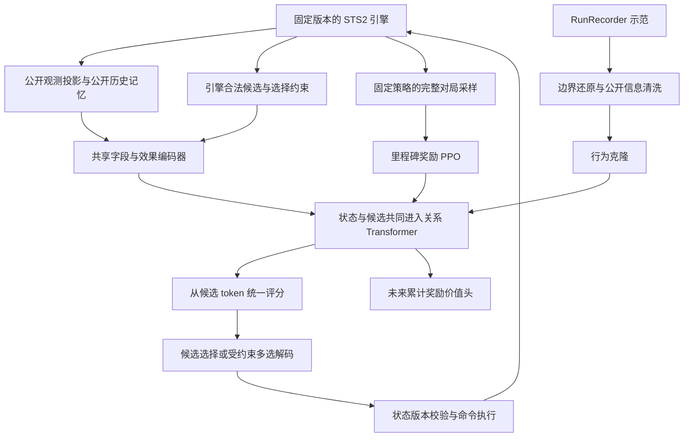

# STS2 新版架构设计

状态：待实现的架构提案，不是已验证的训练结果。

本方案围绕游戏任务与结构化轨迹设计，既有实现仅用于核对输入字段覆盖。**固定 A10 难度、五角色共享约 0.5B 模型、严格玩家视角、采用局内里程碑奖励，最终验收目标是击败第三幕 Boss。** 难度只在数据契约中校验，不输入模型。

## 1. 先确定架构的主线

**公开状态实体＋引擎合法候选 → 共享字段／效果编码器 → 同一个关系 Transformer → 候选 token 评分＋整局价值估计。** 状态实体与动作候选共同进入主干，共享每层的 Q/K/V、输出投影和 FFN 参数。

训练采用少量示范行为克隆，再进行分阶段奖励的整局 PPO。战斗、幕 Boss、整局胜利产生不同级别的奖励，所有决策使用同一条整局回报。约 10 条轨迹是启动预算，模型容量与样本覆盖分别验收。即使尚无通关样本，也可以通过不同进度的阶段奖励进行 PPO 试点；是否有效由新种子上的进度和通关表现判断。



第一版采用一个策略、一个整局累计奖励 V。分阶段指奖励的结算时机，不表示切断战斗与战略的回报。模型输入决策阶段，用于理解相同选择在不同场景的含义。

## 2. 示范数据要求与审计边界

示范可由 RunRecorder 等记录器采集。游戏版本、记录 schema、难度、角色和完整性需要逐局校验；数据存储位置由运行环境配置，不写入公开文档。

| 检查项 | 要求 |
| --- | --- |
| 覆盖范围 | 五角色、固定 A10，覆盖战斗与局外决策 |
| 初始规模 | 约 10 条完整轨迹，每角色约 2 条，尽量覆盖不同牌组和路线 |
| 整局边界 | 从开局开始，具有明确终局；未完成操作需要单独审计 |
| 片段处理 | 文件数不等于独立对局数；同一对局的多个片段不能未经检查直接拼接 |
| 决策完整性 | 检查序号、重复操作、状态捕获错误、父子选择关系与候选覆盖 |
| 来源标记 | 保留人类、求解器和系统行为的类别，具体对局标识仅用于内部数据管理 |

`uncommitted_operations` 是完整性标记，不直接等于丢失的有效决策数。即使片段的 `run_id` 相同，也需要证明边界连续、没有回退或重叠，才可传播完整对局标签。

原始操作条数不等于可训练样本数。自动推进、重复语义、候选无法恢复和状态含选择答案的记录应隔离。JSON 结构检查通过，也不证明每个快照都是正确的决策时刻。

胜利轨迹帮助启动；失败轨迹中的每步动作并不一定错误。只有成功结局的数据不能用于声称价值模型已经校准。原始日志、具体对局标识及逐文件审计记录应独立存储，公开文档保留数据要求和审计方法。

## 3. 系统边界与公开信息契约

将系统拆为五个职责明确的模块：

| 模块 | 输出 | 不承担的职责 |
| --- | --- | --- |
| EngineAdapter | 决策边界、合法候选、命令执行和公开事件 | 不为模型挑选“好动作” |
| PublicObservation | 白名单公开状态、可见性与公开历史摘要 | 不直接序列化整个游戏对象 |
| Representation | 实体、实体引用、地图关系、候选特征 | 不读取 seed 或预测实际随机结果 |
| PolicyValue | 候选分布和当前策略未来累计奖励估计 | 不生成自由格式引擎命令 |
| Dataset/Learner | BC 样本、当前策略 rollout、训练与评测 | 不把示范伪装成 on-policy 数据 |

观测 $x_t=(o_t,m_t)$：$o_t$ 是当前公开信息，$m_t$ 只由此前公开观测、公开事件和自己的动作更新。外部摘要不保证完全消除部分可观测性；后续只有发现明确历史缺失时，才增加学习式记忆。

**允许输入：**当前可见卡牌及数值、公开状态、资源、公开遗物计数、当前敌人意图、已揭示地图、已观察敌人行动、已知抽牌堆组成，以及公开效果明确揭示且尚未失效的牌序。

**禁止输入：**随机 seed／RNG、未揭示牌序与房间结果、引擎隐藏 AI 状态、对象分配 ID、未来结果、下一状态、老师搜索树与分数。Actor 和 critic 使用相同的信息边界。对未知字段使用明确的 unknown/known mask，不能用零代替未知。

RunRecorder 原始记录含 seed，且明确标注 `draw_pile_order=engine_internal`。清洗时不仅要去掉顺序，还要审计每个字段及其上下文：

- 抽牌堆中的内部实例编号、数组下标不能成为排序的替代通道。仅对公开可区分的实例保留引用；无法公开区分的副本表示为数量或可交换实体。
- `saved_properties`、怪物 `move`、UI 反射对象不因出现在日志里就视为公开。逐类白名单到具体语义，默认不传入。
- 记录里奖励按钮对象可能已经包含尚未打开的牌面。只有实际揭示或历史中见过的奖励内容才能进入观测；若适配器自动查看免费信息，必须真实执行对应查看流程并统一训练／部署语义。
- `selected`、最终 `result`、动作携带的已选实体只能作为标签或解码前缀，不能反向填入选择前状态。尤其要检查选择提交钩子是否已包含答案。
- `actions_disabled` 可能反映求解器正在执行，而非规则不允许出牌。统一决策边界应在引擎稳定等待玩家时生成；不能把执行锁当作牌的合法性。
- 角色是输入；A10、版本、run_id、segment_id、teacher_source 是校验或审计元信息。老师来源不作为部署时缺失的特征。

为实体建立仅用于引用的局部句柄。模型读取“来源是第几个实体”的 gather 关系，不学习句柄整数的 embedding；重编号必须只改变引用，不改变输出语义。

验收原则：在相同公开历史下，两个玩家无法区分的内部状态，应产生相同公开观测、候选可见语义与策略分布（允许实体置换）。测试应包含隐藏牌序置换、内部 ID 重编号、隐藏 RNG 变化和未揭示奖励变化；当前公开合法性也必须保持相同。

## 4. 输入表示：先类型化，再做交互

不把整份 JSON 展开为长文本。一个可交互对象对应一个实体表示；每个当前合法候选也对应一个 action 实体。两者共用字段 embedding、数值编码器、局部效果编码器和到主干的投影，用 entity_type、field_type 与关系角色区分语义。同一对象的不同用途通过关系表达。

| 实体 | 核心内容 |
| --- | --- |
| 全局与玩家 | 角色、幕、楼层、阶段、生命／上限、金币、能量、当前回合等 |
| 卡牌 | 内容 ID、升级等级、基础／当前能量与星星费用、X 费、升级预览、附魔／负面修改、临时关键词、目标相关公开预览、区域与引用 |
| 遗物／状态／药水 | 内容 ID、公开计数、层数、触发周期、剩余次数、耗尽状态、药水槽位与容量、所属实体与可用条件 |
| 敌人／召唤物 | 稳定公开引用、生命、格挡、能力、意图的单段／次数／总量、已观察行动与目标关系 |
| 角色机制 | 充能球及槽位顺序、星星、奥斯提等实际公开状态 |
| 地图节点 | 类型、层数、当前／已访问、图关系、规则下可选状态 |
| 决策选项 | 事件页、奖励组、商店价格／库存、删牌服务、选择 min/max、来源／去向／范围、选后费用、跳过与取消 |
| 历史摘要 | 精确公开计数器、已知牌序及有效期、已看奖励、选择来源链、必要行动历史与完整性标记 |
| 数值关系 | 带 known/applicable 的名义伤害／格挡余量、能量／星星／金币余量；不声称是模拟结果 |
| 奖励进度 | 当前幕非 Boss 奖励已用额度、已完成 Boss 里程碑；由公开历史维护，支持恢复 |
| 合法动作实体 | verb、operation、公开成本、候选相关效果／预览、来源／目标／选项引用；由共享编码器产生 action token |

实体表示：

$$
\begin{aligned}
e_i ={}& E_{\mathrm{type}} + E_{\mathrm{content}} + E_{\mathrm{zone}} \\
       &+ \operatorname{MLP}_{\mathrm{num}}(n_i,k_i) \\
       &+ \operatorname{EffectEncoder}(F_i)
        + \operatorname{ContextEncoder}(c_i).
\end{aligned}
$$

数值按字段语义归一化，同时保留适当的线性幅值与压缩幅值，例如生命比例和绝对生命、费用数值与 X 费标志。未知、零、不可用必须分开。计数与数量要显式保留，避免集合平均把一张牌和多张牌编码成一样。

效果表示先实现小而明确的语法：`操作、数值/表达式、目标角色、条件、触发时机、顺序、重复方式`。例如“伤害敌人后给自己格挡”是两个带目标绑定的有序节点；不能先把效果集合和目标集合分别求平均。

第一版用 **内容 ID＋动态数值＋少量结构化效果**。只从已核对的公开规则构建静态内容表，复杂效果保留 ID 和公开描述引用，不伪造解析结果。原始 `vars` 的字段值不是完整效果语义，需要显式映射。旧 `CardEffects` 主要导出费用、关键词、保留／消耗等动态修改，不等同于完整效果图。

静态描述文本向量作为后续消融项，不作为首版依赖；固定版本下，先判断类型化表示与少量效果是否足够。静态描述不包含本局隐藏信息。内容表、效果表与规则版本都要记录哈希。

战斗手牌、充能球等只在顺序具有公开规则意义时加入位置。**抽牌堆、弃牌堆、消耗牌堆均完整纳入观测，默认按无序多重集合表示。** 第一版保留每张公开卡牌的实例 token 和所属牌堆标记，另有各堆的数量／完整性摘要；不先平均成一个向量，也不丢掉重复牌数量。同内容但升级、费用或修改不同的牌是不同实体。

三个牌堆都不使用数组顺序、列表下标、全局绝对位置编码或 RoPE 表示先后。明确揭示的抽牌顺序单独作为公开关系；已观察的“上一张弃掉／消耗的牌”属于事件历史，不把整个底层牌堆变成有序输入。未知内容只给公开数量和 unknown 标记。

牌堆中卡牌与手牌使用同一个内容／数值／效果编码器，并同样参与主干注意力。移入不同牌堆会改变 zone 特征；检索、回收或选牌候选通过关系引用对应实例。地图使用图关系；历史使用公开时间关系；实体在打包张量中的位置没有游戏语义。集合注意力与置换性质的背景见 [Set Transformer](https://arxiv.org/abs/1810.00825)。

## 5. 地图：保留完整 DAG，区分结构与实际可选性

任意两地图节点采用六类互斥关系：自身、正向直接、正向间接、反向直接、反向间接、互不可达。再编码带符号的层差：

$$
\begin{aligned}
\operatorname{score}_{ij}^{(h)} ={}& \frac{q_i^\top k_j}{\sqrt{d_h}} \\
 &+ b^{(h)}_{\operatorname{relation}(i,j)} \\
 &+ c^{(h)}_{\operatorname{bucket}(\mathrm{floor}_j-\mathrm{floor}_i)}.
\end{aligned}
$$

这是针对本任务的设计，借鉴 [Graphormer 的结构注意力偏置](https://arxiv.org/abs/2106.05234)，不代表论文验证了 STS2 的这个关系划分。主干中的地图节点对直接使用此偏置，首版不再堆叠独立大型地图网络。

节点增加入度、出度、相对当前层数，并明确分开：

1. 原始地图图结构上的后继／可达关系；
2. 当前公开规则和资源下可立即选择的节点；
3. 已访问、当前所在与玩家已知的内容。

特殊移动能力可能允许选择没有原始直接边的节点。因此动作合法性以引擎为准，不能只靠图邻接推断。普通路径的统计必须标为普通边统计，不冒充特殊规则下的最优路线。

可补充按未来层数分组的可达节点类型计数、最近营火／商店的图距离、单一路线上精英数量的 min/max。这些都是公开图上的确定性计算：汇合节点不重复计数；互斥分支不可相加成同一条路径。完整关系图负责保留“先营火后精英”的顺序信息，统计只是辅助。

不使用按时间的因果遮罩阻止读取已揭示的未来地图。地图随公开信息变化而更新；跨幕缓存按图版本失效。

## 6. 主干、共享动作头与整局价值头

模型目标约 **0.5B（5 亿）参数**。主干采用标准双线性层 GELU FFN，预算如下；完整模型参数量和吞吐待实现后实测：

| 项目 | 初始设计 |
| --- | --- |
| 联合主干 | 25 层，宽 1280，20 头，每头 64 维，FFN 5120，Pre-LN |
| 主干规模 | 含 bias、LayerNorm 和末端 norm 的预算为 491,938,560 参数 |
| 共享输入编码 | 状态与候选共用内容／字段 embedding、数值与 2 层局部效果编码器，局部宽 256，再投影到 1280；预算约 6–12M |
| 输出与关系 | 候选评分 MLP、价值头、角色化引用融合及关系偏置等约 1–3M；无独立动作 Transformer |
| 总规模 | 约 499–507M；注册表大小与具体投影会影响精确值 |
| 联合 token | 全局／价值 token＋状态实体＋公开记忆＋牌堆摘要＋合法动作 token |
| 策略头 | 同一个 MLP 逐个读取联合主干输出的 action token，产生候选 logit |
| 价值头 | 全局汇聚表示→MLP→线性标量，预测未来累计阶段奖励；不使用概率 sigmoid |
| 角色共享 | 五角色同一主干、同一评分函数；角色作为全局条件 |
| 随机层 | 首版 dropout=0，保证 PPO 概率重算一致 |

设共享局部编码器为 E，所有 token 一起计算：

$$
\begin{aligned}
X &= [e_{\mathrm{value}},E(s_1),\ldots,E(s_N), \\
  &\qquad E(a_1),\ldots,E(a_M)], \\
H &= T_\theta(X;B).
\end{aligned}
$$

$$
\begin{aligned}
\ell_a &= f_{\mathrm{score}}(h_a), \\
V &= g(h_{\mathrm{value}}), \\
\pi_\theta(a\mid x)
  &= \frac{\exp(\ell_a)}{\sum_{b\in A_{\mathrm{legal}}(x)}\exp(\ell_b)}.
\end{aligned}
$$

共享 E 表示共享语义字段与效果处理参数，不要求卡牌和动作具有完全相同的字段：type、verb、operation 和 known/applicable mask 区分它们。动作使用公开来源／目标引用，必要时以不同角色槽融合来源／目标的初始局部表示；不复制整份状态。没有来源或目标时使用明确的空引用类型。

默认双向联合 self-attention：状态↔状态、候选↔状态、候选↔候选、value↔全部公开 token 均可读取。关系 B 包括地图关系、action→source／target／option 及反向关系、card→pile 等成员关系；角色不同的边不能合并成一个模糊“关联”标签。多目标用多条目标边或明确的目标集合表示。bias 只在相应实体对上生效，不能给非地图 token 套用地图关系。

合法候选是公开状态的一部分，因此价值 token 可以读取它们；不得附带教师优选标记、真实未来收益或待执行答案。候选间注意力可以表达比较和共同约束，但不等于模拟未来动作序列。第一版不训练未选动作 Q。

候选无全局位置编码，重排时其 logit 应等变，映射回同一动作后概率不变；全局 V 应不变。删除、升级、弃牌、复制即使都选择卡牌，也必须拥有不同的操作上下文。padding 在每层 attention 和最终 softmax 中屏蔽，不能从候选数量补齐位置泄漏信息。严格重复的执行别名在适配器侧去重，避免同一动作因被枚举两次而获得两份概率。

先前的小动作交叉注意力模块是一种计算效率选择，并非必要语义分离。当前设计采用统一主干；去掉独立动作分支后，将共享层数设为 25，使总规模仍约 0.5B。它是否优于独立解码分支需要实验，不能仅凭统一结构断言胜率更高。

Actor 和 V 第一版共享可训练主干，价值损失可以更新主干；监测两种梯度的尺度。优势中的旧 V 必须 detach。是否改为部分独立 critic，是后续实验选择，不预先假定其中一种一定更优。主干每层的主要参数量为 `4*d² + 2*d*ff = 12*d²`；这里 FFN 是 GELU 的两矩阵结构，换成 SwiGLU 时需要重新计算，不能保持相同隐藏宽度后仍沿用本预算。

部署时应实测 GPU 显存、系统内存和软件环境。按 0.5B 估算，BF16 权重约 1GB，常见含 FP32 优化器状态的训练基础存储约 8GB，均为十进制粗算且不含激活、缓存、临时张量或额外策略副本。实际峰值取决于实体数、候选数、attention 实现和微批次。

## 7. 动作协议与组合选择

每个决策包应包含：

```text
DecisionFrame
  contract: game_build, adapter_version, observation_schema, action_schema,
            content_hash, memory_version, fixed_ascension=10
  routing: episode_id, decision_id, state_version        # 不输入模型
  public: phase, entities, relations, memory
  legal: candidate_features, entity_refs, selection_constraints
  execution: opaque_handle -> engine_command             # 不输入模型
```

公开观测与候选来自同一个稳定快照。执行时核验 `state_version`，拒绝过期选择。未知阶段、空的非终局候选集和违反协议均作为环境错误，不能偷偷替换成 end_turn 或随机动作继续积累训练样本。

一般动作直接选择引擎候选。多选组合过大时，引擎提供完整的可选元素与可行前缀约束；解码器逐项选择并最终提交，不能仅靠 `min/max` 猜测所有组合都合法。

**同一次提交前没有新公开信息的多选**，作为一个宏动作：

$$
\log\pi(S\mid x)=\sum_k\log\pi(a_k\mid x,a_{<k}).
$$

包括非强制 STOP；强制停止没有额外随机选择。无序子集采用按稳定公开候选语义／界面顺序的规范生成方式，让每个子集对应唯一解码序列；该顺序与张量打包顺序分开保存，不能因打乱 batch 中 token 就改变多选约束。公开语义完全相同的副本按数量或等价类处理，不使用隐藏实例 ID 作为排序特征。每个前缀必须能补全为合法结果。顺序具有游戏意义时保留顺序。不能丢掉可实现的合法子集。

多选的每个前缀进入公开决策上下文，当前可行元素与 STOP 仍生成 action token，使用同一个编码器和联合 Transformer。前缀或候选集变化会通过双向注意力影响状态 token，因此首版每个前缀重新运行联合主干；只能缓存与前缀无关的静态局部特征，不能复用失效的上下文化 H 或前一前缀的 V。宏动作 PPO 的 V 使用该宏动作开始、空前缀时的 value token。

BC 对联合 log-prob 求负值；PPO 用整个宏动作的新旧联合概率比做一次 clip，不能改用各 token 单独 clip 却称为同一个目标。保存全部前缀与掩码，支持重算。宏动作内部不额外给予游戏奖励或折扣。

若动作中途揭示新卡牌或新的选择界面，那个时刻是新的真正环境决策，不能把后续信息提前用于父动作。只剩一个合法候选时策略梯度为零；自动执行仍要正确保留状态变化、公开记忆和终局奖励。

合法动作屏蔽与策略梯度兼容，但前提是采样与更新使用同一合法集合语义；参见 [invalid action masking 研究](https://arxiv.org/abs/2006.14171)。

## 8. 轨迹转换与行为克隆

保留不可变原始日志，另产出与在线推理相同 schema 的数据。记录器格式与模型格式分开版本管理。

转换流程：

1. 按 run_id 分组、segment_id 保留边界，验证版本、A10、角色、结局和记录完整性。
2. v1 配对动作生命周期，区分 UI 尝试、预览、真正提交；v2 按操作依赖和开始顺序恢复父子关系，不能把文件完成顺序当作决策顺序。
3. 把根操作和子选择还原成真正的决策点。父操作不能因为等待子选择而重复成为两个执行动作。
4. 使用决策当时的公开状态和历史构建观测。标签来自最终选择；不读取 next_state 来补充候选信息。
5. 还原当时完整的合法候选与已选动作引用。候选不完整、索引有歧义、选择前状态含答案的样本隔离；不能将已选动作临时插入候选来使数据“通过”。
6. 分别统计每角色、幕、阶段、动作类型的有效覆盖及丢弃原因。

当前快照不是可恢复的完整引擎存档。相同 seed 也不能自动保证跨 Steam／headless／Mod 的重放一致。用重放恢复训练样本前，必须逐决策验证公开状态与动作语义；分歧后的记录不能继续当作精确重放。

BC 按角色、阶段分层，避免数千次出牌淹没少数路线、商店和选牌。阶段权重只用于示范训练，不自动带入 PPO 改变通关目标。留出单位是完整 run/seed，不能随机拆同局的相邻步骤到训练和验证；同一局不同片段必须在同一侧。

约 10 条数据下，离线验证的统计能力很有限。可以做按整局分组的交叉验证，同时使用独立的新 seed 实机评测；角色没有足够多局时明确报告无法估计其离线泛化。

CombatSolver 等教师来源应单独保留以供审计；actor 标签本身不证明求解器的信息访问范围。自动扩增教师数据前，需验证它只依赖公开观测／公开规则；不能假定移除学生输入里的隐藏字段，就证明教师决策也符合严格玩家视角。未核实的示范应标记 teacher_visibility=unverified，不作为信息边界合规的证明。

示范用于策略行为克隆。教师轨迹的累计里程碑奖励不能直接视为新策略的价值真值，因为后续行为属于教师。部署策略的 V 主要由自己的 rollout 监督；若未来研究示范价值预训练，需单独说明策略分布差异。

## 9. 强化学习目标、采样和更新

最终验收指标固定为五角色等权 A10 通关概率：

$$
J(\theta)=\frac{1}{5}\sum_{c=1}^{5}
\Pr_{\pi_\theta}(\mathrm{win}\mid c,\mathrm{A10}).
$$

其中 $c$ 表示角色，$\mathrm{win}$ 表示击败第三幕 Boss 并确认整局通关。

训练采用局内里程碑奖励。下表数值是首轮待验证的工程起点，可根据开发评测调整，但一次采样和更新期间必须固定：

| 里程碑 | 初始奖励 | 结算规则 |
| --- | --- | --- |
| 普通／事件中的非精英、非 Boss 战斗胜利 | +0.005 | 每个真实 encounter 首次确认胜利时一次 |
| 精英战斗胜利 | +0.02 | 替代普通战斗奖励，不叠加 |
| 第一幕 Boss 胜利 | +0.10 | 该幕最终 Boss 战斗完成时一次，不再叠加普通／精英奖励 |
| 第二幕 Boss 胜利 | +0.20 | 同上 |
| 第三幕 Boss 胜利并确认整局通关 | +1.00 | 终局一次，不另外重复支付第三幕 Boss 奖励 |
| 死亡、出牌、选牌、购物、查看奖励、推进 UI | 0 | 死亡结束整局，已获得的历史阶段奖励保留 |

每幕非 Boss 战斗奖励合计上限暂定 0.10；单次支付为 `min(基础奖励, 本幕剩余额度)`，额度不会变负。于是完整对局非终局奖励最多 0.60（3 幕战斗额度 0.30，加前两幕 Boss 0.30），终局额外奖励为 1.00。可区分失败局的推进程度，同时限制早期反复战斗的奖励规模。

这些权重使单条通关轨迹的总奖励高于单条失败轨迹，但**不保证按期望奖励排序与按通关率排序完全一致**。本版训练实际优化的是 `J_train = P(通关) + E(阶段奖励)`，阶段奖励会产生路线偏好。最终选模仍依据留出通关率；若阶段得分上涨而通关率下降，应调低或调整辅助里程碑权重。不能把这套奖励宣称为目标不变的势函数塑形；相关理论条件见 [reward shaping 原论文](https://people.eecs.berkeley.edu/~russell/papers/icml99-shaping.pdf)。

奖励由独立 `MilestoneLedger` 从引擎确认事件计算，逐分量存盘。关键边界：

- 按真实 encounter 去重，不能按怪物死亡、波次、Boss 阶段、奖励弹窗或从 combat 切到 selector 就给战斗胜利奖。
- 同一节点内可能存在多个真实战斗，因此 encounter 身份与地图节点身份分开；重复发送同一完成事件不得再次支付。
- Boss 奖与战斗基础奖互斥；最终胜利只支付一次。失败、逃离及只完成一个 Boss 阶段不能冒充胜利。
- 多选子步骤不给奖励；真实战斗结束或其他里程碑归入相应环境转移。纯自动推进期间产生的奖励回收到引发它的上一真实决策转移中。
- 恢复对局时一并恢复已支付集合、当前幕额度和公开记忆；不能通过读档、重开界面或课程起点再次领取过去的里程碑。
- 当前幕已用额度和已完成 Boss 是公开历史可确定的奖励相关状态，进入输入。全局去重句柄只在环境侧，不作为网络特征。

完整对局的回报与优势改为：

$$
\begin{aligned}
\gamma &= 1, \\
G_t &= \sum_{k=t}^{T-1}r_k, \\
\hat A_t &= G_t-V_{\mathrm{old}}(x_t).
\end{aligned}
$$

这里以正常结束的完整对局为前提，默认完整回报对应 lambda=1。不同时间点的 G 不再都相同：已经在过去获得的奖励不能重复加入未来回报。主干仍然是单步状态网络；所有阶段奖励和最终结果通过同一条整局时间线传递。战斗结束只是奖励结算边界，不是 value 的终止边界。

第一版采用冻结策略、固定开局集合的完整对局 PPO：

1. 冻结策略版本、观测变换、内容表和 reward_version；每角色预先分配相同开局数，seed 从训练池独立抽样。
2. 所有对局都使用该快照跑到真实终局。跨战斗、跨幕不清空回报。
3. 轨迹可以分块写磁盘，但未完成对局暂不形成完整回报样本。先完成的局不能仅因快而获得更高入选概率。
4. 在任何更新前固定 old_log_prob、old_value、动作候选与组合前缀；新旧概率重算使用一致精度和无 dropout 的前向模式。
5. 用全部完整轨迹更新 PPO；新一轮重新采样。示范只通过独立 BC loss 参与，不伪装为 PPO 旧策略数据。

PPO 使用新旧策略的概率比与 clipped surrogate；算法依据见 [PPO 论文](https://arxiv.org/abs/1707.06347)。概率比为：

$$
\rho_t=\exp\!\left(
  \log\pi_\theta(a_t\mid x_t)
  -\log\pi_{\mathrm{old}}(a_t\mid x_t)
\right).
$$

主价值头使用线性输出，以 MSE 拟合未来累计奖励；不使用二元 BCE 或 sigmoid 概率约束。诊断包括 RMSE、explained variance、相对常数基线误差及预测／目标标准差。真实通关率由对局结果统计；若以后增加单独的通关概率辅助头，必须与 PPO 的 V_return 分开命名和监督。

Actor 聚合以“等权角色、每局内部累加决策贡献”为原则，例如：

$$
\begin{aligned}
\tilde\rho_t &= \operatorname{clip}(\rho_t,1-\epsilon,1+\epsilon), \\
u_t &= \min(\rho_t\hat A_t,\tilde\rho_t\hat A_t), \\
L_{\mathrm{actor}} &= -\frac{1}{5H_{\mathrm{ref}}}
  \sum_{c=1}^{5}\frac{1}{N_c}\sum_{i=1}^{N_c}
  \sum_{t\in\tau_{c,i}}u_t.
\end{aligned}
$$

其中 $u_t$ 是单步裁剪目标，$N_c$ 是角色 $c$ 的对局数，$\tau_{c,i}$ 是该角色第 $i$ 条轨迹。$H_{\mathrm{ref}}$ 是固定的梯度尺度常量，与单局长度和胜负无关；不能逐局除以自己的动作数而无意改变目标。分桶和微批次只改变计算顺序，保留上述权重。成功重采样、分阶段配额若用于 RL，需要显式分布校正，不能照搬 BC 的平衡采样。

约 0.5B 的首轮试点可取 clip=0.2、主干 LR=1e-5、动作／价值头 LR=3e-5、梯度范数上限 1、1–2 遍 PPO、target KL=0.01–0.02，均为待验证起点。先校准策略／价值梯度尺度，再确定损失系数；记录分角色和阶段的 KL，不能只看全局平均。优势采用 G-V，不逐局或逐阶段减均值；若做标准化，以整轮冻结统计统一处理，不能在分桶微批次中分别归一化。

熵与 BC 保持是训练正则项，会影响策略偏好；初期小量使用，随自主进展衰减，最终以真实通关率选模型。需分别报告战斗奖励、Boss 奖励和终局奖励，不能用阶段总分掩盖长期没有后续进展的问题。

**结束语义：**

| 边界 | 处理 |
| --- | --- |
| 第三幕 Boss 胜利／真实死亡 | terminal，转移奖励分别为 +1／0；历史已支付奖励保留 |
| 非最终战斗结束、进入下一幕 | 支付对应里程碑，非终局，继续整局采样 |
| 内存批次满、写盘分块 | 存储边界，继续同一策略对局 |
| 工程步数上限／超时 | 单独记录 unresolved，不能直接当死亡 |
| 崩溃、非法候选、协议分歧 | 环境错误，隔离并修复，不能冒充有效战败 |

完整对局版本遇到 unresolved 应尝试恢复或完成原队列；不能不断丢弃长局只训练快速结束局。确需分段 PPO 时，在有效截断状态 bootstrap，单独记录 terminal mask 与 trace continuation mask，禁止串接不同对局。这是后续实现分支，不与完整回报基线混用。参考 [Gymnasium 对终止与截断的区分](https://gymnasium.farama.org/tutorials/gymnasium_basics/handling_time_limits/) 和 [GAE](https://arxiv.org/abs/1506.02438)。

## 10. 约 10 条示范下的启动策略

训练顺序：**数据与协议验收 → BC → 自主 A10 整局评测／价值预热 → 整局 PPO。**

BC 之后先对五角色分别用新 seed 进行固定数量的评测，按克隆策略的概率分布采样动作，验证合法率、失败位置、通关样本以及各阶段覆盖。评测使用正常开局，不由教师接管；教师辅助轨迹另列。

分阶段奖励允许在尚未通关时开始 PPO：只要战斗、幕推进结果存在可学习差异，就有回报信号。但如果所有对局在同一阶段失败且回报几乎一致，仍需改善示范或探索。离线准确率不替代自主评测；每个角色单独统计战斗完成、第一／二幕 Boss 和最终通关率。

工程试点可预先固定每角色 100 局作为首次观察窗口，报告置信区间；这是探测预算，不是学会的阈值。正式 rollout 初始可按每角色 32 局组成 160 局队列，随后依据实测成功率和时长调整。所有角色都必须有独立的进度报告，不能用平均值遮住某角色长期没有正样本。

如果阶段奖励 PPO 停滞在早期，优先路径是：

1. 补充模型实际访问的失败状态上的教师选择，修正行为克隆的分布偏移；只在教师接口已可用且公开信息边界已验证时，采用 DAgger 式增量收集。参见 [DAgger 原论文](https://arxiv.org/abs/1011.0686)。这是一条可选的数据获取路径，不假定 CombatSolver 已支持它。
2. 若引擎实现了可靠的状态恢复，从真实可达的 A10 中后期局面开始，并逐步向正常开局移动。恢复包括完整引擎内部状态，但这些数据留在环境侧；只将公开观测及正确公开记忆传给模型。
3. 局面课程沿用相同的里程碑账本，仅支付起点之后新发生的奖励；不能把赢下一场战斗或课程结束等价为整局胜利。课程起点分布与自然开局分布分别标记，最终验收始终是正常开局。

现有 RunRecorder 快照本身不能承担第 2 条。需要先开发可靠恢复，或验证从开局严格重放到锚点；不能按快照中的血量、牌组拼造一个相似局面，就声称延续了同一条轨迹。

第一版的阶段奖励限于真实战斗与幕／整局胜利。生命、金币、选牌、药水使用和资源保留通过输入及后续回报学习；不额外按伤害、治疗点击、查看奖励、领取牌或原始楼层移动计分。奖励表是当前建议起点，调整时升 reward_version、重新计算对应目标并重新校准价值头。

## 11. 数据工程、吞吐和复现

从 8 个环境进程开始，实测比较 16、24；集中 GPU 推理，按实体数和候选数分桶。每个环境只加载引擎，不复制 GPU 模型。根据系统可用内存限制进程、轨迹队列与未压缩快照，不能只按 CPU 线程数开满。

静态内容和地图拓扑按哈希存一次，轨迹保存动态字段、公开记忆快照、候选引用与必要概率。完整回报不要求把整局激活图常驻显存：采样无梯度，训练按微批次重新前向。

关系偏置可能影响高效 attention 实现的可用性，因此实测真实输入的峰值显存与时间。约 0.5B 模型计划使用 BF16 autocast、FP32 softmax／log-prob／优势与损失归约、按层 activation checkpointing；只有新旧策略概率重算误差通过验收后才采用该精度组合。微批次从 1–4 个状态起测，用梯度累积达到更新批量；实体数差异较大时按 token／attention 工作量预算分桶。

一次普通决策将状态与所有候选合成一个 batch 项，25 层联合主干只前向一次，不能每个候选分别运行。设状态／记忆／摘要 token 总数为 S，候选数为 A，主干 attention 矩阵规模为 `(S+A)²`，逐 token 投影与 FFN 随 S+A 增长；相较状态单独编码会增加计算，但并不需要复制模型参数。

组合解码时每个变化的前缀是一次新的联合前向；这个成本必须计入吞吐和显存预算，不能再声称所有前缀复用同一份 H。只缓存静态规则与仍有效的局部特征。训练时各前缀 log-prob 保留正确梯度，可用 checkpointing 和分段重算控制显存。采样结束后已保存旧概率与 V，不要求训练时再常驻一整份旧主干；如果某种 KL 计算需要旧分布，另行计入缓存／模型开销。

不静默截断实体或候选。先测 token 数分布，再确定容量；溢出显式报告。可对完全等价且无需单独引用的实体做带数量的集合压缩，不删除可选动作或关键实例。

检查点包含权重、优化器、随机状态、训练步、公开输入契约及内容表哈希、reward_version、采样策略版本、seed 池版本；对局恢复状态还包含公开记忆及里程碑账本。seed 用于复现和数据划分，始终不进入网络。

## 12. 验收与实施顺序

| 阶段 | 交付与通过条件 |
| --- | --- |
| A：数据契约 | 每类决策都能得到选择前公开状态与完整合法集；当前数据逐条给出接受／隔离原因 |
| B：环境契约 | 五角色 A10 正常整局；同版本可复现；奖励边界、嵌套选择、合法候选和信息不泄漏通过检查 |
| C：表示与网络 | 联合状态／候选置换等变、V 不变；三个牌堆的重排不改变语义输出；隐藏状态变化不影响输入；未更新策略的概率比接近 1 |
| D：BC 基线 | 按角色和阶段报告留出 NLL 与动作覆盖，并实测新 seed 上的自主通关率 |
| E：RL 试点 | 记录各级里程碑计数／奖励、真实通关数、KL、裁剪比例、熵、V 回归质量、错误／未决局数及训练资源消耗 |
| F：正式训练 | 相同预算下对照 BC 基线，独立留出 seed 的五角色平均通关率改善，弱角色没有被平均值掩盖 |

评测包含每角色通关数／有效完成局数及置信区间、五角色等权平均、最弱角色表现、环境失败和 unresolved 占全部尝试的比例。错误局不能算作游戏死亡，也不能隐藏其导致的选择偏差；无法完成的局较多时，胜率结论标记为不充分。必要时给出全部尝试中将未决局视为未胜／可能胜的区间。

训练 seed、开发评测 seed、最终留出 seed 分开。最优检查点由开发评测选择，最终留出集不反复用于调参。随机采样策略与 argmax 策略若都报告，使用不同标签，不能混作同一指标。

少量必要消融：ID＋数值 vs 加效果；地图关系偏置 vs 无偏置；公开历史摘要 vs 无摘要；保持 BC vs 衰减 BC；里程碑权重变化对通关率的影响。每次只改变一个主要因素。主模型容量按约 0.5B 固定，循环记忆、多步搜索和离线 RL 不在基线未建立前同时引入。

**当前可定稿：**固定 A10；全角色共享；公开信息边界；状态与合法动作共用编码器及联合注意力主干；抽牌／弃牌／消耗堆按无序多重集合完整输入；有向地图关系；统一候选评分；一个整局累计奖励 V；局内里程碑奖励；完整回报 PPO；约 0.5B 模型。

**仍需在实现阶段验证：**清洗后真正可用的示范数量、教师信息边界、各阶段候选可恢复性、BC 自主成功率、引擎恢复能力、吞吐和最合适的更新规模。它们是可测的工程与实验问题，不需要提前假定已经成立。
