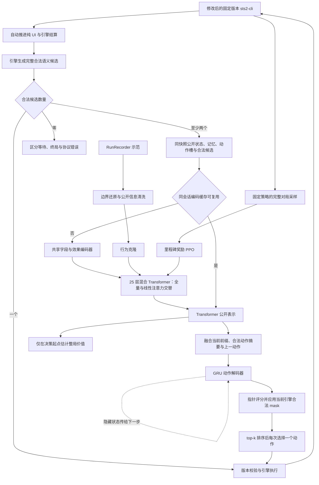

# STS2 新版架构设计

状态：**v1 架构定稿，目标为单张 RTX PRO 6000 Blackwell Workstation Edition；实现与训练／性能验收尚未完成。** 硬件默认配置以第 11.7 节及[定稿配置](specs/architecture_rtx_pro_6000_v1.json)为准；第 11.2、11.6 节中的其他技术作为后续对照，不同时启用。

动作规格与逐项核对入口：[动作／效果／目标编码](ACTION_ENCODING.md)、[全流程动作及接口映射](ACTION_CATALOG.md)、[57 个问号事件](EVENT_ACTIONS.md)、[开局与远古之民](ANCIENT_ACTIONS.md)。事件清单已按固定 CLI 与本机游戏 DLL 做静态核对；效果程序为表示层设计，完整内容注册、人工审核及 headless 运行验收另行记录。

本方案围绕游戏任务与结构化轨迹设计。**明确使用并修改 sts2-cli 作为训练和部署的游戏执行引擎：由引擎提供完整合法候选动作列表，模型只在存在多个语义候选时选择。** 固定 A10 难度、五角色共享约 1B 模型、严格玩家视角、采用局内里程碑奖励，最终验收目标是击败第三幕 Boss。难度只在数据契约中校验，不输入模型。

## 1. 先确定架构的主线

**修改后的 sts2-cli 推进到语义决策边界 → 自动执行唯一合法动作 → 多候选时由全量／线性注意力交替的 Transformer 联合编码 → GRU 结合当前信息和上一步隐藏状态逐项解码 → 引擎合法 mask 后排序并选择一个动作。** 价值头从决策起点的公开表示估计整局回报。纯 UI 操作由环境自动完成；选牌、出牌、路线、购买、事件交互，以及结束／跳过等有游戏后果的选择属于语义动作。状态实体与公开动作槽共同进入主干，在同一层共享 Q/K/V、输出投影和 FFN 参数。

训练采用少量示范行为克隆，再进行分阶段奖励的整局 PPO。战斗、幕 Boss、整局胜利产生不同级别的奖励，所有决策使用同一条整局回报。约 10 条轨迹是启动预算，模型容量与样本覆盖分别验收。即使尚无通关样本，也可以通过不同进度的阶段奖励进行 PPO 试点；是否有效由新种子上的进度和通关表现判断。



第一版采用一个策略、一个整局累计奖励 V。分阶段指奖励的结算时机，不表示切断战斗与战略的回报。模型输入决策阶段，用于理解相同选择在不同场景的含义。

## 2. 示范数据要求与审计边界

示范可由 RunRecorder 等记录器采集。游戏版本、记录 schema、难度、角色和完整性需要逐局校验；数据存储位置由运行环境配置，不写入公开文档。

| 检查项 | 要求 |
| --- | --- |
| 覆盖范围 | 五角色、固定 A10，覆盖战斗与局外决策 |
| 初始规模 | 约 10 条完整轨迹，每角色约 2 条，尽量覆盖不同牌组和路线 |
| 整局边界 | 从开局开始，具有明确终局；未完成操作需要单独审计 |
| 片段处理 | 文件数不等于独立对局数；同一对局的多个片段不能未经检查直接拼接 |
| 决策完整性 | 检查序号、重复操作、状态捕获错误、父子选择关系与候选覆盖 |
| 来源标记 | 保留人类、求解器和系统行为的类别，具体对局标识仅用于内部数据管理 |

`uncommitted_operations` 是完整性标记，不直接等于丢失的有效决策数。即使片段的 `run_id` 相同，也需要证明边界连续、没有回退或重叠，才可传播完整对局标签。

原始操作条数不等于可训练样本数。纯 UI 和唯一候选的自动步骤保留为环境轨迹，不计入策略样本；重复语义、候选无法恢复和状态含选择答案的记录应隔离。JSON 结构检查通过，也不证明每个快照都是正确的决策时刻。

胜利轨迹帮助启动；失败轨迹中的每步动作并不一定错误。只有成功结局的数据不能用于声称价值模型已经校准。原始日志、具体对局标识及逐文件审计记录应独立存储，公开文档保留数据要求和审计方法。

## 3. 系统边界与公开信息契约

将系统拆为六个职责明确的模块：

| 模块 | 输出 | 不承担的职责 |
| --- | --- | --- |
| sts2-cli / EngineAdapter | 引擎内的决策边界、完整合法候选、选择会话、执行校验和公开事件 | 不在 Python 或模型侧另写一套合法性规则，不为模型挑选“好动作” |
| EnvironmentRunner | 推进纯 UI／结算、执行唯一候选、仅将多候选分支送推理队列、收集转移 | 不替模型决定购买、跳过、提前结束或事件结果 |
| PublicObservation | 白名单公开状态、可见性与公开历史摘要 | 不直接序列化整个游戏对象 |
| Representation | 实体、实体引用、地图关系、候选特征 | 不读取 seed 或预测实际随机结果 |
| PolicyValue | Transformer 表示、GRU 会话解码、合法候选分布和整局价值估计 | 不生成自由格式引擎命令，不自行判断合法性 |
| Dataset/Learner | BC 样本、当前策略 rollout、训练与评测 | 不把示范伪装成 on-policy 数据 |

### 3.1 sts2-cli 的使用方式与必要修改

本项目维护的引擎源码位于 [sts2-cli/](sts2-cli/README.md)，随 Spire-model 一起进行版本管理。上游基线与本地改动见 [UPSTREAM.md](sts2-cli/UPSTREAM.md)。当前已包含固定等待优化；下表的统一候选与决策协议仍需实现。

在 sts2-cli 的受控分支中实现环境协议，复用其 `Sts2Headless → sts2.dll + GodotStubs` 执行链。修改范围包括 C# 命令路由、决策检测、选择器与特殊事件的 headless 桥接；必要的桥接补丁必须保持原版规则、成本、随机结算和效果顺序。模型侧只消费协议，不根据卡牌文本、CLI 帮助或 UI 按钮自行拼候选。训练与部署使用同一个修改后的引擎及协议版本。

本次静态核对的 sts2-cli 基线为提交 `084d1aa3d8e118ca7ce8d8774ad16d6be9c92367`；对应源码位置相对于 sts2-cli 仓库。以下是待实现差异，不表示已经修改或完成游戏兼容性验证：

| 基线位置与现状 | 必要修改 |
| --- | --- |
| `src/Sts2Headless/Program.cs`、`RunSimulator.cs::ExecuteAction` 按动作名和参数分发 | 新增版本化决策帧、引擎生成的候选句柄及原子执行接口；普通动作枚举完整的合法参数绑定，如出牌与目标的组合 |
| `DetectDecisionPoint` 分别导出各阶段状态；`HeadlessCardSelector` 暴露 `min_select/max_select` | 增加统一候选提供器，覆盖卡牌、药水、路线、商店、奖励、营火、事件及子选择；候选生成与执行共享规则校验入口 |
| `DoSelectCards`／`ResolvePendingByIndices` 过滤无效索引后提交，未完整验证数量与重复；`DoSkipSelect` 直接清空选择 | 新增逐项选择会话，校验前缀、数量、重复、可完成性、结束及取消权限；非法命令不得悄悄截断、补选或转为跳过 |
| `HeadlessCardSelector` 已自动处理“单张且必须选”的局部情况 | 将唯一候选自动执行扩展到所有语义阶段，完整计入 STOP／跳过等备选；绕过整个 PolicyValue 推理 |
| `DoChooseOption` 已处理部分选牌／奖励／卡包等待；基线未见水晶球专用语义交互协议 | 统一挂起与恢复机制，补齐特殊事件候选提供器；不能把一般 `event_choice` 支持视为小游戏已兼容 |

游戏 build、sts2-cli 上游提交、修改后引擎提交、DLL／补丁哈希、协议版本和自动推进规则版本一起固定。原有调试命令如设置玩家属性、指定抽牌顺序、强制进入房间不进入合法候选。首版实现接口名称见第 7 节，均为新增设计。

### 3.2 公开信息边界

观测 $`x_t=(o_t,m_t)`$：$`o_t`$ 是当前公开信息，$`m_t`$ 只由此前公开观测、公开事件和自己的动作更新。外部摘要不保证完全消除部分可观测性；本版 GRU 只记忆当前选择会话。后续只有发现明确历史缺失时，才考虑跨环境决策的学习式记忆。

**允许输入：**当前可见卡牌及数值、公开状态、资源、公开遗物计数、当前敌人意图、已揭示地图、已观察敌人行动、已知抽牌堆组成，以及公开效果明确揭示且尚未失效的牌序。

**禁止输入：**随机 seed／RNG、未揭示牌序与房间结果、引擎隐藏 AI 状态、对象分配 ID、未来结果、下一状态、老师搜索树与分数。Actor 和 critic 使用相同的信息边界。对未知字段使用明确的 unknown/known mask，不能用零代替未知。

RunRecorder 原始记录含 seed，且明确标注 `draw_pile_order=engine_internal`。清洗时不仅要去掉顺序，还要审计每个字段及其上下文：

- 抽牌堆中的内部实例编号、数组下标不能成为排序的替代通道。仅对公开可区分的实例保留引用；无法公开区分的副本表示为数量或可交换实体。
- `saved_properties`、怪物 `move`、UI 反射对象不因出现在日志里就视为公开。逐类白名单到具体语义，默认不传入。
- 记录里奖励按钮对象可能已经包含尚未打开的牌面。只有实际揭示或历史中见过的奖励内容才能进入观测；若适配器自动查看免费信息，必须真实执行对应查看流程并统一训练／部署语义。
- `selected`、最终 `result`、动作携带的已选实体只能作为标签或解码前缀，不能反向填入选择前状态。尤其要检查选择提交钩子是否已包含答案。
- `actions_disabled` 可能反映求解器正在执行，而非规则不允许出牌。统一决策边界应在引擎稳定等待玩家时生成；不能把执行锁当作牌的合法性。
- 角色是输入；A10、版本、run_id、segment_id、teacher_source 是校验或审计元信息。老师来源不作为部署时缺失的特征。

为实体建立仅用于引用的局部句柄。模型读取“来源是第几个实体”的 gather 关系，不学习句柄整数的 embedding；重编号必须只改变引用，不改变输出语义。

验收原则：在相同公开历史下，两个玩家无法区分的内部状态，应产生相同公开观测、候选可见语义与策略分布（允许实体置换）。测试应包含隐藏牌序置换、内部 ID 重编号、隐藏 RNG 变化和未揭示奖励变化；当前公开合法性也必须保持相同。

## 4. 输入表示：先类型化，再做交互

不把整份 JSON 展开为长文本。一个可交互对象对应一个实体表示；每个公开动作槽也对应一个 action 实体，并由引擎逐步给出当前合法 mask。普通决策的动作槽就是合法候选，buffered 多选的固定公开槽集合见第 6 节。状态与动作共用字段 embedding、数值编码器、局部效果编码器和到主干的投影，用 entity_type、field_type 与关系角色区分语义。同一对象的不同用途通过关系表达。

| 实体 | 核心内容 |
| --- | --- |
| 全局与玩家 | 角色、幕、楼层、阶段、生命／上限、金币、能量、当前回合等 |
| 卡牌 | 内容 ID、升级等级、基础／当前能量与星星费用、X 费、升级预览、附魔／负面修改、临时关键词、目标相关公开预览、区域与引用 |
| 遗物／状态／药水 | 内容 ID、公开计数、层数、触发周期、剩余次数、耗尽状态、药水槽位与容量、所属实体与可用条件 |
| 敌人／召唤物 | 稳定公开引用、生命、格挡、能力、意图的单段／次数／总量、已观察行动与目标关系 |
| 角色机制 | 充能球及槽位顺序、星星、奥斯提等实际公开状态 |
| 地图节点 | 类型、层数、当前／已访问、图关系、规则下可选状态 |
| 决策选项 | 事件页／子阶段、奖励组、商店价格／库存、删牌服务、选择 min/max、已选前缀、剩余次数、来源／去向／范围、选后费用、结束／跳过／取消权限 |
| 特殊事件交互实体 | 公开图块／格子及位置关系、已揭示内容、可选模式、公开计数与已承诺待结算结果；未揭示内容保持 unknown |
| 历史摘要 | 精确公开计数器、已知牌序及有效期、已看奖励、选择来源链、必要行动历史与完整性标记 |
| 数值关系 | 带 known/applicable 的名义伤害／格挡余量、能量／星星／金币余量；不声称是模拟结果 |
| 奖励进度 | 当前幕非 Boss 奖励已用额度、已完成 Boss 里程碑；由公开历史维护，支持恢复 |
| 动作槽与合法性 | 决策类型、公开效果程序、角色化对象绑定、数值／随机域／后续选择／时机、可靠公开预览；共享编码器产生 action token；每步引擎 mask 决定可执行槽 |

实体表示：

```math
\begin{aligned}
e_i &= E_{\mathrm{type}} + E_{\mathrm{content}} + E_{\mathrm{zone}} \\
    &\quad + \mathrm{MLP}_{\mathrm{num}}(n_i,k_i) \\
    &\quad + \mathrm{EffectEncoder}(F_i)
           + \mathrm{ContextEncoder}(c_i).
\end{aligned}
```

数值按字段语义归一化，同时保留适当的线性幅值与压缩幅值，例如生命比例和绝对生命、费用数值与 X 费标志。未知、零、不可用必须分开。计数与数量要显式保留，避免集合平均把一张牌和多张牌编码成一样。

效果采用 [ACTION_ENCODING.md](ACTION_ENCODING.md) 的可组合程序：叶节点为 `操作原语、角色化对象绑定、数值/内容参数、原因与时机`，组合节点保留顺序、条件、重复、随机、后续玩家选择和持续触发。治疗 26 编成 HEAL＋数值26＋recipient=self；“获得随机药水”编码对象种类与公开生成规则，不能填入未揭示种类。“伤害敌人后给自己格挡”是两个分别绑定目标的有序节点，不能先把效果集合和目标集合分别求平均。

第一版以 **结构化效果程序＋动态参数／对象关系** 为动作语义主体，内容 ID 作补充；按钮标题不是效果表示。一个候选可包含多项成本与后果，局部编码后仍作为一个完整候选由 GRU 选择，不把原语拆成可随意组合的模型命令。已支付成本与子会话剩余后果分开；物品的获得、使用能力与被动触发分开。模板仅由已核对的公开规则登记，复杂未覆盖部分标记 partial/opaque 并统计，不以 ID 或空效果冒充完整解析。原始 `vars` 及旧 `CardEffects` 不等同于完整效果程序。

静态描述文本向量作为后续消融项，不作为首版依赖；首版以类型化对象和结构化效果程序为主体，再评估文本向量是否带来增益。静态描述不包含本局隐藏信息。内容表、效果表与规则版本都要记录哈希。

战斗手牌、充能球等只在顺序具有公开规则意义时加入位置。**抽牌堆、弃牌堆、消耗牌堆均完整纳入观测，默认按无序多重集合表示。** 第一版保留每张公开卡牌的实例 token 和所属牌堆标记，另有各堆的数量／完整性摘要；不先平均成一个向量，也不丢掉重复牌数量。同内容但升级、费用或修改不同的牌是不同实体。

三个牌堆都不使用数组顺序、列表下标、全局绝对位置编码或 RoPE 表示先后。明确揭示的抽牌顺序单独作为公开关系；已观察的“上一张弃掉／消耗的牌”属于事件历史，不把整个底层牌堆变成有序输入。未知内容只给公开数量和 unknown 标记。

牌堆中卡牌与手牌使用同一个内容／数值／效果编码器，并同样参与主干注意力。移入不同牌堆会改变 zone 特征；检索、回收或选牌候选通过关系引用对应实例。地图使用图关系；历史使用公开时间关系；实体在打包张量中的位置没有游戏语义。集合注意力与置换性质的背景见 [Set Transformer](https://arxiv.org/abs/1810.00825)。

## 5. 地图：保留完整 DAG，区分结构与实际可选性

任意两地图节点采用六类互斥关系：自身、正向直接、正向间接、反向直接、反向间接、互不可达。再编码带符号的层差：

```math
\begin{aligned}
\mathrm{score}_{ij}^{(h)} &= \frac{q_i^\top k_j}{\sqrt{d_h}} \\
 &\quad + b^{(h)}_{\mathrm{relation}(i,j)} \\
 &\quad + c^{(h)}_{\mathrm{bucket}(\mathrm{floor}_j-\mathrm{floor}_i)}.
\end{aligned}
```

这是针对本任务的设计，借鉴 [Graphormer 的结构注意力偏置](https://arxiv.org/abs/2106.05234)，不代表论文验证了 STS2 的这个关系划分。混合主干的 **13 个全量注意力层**在地图节点对上使用此偏置；12 个线性层通过前后全量层的实体表示接收关系信息，不将任意成对偏置硬塞进线性聚合。完整 DAG 和节点统计始终保留，首版不再堆叠独立大型地图网络。

节点增加入度、出度、相对当前层数，并明确分开：

1. 原始地图图结构上的后继／可达关系；
2. 当前公开规则和资源下可立即选择的节点；
3. 已访问、当前所在与玩家已知的内容。

特殊移动能力可能允许选择没有原始直接边的节点。因此动作合法性以引擎为准，不能只靠图邻接推断。普通路径的统计必须标为普通边统计，不冒充特殊规则下的最优路线。

可补充按未来层数分组的可达节点类型计数、最近营火／商店的图距离、单一路线上精英数量的 min/max。这些都是公开图上的确定性计算：汇合节点不重复计数；互斥分支不可相加成同一条路径。完整关系图负责保留“先营火后精英”的顺序信息，统计只是辅助。

不使用按时间的因果遮罩阻止读取已揭示的未来地图。地图随公开信息变化而更新；跨幕缓存按图版本失效。

## 6. 约 1B 混合注意力主干、GRU 动作解码器与整局价值头

模型目标约 **1B（10 亿）参数**。Transformer 按层交替使用全量注意力头和线性注意力头：同一层的 28 个头采用同一种机制，奇数层全量、偶数层线性，首尾均为全量层。Transformer 后接单层 GRU 动作解码器，替换原来直接对每个 action token 评分的 MLP 策略头。GRU 隐藏状态记录本次选择的解码历史，结合当前公开信息和上一动作，逐步生成下一动作分布。整局价值头单独保留，用于 PPO 的回报估计。

### 6.1 参数预算与联合编码

主干采用标准两矩阵 GELU FFN；以下为 v1 固定结构，完整参数量与吞吐仍需在实现后实测：

| 项目 | v1 定稿 |
| --- | --- |
| 联合主干 | 25 层，宽 1792，28 头，每头 64 维，FFN 7168，Pre-LN |
| 注意力排布 | `[Full, Linear] × 12 + [Full]`：全量层 1、3、…、25，线性层 2、4、…、24 |
| 全量层 | 双向全局 softmax attention，保留地图及角色化关系偏置；所有有效公开 token 可交互 |
| 线性层 | 双向核化线性 attention，固定 `φ(x)=ELU(x)+1`，每头特征维度 r=64；不按 token 打包顺序做因果扫描 |
| 主干规模 | 两类层均保留同尺寸 Q/K/V/O、FFN 和 norm，每层 `12*d² + 13*d`，加末端 norm；共 963,965,184 参数，不含另计的关系偏置 |
| 共享输入编码 | 状态与动作共用内容／字段 embedding、数值与 2 层局部效果编码器，局部宽 256，投影到 1792；预算约 6–12M |
| GRU | 单层 `GRUCell(input_size=1792, hidden_size=1792, bias=True)`；共 19,278,336 参数 |
| 解码读出与其他 | 当前前缀及上一动作投影、候选 key／GRU query 投影、价值头、引用融合和关系偏置等约 11–14M |
| 总规模 | 约 1.000–1.010B；按最终注册表和实际模块清点，不把 GRU 排除在 1B 预算外 |
| 联合 token | 全局／价值 token＋状态实体＋公开记忆＋牌堆摘要＋本次解码动作槽 |
| 策略输出 | GRU 隐藏状态生成 query，对动作槽做指针式评分；引擎合法 mask 后得到分布与 top-k 排序，每次只执行一个 |
| 价值输出 | 决策起点的公开状态、合法动作摘要及前缀→MLP→线性标量，预测未来累计阶段奖励 |
| 角色共享 | 五角色同一 Transformer、GRU 和读出投影；角色作为全局条件 |
| 随机层 | Transformer 与 GRU 首版 dropout=0，保证 PPO 概率重算一致 |

两类层只改变 attention 聚合算子，固定核映射不增加可训练矩阵；各层参数独立，层内状态与动作共用参数，因此总预算仍约 1B。模型配置记录 `attention_schedule`、`linear_feature_map`、r、分母稳定项及关系偏置作用层。交替排布属于训练架构，不能在推理时把已训练的全量层临时换成线性层，或按输入长度切换两种数学定义。

交替排布作用于 25 层联合主干。宽 256、2 层的局部效果编码器继续使用全量注意力，处理小规模程序节点及其顺序／绑定关系；其参数仍计入共享输入编码预算。

GRU 的预算由 `3*d_in*d_h + 3*d_h² + 6*d_h` 得到；权重和 bias 的形状按 [PyTorch GRUCell 文档](https://docs.pytorch.org/docs/2.14/generated/torch.nn.GRUCell.html) 核对。

设共享局部编码器为 E，本次解码可表示的公开动作槽集合为 U，联合编码为：

```math
\begin{aligned}
X &= [e_{\mathrm{value}},E(s_1),\ldots,E(s_N), \\
  &\qquad E(a_1),\ldots,E(a_{|U|})], \\
H &= T_\theta(X;B), \qquad c=h_{\mathrm{value}}.
\end{aligned}
```

普通单步决策的 U 就是当前合法动作集；buffered 多选的 U 是引擎给出的本会话公开动作槽，包括公开可选元素及 STOP 等控制项。**动作槽可被表示不等于当前可执行**：例如恰选 5 张时 STOP 有表示，但在满足数量前必须被屏蔽。槽只来自已经公开的元素及已知规则控制项，不能预存未来才揭示的卡牌、事件结果或隐藏目标。每一步真正可执行的集合始终是引擎返回的合法候选 A_k。

共享 E 处理语义字段与效果，type、verb、operation 和 known/applicable mask 区分状态与动作；来源／目标按角色化引用融合，不复制整份状态。候选没有来源或目标时用明确的空引用。两类 attention 都是双向联合交互；全量层的关系 B 包括地图、动作→来源／目标／选项及反向关系、卡牌→牌堆等。线性层继续读取已有关系化实体表示；不使用动作槽打包位置或内部句柄整数的 embedding。

**全量层：**每个头使用 `softmax(QKᵀ/√64 + B + M_pad)V`，全局关注全部有效公开状态和动作槽。全量不等于必须在显存中生成完整注意力矩阵；融合内核可以分块计算相同语义的结果。这里的 `M_pad` 只排除 padding／不同样本，不是 GRU 最终输出的合法动作 mask。

**线性层：**采用非因果的正值核聚合，先对本样本所有有效 token 汇总，再计算每个 query 的输出。其形式参考 [Linear Transformers 原论文](https://proceedings.mlr.press/v119/katharopoulos20a/katharopoulos20a.pdf)，本项目按公开实体集合使用双向版本：

```math
\begin{aligned}
\phi(x)&=\operatorname{ELU}(x)+1, \\
S_h&=\sum_{j\in\mathcal{V}}\phi(k_{j,h})v_{j,h}^{\top}, \\
z_h&=\sum_{j\in\mathcal{V}}\phi(k_{j,h}), \\
o_{i,h}&=\frac{\phi(q_{i,h})^{\top}S_h}
 {\max(\phi(q_{i,h})^{\top}z_h,\epsilon)},
\qquad \epsilon=10^{-6}.
\end{aligned}
```

其中 $`\mathcal{V}`$ 表示本样本的有效 token 集合，r 与 value 头宽均为 64；S_h 为 64×64，z_h 为 64 维。padding 必须从两个求和中显式排除，仅把其输入置零不够，因为 `φ(0)=1`。不同对局分别聚合，padding query 的输出清零。核映射、累加和归一化使用 FP32，分母设置下界并检查有限值，再转换回主干精度；mask 后暂不可执行但已公开的动作槽仍是有效输入，不被当作 padding 删除。

任意成对关系偏置一般不能分解进上述两个求和，线性层不构建 N×N 关系分数矩阵；关系精确交互由交替的全量层承担。两类层都不引入牌堆／候选的虚构顺序。线性核是本模型的独立注意力定义，不与 softmax attention 声称数值等价；应从同一混合架构开始训练，并按第 12 节验证表达能力与通关表现。

### 6.2 当前信息、GRU 隐藏状态与逐步合法 mask

每一步先取引擎的新合法候选，再映射到 U 得到二值 mask `m_k`，其中 1 表示可执行。GRU 的当前输入包含：Transformer 全局表示 c、当前合法动作表示的集合摘要、已选前缀／剩余数量／阶段等公开特征 p_k，以及上一实际动作的语义表示 e_prev。仅传相同的 c 和上一步隐藏状态不够：上一动作是在产生隐藏状态之后才选出的，必须将实际选中结果反馈到下一步。

对于需要模型选择的步骤，定义：

```math
\begin{aligned}
\bar h_k &= \frac{1}{|A_k|}\sum_{a\in A_k}h_a, \\
u_k &= \mathrm{LN}(c+\bar h_k+W_p p_k+W_e e_{\mathrm{prev}}), \\
h^D_k &= \mathrm{GRUCell}(u_k,h^D_{k-1}), \\
q_k &= W_q h^D_k, \qquad v_a=W_K h_a, \\
\ell_{k,a} &= \frac{q_k^\top v_a}{\sqrt{1792}}, \\
\tilde\ell_{k,a} &=
\begin{cases}
\ell_{k,a}, & m_{k,a}=1,\\
-\infty, & m_{k,a}=0,
\end{cases} \\
\pi_\theta(a\mid x,a_{\lt k},A_k)
&=\mathrm{softmax}(\tilde\ell_k)_a.
\end{aligned}
```

p_k 为宽 256 的共享局部编码，包含已选实体集合／有序前缀、准确数量、min/max、可结束标记、剩余要求、期间强制动作摘要与公开操作上下文；数量显式编码，不由平均向量猜测。初始隐藏状态 `h^D_0=0`，无上一动作时使用 BOS 表示。输出维度由当前动作槽数量决定，GRU 后保留必要的 query／key 投影，替换的是原独立逐候选 MLP 策略头。mask 由引擎生成，不由 GRU 预测。

top-k 只表示屏蔽后的本步候选排序，取 `k_eff=min(k, |A_k|)`；每次从本步分布选择并执行一个动作，再请求引擎更新候选。训练 rollout 从**完整合法分布**采样，默认推理取 top-1，top-k 可供查看排序；不一次执行 k 个动作，也不从第一次排序直接拿前五张完成“10 选 5”。首版不进行多分支搜索，不用 top-k 截断训练分布；实际采样方式随策略版本记录。

STOP 与选牌动作共用评分和 mask：强制选够前 `m_STOP=0`，满足最低要求后按引擎结果置 1。净化选两张后，STOP 与剩余可选牌共同竞争；选 STOP 提交已选两张。若只剩一个合法候选，包括强制 STOP，则直接执行，Transformer、GRU、读出和价值头都不调用。

候选重排时，表示、mask、上一动作引用及选择前缀引用同步置换，同一步概率应等变、映射回语义动作后不变；padding 在 attention、集合摘要、softmax 和 top-k 中都排除。GRU 沿实际选择步骤递归，不沿候选数组下标递归。第一版不训练未选动作 Q。

### 6.3 多选循环、缓存与隐藏状态边界

对没有中间结算的 buffered 多选，首次需要模型选择时编码一次公开状态及完整公开动作槽。后续若只改变已选前缀和合法性，保持 H 不变，把新 p_k、新 mask 和上一动作反馈给 GRU。动态前缀和当前合法 mask 不写回这份缓存的 Transformer 输入；更新它们应改变 GRU 输入和输出分布。

缓存复用需要引擎确认基础公开状态、动作槽语义、费用／效果及关系不变。出现新增槽、公开属性或预览变化时重新编码，并在同一 buffered 会话内保留 GRU 隐藏状态；真实游戏结算或信息揭示则结束当前解码段，在新环境边界重新编码并初始化 GRU。不能在输入已变的情况下仍复用原先双向 attention 的 H。缓存按基础状态、动作槽／关系、模型／混合注意力配置、精度与内核配置标识，而不是把所有前缀变化都当作基础状态变化。

因此，静态“10 选 5”是 **1 次 Transformer＋5 次 GRU 分支调用＋强制提交零调用**。净化选两张后主动结束，在三个步骤均有多个候选的情况下是 **1 次 Transformer＋3 次 GRU**；第三次 GRU 选择 STOP。下一选择受真实揭示影响的场景，例如水晶球下一次占卜，每次重新编码公开状态，不能靠旧 H 推测新结果。

GRU 隐藏状态的作用域是一次 buffered 选择／解码段。普通单步动作只解码一次；提交、取消、真实结算、新的子会话或对局结束时清空，父子会话不共享可变隐藏状态。它不是跨整局的记忆网络，长期公开信息仍由 PublicObservation 的历史摘要承担。

若同一会话中间出现唯一候选，环境直接执行并保留当前隐藏状态，不为更新 GRU 而额外前向。引擎记录这些强制步骤；下一次出现分支时，当前前缀包含全部已发生选择，并提供上一实际动作及期间强制动作的公开摘要。此时才编码补充信息并继续 GRU；不能漏掉强制选择，也不能向策略样本插入概率为 1 的伪决策。

### 6.4 价值估计与资源预算

价值头使用首次模型分支处的 c、当前合法动作摘要和前缀特征，输出线性标量 `V=g(c, mean_legal(H), p_start)`；不使用 sigmoid。宏动作只监督起点 V，不能拿选择后的隐藏状态或最终集合来预测选择前价值。Actor 与 V 共享 Transformer，动作损失通过 GRU 和指针读出回传；价值损失更新主干及价值头，默认不经 GRU。优势中的旧 V 必须 detach。

按约 1B 估算，单独导出的 BF16 权重约 2GB。v1 训练与 rollout 共用一份 FP32 参数，在前向使用 BF16 autocast；FP32 参数约 4GB、梯度约 4GB、两份 FP32 Adam 状态约 8GB，基础存储约 16GB，均为十进制粗算。还需计入 autocast 权重转换／缓存、激活、Transformer 输出缓存、GRU 展开图和临时张量，16GB 不是峰值。采样与更新分阶段执行，保存旧概率／V 后不保留第二份完整旧策略。实际峰值按第 11.7 节预算验收。GELU 的两矩阵 FFN 与上述参数预算绑定；改用 SwiGLU 时须升架构版本并重新计算。

## 7. 动作协议与组合选择

### 7.1 动作边界按游戏语义划分

模型的选择必须改变游戏状态、承诺一个游戏结果，或决定有规则意义的信息揭示；多选前缀则是构造最终语义动作的一部分。是否点击按钮、打开新界面或切换页面，不是划分标准。

| 场景 | 交给模型的语义候选（存在多个时） | 环境自动执行 |
| --- | --- | --- |
| 地图与商店 | 选择通往哪个节点；购买、删牌、使用药水、放弃剩余购买机会并离开 | 已选中商店节点后的进入／打开商店界面，切换查看库存 |
| 战斗 | 出牌及目标、使用／丢弃药水、结束回合 | 动画、敌人回合、已选动作的结算，以及唯一合法候选 |
| 奖励／营火 | 选择卡牌、跳过奖励、选择休息或锻造、升级哪张牌 | 打开奖励面板、无额外选择的确认、完成后返回路线界面 |
| 选牌效果 | 选哪张、是否继续选、是否结束并提交当前已选集合 | 达到强制结束条件后的提交与关闭窗口 |
| 特殊事件 | 付费／接受代价的事件选项、占卜方式、图块或目标、规则允许的提前退出 | 打开小游戏、说明页、动画、无选择的结算与页面推进 |

“离开商店”“跳过奖励”“结束回合”会放弃机会或推进规则状态，即使未立刻改变生命／金币也必须保留。界面上名为“继续／确认”的按钮若实际支付代价、接受结果或放弃选择，同样是语义候选。相反，仅确认已经作出的选择不得再制造一个模型步骤。

纯 UI 自动推进采用引擎侧显式分类和白名单：操作不得自行选择结果、支付可选成本或放弃机会。免费查看信息也必须通过实际游戏流程公开，统一训练与部署时机；付费、消耗次数或彼此排斥的信息揭示仍是决策。对于购买顺序、奖励领取顺序等可能影响后续状态的情况，不能因“通常没有区别”而自动排序。严格等价的执行别名由引擎去重，不能用相同名称、相同预期收益或隐藏结果来判定等价。

### 7.2 引擎提供的决策包和执行接口

以下为修改后的 sts2-cli 新增协议，而非已有 CLI 命令。普通动作枚举完整参数绑定后的候选，例如 `PLAY_CARD(card_ref, target_ref)`；组合选择枚举当前前缀下的下一步候选。模型只返回一个候选引用。

```text
DecisionFrame
  contract: game_build, engine_commit, patch_hash, adapter_version,
            observation_schema, action_schema, auto_advance_version,
            content_hash, effect_schema_version, effect_registry_hash,
            memory_version, fixed_ascension=10
  boundary: decision | waiting | terminal | error
  routing: episode_id, decision_id, state_version,
           selection_id?, parent_decision_id?, selection_revision?,
           base_public_version?, action_bank_version?       # 不输入模型
  public: phase, entities, relations, memory
          selection_context?, event_context?, decoder_bank?
  legal: candidates[]                                    # 引擎完整枚举
    candidate: verb, operation, source_refs, target_refs, option_refs,
               semantic_program, effect_coverage, public_previews, known_masks
               public_costs -> semantic_program 中成本节点的索引视图
  execution: candidate_ref -> opaque_handle -> engine_command # 不输入模型
             candidate_ref -> decoder_slot_ref             # 仅作引用映射

SelectionContext
  operation, source_ref, destination, scope
  mode: buffered | incremental
  selected_refs, selected_count, min_total, max_total
  order_matters, repetition_allowed
  can_finish, can_skip, can_cancel, remaining_required
  stage, step_index, remaining_steps?, public_constraints

EventContext
  event_type, stage, public_modes, public_cells, public_relations,
  revealed_results, remaining_uses, committed_results
```

协议操作为 `advance_to_boundary()` 和 `execute_candidate(decision_id, state_version, candidate_ref, selection_revision?)`。前者推进已确定的规则流程及纯 UI，到下一个稳定选择边界／终局；后者原子校验候选所属帧、前缀版本和当前合法性，再执行对应命令。返回转移事件及新边界。选择前缀发生变化也更新版本，即使尚未改变牌堆；旧帧和重复命令不能再次消费资源。

`semantic_program` 是公开规则的表示，不是另一个执行器。语义结构见 [编码方案](ACTION_ENCODING.md)；原接口 verb 保留路由用途，模型通过程序理解分支后果。随机、选择及触发节点不提前执行；全部执行与合法性仍以固定引擎为准。

公开观测与候选来自同一个稳定快照。候选生成复用引擎实际执行时的合法性判断，不由模型侧从 `can_play`、费用、min/max 重新推断。所有当前可行的目标、替代奖励、结束与跳过都要覆盖；动态组合约束由引擎在每个前缀重新计算。候选查询不执行试探动作、不消耗 RNG，也不泄露未公开结果。执行前的版本检查不通过则重新取帧，禁止拿旧候选在新状态中重试。

`can_finish/can_skip/can_cancel` 是用于解释候选的公开字段，最终执行权以候选列表为准，二者必须一致。候选数按完整语义列表统计，包含结束和跳过；“只剩一张可选牌，但还可以不选”是两个候选。未知阶段、稳定决策边界的空候选集和协议矛盾均报环境错误；引擎正在结算时返回 `waiting`，不能伪装成空决策或强制结束回合。

`decoder_bank` 是 buffered 会话中已公开的元素／控制项表示池，由引擎输出并版本化；它不是当前合法集。每步根据 `legal.candidates` 到槽的引用映射构造 mask，只有有当前候选绑定的槽才能执行。已选牌和暂不可用的 STOP 可以保留槽表示，但 mask 为 0。公开槽无法覆盖新候选时刷新表示池并重编码，禁止丢掉候选或沿用上一 mask。`selection_revision` 每个前缀都变；基础公开内容未变时，`base_public_version/action_bank_version` 可以不变以支持第 6.3 节缓存。

### 7.3 唯一候选直通与自动推进循环

EnvironmentRunner 在发起任何 PolicyValue 前向前执行以下流程；多选前缀和特殊事件使用相同规则：

```text
frame, events = engine.advance_to_boundary()
循环：
  记录 events，更新公开记忆、奖励账本和待完成转移
  若 terminal：结束对局并结算待完成转移
  若 waiting：
    frame, events = engine.advance_to_boundary()
    继续循环；超时记录为 unresolved
  若 error 或 decision 且候选数为 0：隔离并报告，停止当前环境
  若候选数为 1：
    记录 origin=forced
    frame, events = engine.execute_candidate(当前帧版本, 唯一候选)
    继续循环
  若候选数 >= 2：
    更新当前合法 mask、公开前缀及上一实际动作
    首次分支／缓存失效时运行 Transformer；按会话边界初始化或沿用 GRU 状态
    GRU 单步解码，屏蔽非法槽，排序／采样并只选择一个动作
    记录所选候选、概率、会话状态及 origin=policy
    frame, events = engine.execute_candidate(当前帧版本, 所选候选)
    继续循环
```

自动执行唯一候选时，**不调用 Transformer、GRU、动作读出或价值头**，也不构造只有一个候选的 GPU 推理请求；隐藏状态与强制步骤按第 6.3 节衔接。自动链保留操作、事件、版本和因果来源，但不是独立 BC／PPO 策略样本；其条件概率为 1，log-prob 为 0。纯 UI 标记 `origin=ui_auto`，模型分支标记 `origin=policy`。

自动执行不能丢失死亡、战斗胜利、公开信息揭示或嵌套子选择；每次推进后重新检查边界。界面或选项数不变不表示没有进展，应检查引擎事件、会话版本及明确的结束状态。重复无进展与工程步数超限进入诊断／unresolved，不得默认选第一项或强制离开事件。

### 7.4 逐项选择、强制数量与提前结束

采用引擎持有的 `SelectionSession`，把“10 选 5”等多选表达为一次选一项的过程，不枚举全部组合，也不让模型输出任意数组。每次选择后引擎返回更新后的已选前缀、公开约束和完整下一步候选。操作上下文必须区分消耗、弃置、永久移除、升级、复制、排序等，不能只有通用 `select_card` 而丢失来源与去向。

| 候选 | 精确定义 |
| --- | --- |
| `SELECT_ONE(ref)` | 加入一个当前合法元素；禁止重复时，引擎从后续候选中移除该实例 |
| `FINISH_SELECTION`（下文记作 STOP） | 提交当前已选集合／序列并结束；仅在当前前缀已经满足全部提交条件时出现 |
| `SKIP` | 在来源规则允许时放弃整个选择／机会；不是“提交已经选中的两张” |
| `CANCEL` | 仅在游戏明确允许撤销时返回父阶段，并按实际规则处理已支付成本；不可凭空提供回退 |

空集合提交若与 SKIP 的后果完全相同，仅保留一个候选；若成本、来源或后续流程不同则分别保留。`min_total/max_total` 是本会话总数量界限；`remaining_required` 表示尚缺的强制数量。它们不足以描述的类型配额、互斥、顺序和依赖约束由引擎维护。每个 buffered 前缀必须能补全为合法提交；不能选择后陷入既不能继续也不能结束的状态。

仅用于编辑未提交前缀的撤选、返回上一层 UI 不进入策略动作；CANCEL 只用于原规则中具有成本或后续机会差异的取消。若引擎可证明无序 buffered 选择只存在一个合法最终结果（例如必须选取全部剩余牌，且没有取消／替代结果），直接返回唯一的强制完成候选并执行，避免把没有后果差异的选取顺序交给模型。

**精确 10 选 5：**在十张公开可区分、均可独立选择且不允许重复或取消的例子中，`min_total=max_total=5`。候选依次为 10、9、8、7、6 个 `SELECT_ONE`，每次只选一张；选到第五张之前不提供 STOP／SKIP。第五张选完后只剩 `FINISH_SELECTION`，直接自动提交。若某一步仅有一个符合约束的选择，也直接执行；若原效果规定候选不足时全选，按引擎规则处理，适配器不能擅自降低 min。

**净化“消耗最多 3 张手牌”：**按本例的效果值，`operation=exhaust`、`scope=hand`、`min_total=0`、`max_total=3`。开始时可零张结束；选一张或两张后，合法集同时包含可继续选择的手牌和 STOP。选到两张时，模型可以选择 STOP，提交且只消耗这两张；绝不能把 STOP 实现为清空选择，也不能强制补足第三张。选到三张后 STOP 成为唯一候选并自动执行。数量来自当前卡牌效果与引擎约束，不按“净化”名称固定写死；如升级改变上限，使用实际值。

**必须选与可少选分别编码：**恰选 N 张在 N 之前不可结束；至少 1、最多 3 张在第一张之前无 STOP，之后可结束；最多 3 张允许 0～3 张。即使候选池只剩一张，可选效果仍有“选这张”和“结束”两条路径。达到上限、没有剩余合法元素且提交有效时，自动提交；提交无效且无候选则是规则／协议错误，不伪造跳过。

会话区分两类实际执行语义：

- `buffered`：每次选择只更新待提交前缀，不提前消耗／移除卡牌；STOP 或强制完成后一次提交给原版效果。父动作已支付的费用不重复支付，也不因子选择结束自动退还。
- `incremental`：原规则本来就是“先选 1、结算，再选 1”，每一步按原版时机生效。新选择、可见结果或资源变化形成新的环境决策；不能把数次单选拼成一次批量提交。是否可提前终止由当前步骤的引擎候选决定。

因此，相似的“选五次”界面未必具有同一种概率与结算边界。协议按效果语义标记 mode，不能按按钮数量或相同标题推测。

### 7.5 特殊事件与嵌套选择兼容性

在 sts2-cli 增加统一的 `PendingInteraction` 协议和按事件／阶段注册的候选提供器。通用选牌、奖励、卡包继续复用公共选择会话；图块、空间范围、排序、模式切换等保留对应实体与关系。事件提供器负责从真实事件状态生成公开观测、合法候选和执行绑定；模型侧不维护事件专属控制脚本。

**水晶球占卜作为首批必过案例。** 已对本机 `v0.111.0 / 41cef1ea` 的事件、小游戏与原 UI 做静态核对：图板为 11×11，两种占卜均消耗 1 次；小幅清除一个格，大幅清除中心周围裁剪到板内的 3×3；点击中心必须仍隐藏；没有提前领取退出动作。完整揭示诅咒时立即加入 Doubt，其余物品按结束奖励流程处理。具体合法集、公开片段与验收条目见 [事件清单第 4 节](EVENT_ACTIONS.md#4-水晶球必须逐项实现的完整交互)。这些规则尚待 headless 桥接与运行验收，不能只凭中文文案实现。

按以下阶段接入和验收：

1. 选择入场方案是语义决策，成本和承诺来自引擎；打开水晶球界面与说明页自动完成。
2. 引擎暴露当前公开图块位置、已揭示状态、剩余次数和合法占卜方式。未揭示图块的内部内容／预先生成结果不进入观测、候选特征或候选排序。
3. 一次占卜优先枚举完整的 `DIVINE(mode, target_ref)` 候选；仅 UI 上先切换模式再点击目标时，由引擎组合执行。若选择模式本身立即产生规则效果或揭示新信息，才以父子决策阶段表达。模式或位置影响范围／消耗／结果时，必须保留该选择，不能当作“点击 UI”自动代选。
4. 执行后先由引擎真实揭示并结算，再更新公开记忆和后续合法候选。后一次占卜是看到新信息后的新决策，不能提前一次性选完全部位置。
5. 次数用尽后，按原事件流程自动结算已确定结果；若触发选牌、奖励或其他子选择，挂起事件直到子选择完成。只有规则允许提前结束时才提供对应候选。

通用嵌套流程为 `父动作 → pending 子交互 → 子交互结束 → 恢复原 continuation → 下一交互／父动作完成`。路由保存父决策和选择会话标识，模型读取公开来源链而非内部句柄。恢复不能再次执行父动作或重复扣费；不得按“选项数没变”强制结束事件，也不能通过超时自动接受默认结果。暂不支持的事件阶段必须显式报告 `unsupported_interaction`，补齐后再纳入整局验收，不能悄悄跳过事件并宣称兼容。

### 7.6 选择轨迹与 BC／PPO 概率

**仅缓冲前缀、提交前没有中间游戏效果或新公开信息的多选**，作为一个宏动作。令 $`z=(a_1,\ldots,a_K)`$ 为实际逐项选择轨迹，包含可选 STOP；用整条轨迹的联合概率：

```math
\log \pi(z \mid x)
=\sum_{k:\,|A_k|>1} \log \pi(a_k \mid x,a_{\lt k},A_k).
```

其中 $`A_k`$ 是引擎返回的该前缀合法集合；唯一候选（包括强制 STOP）的 log-prob 为 0，直接执行。无序子集允许多个选择顺序，协议不为消除排列而删除其他当前合法元素；上式是**选择轨迹概率，不是最终无序集合概率**。同一集合的概率是所有对应轨迹概率之和。PPO 以实际采样轨迹为动作，不把某一个顺序的概率冒充集合概率，也不枚举所有排列。

对于无序选择，显式前缀特征表达“已选集合及数量”；GRU 仍按实际选择顺序递归，所以同一集合经不同路径得到的隐藏状态可以不同，不额外宣称路径置换不变。日志保留实际动作序列、上一动作、逐步 mask 及重置边界用于重算。仅记录最终集合的旧示范，在确认 buffered 且无中间信息后，才可按稳定公开顺序生成一条合法标签路径，并标记为重建路径；这只是 BC 的一种路径标签。公开语义完全相同的副本按数量或等价类处理，不使用隐藏实例 ID 排序。

每个需要模型选择的前缀，使用第 6 节的 `Transformer 表示＋当前前缀／合法 mask＋上一动作＋GRU 隐藏状态` 计算条件分布。符合条件的 buffered 会话复用 H，GRU 逐步展开；真实结算或新公开信息按环境边界重新编码与重置。宏动作 V 使用自动前缀推进后首次多候选分支的公开表示；若整次选择没有分支，则不产生模型样本。后续前缀不增加价值训练目标。

BC 使用 teacher forcing：将真实上一动作送入下一步，累加所有分支的负 log-prob。PPO 用宏动作完整的新旧轨迹概率比做一次 clip；采样来自完整合法 softmax，不来自截断 top-k。保存全部前缀、槽映射、mask、自动步骤、缓存失效和会话重置边界。更新时用当前参数从 BOS／零隐藏状态重放整条实际选择序列，得到新的隐藏状态和 log-prob；不能直接用 rollout 保存的旧隐藏状态计算新策略概率，也不能对每个前缀单独清零。

宏动作内部对 GRU 完整反向传播，梯度经共享 H 回到 Transformer；不把每步隐藏状态 detach 后仍声称训练完整多选依赖。训练按完整选择会话分桶，长会话使用 checkpointing／重算，分块存储不改变递归边界。缓冲前缀不额外给予游戏奖励或折扣。`incremental` 的真实结算步骤、水晶球每次揭示以及父动作触发的新选择会话分别形成环境边界，按实际多候选决策记录样本；不能把后续信息回填父决策，也不能只因换了一层 UI 就拆分同一次 buffered 选择。

合法动作屏蔽与策略梯度兼容，但前提是采样与更新使用同一合法集合语义；参见 [invalid action masking 研究](https://arxiv.org/abs/2006.14171)。

## 8. 轨迹转换与行为克隆

保留不可变原始日志，另产出与在线推理相同 schema 的数据。记录器格式与模型格式分开版本管理。

转换流程：

1. 按 run_id 分组、segment_id 保留边界，验证版本、A10、角色、结局和记录完整性。
2. v1 配对动作生命周期，区分 UI 尝试、预览、真正提交；v2 按操作依赖和开始顺序恢复父子关系，不能把文件完成顺序当作决策顺序。
3. 按第 7 节还原语义边界，区分纯 UI、唯一候选自动执行、buffered 前缀和 incremental 子决策。父操作不能因为等待子选择而重复成为两个执行动作。
4. 使用决策当时的公开状态和历史构建观测。标签来自最终选择；不读取 next_state 来补充候选信息。
5. 通过记录的引擎候选或经验证的同版本重放恢复完整合法候选及每步前缀，包含 STOP／SKIP 等替代项。候选不完整、索引有歧义、选择前状态含答案的样本隔离；不能将已选动作临时插入候选来使数据“通过”。
6. 只将多候选分支及包含分支的 buffered 宏动作生成 BC 标签；强制步骤与纯 UI 保留在环境事件链中，不按人类点击次数生成训练权重。
7. 分别统计每角色、幕、阶段、动作类型的有效覆盖、自动步骤数量及丢弃原因，单列特殊事件和提前结束的覆盖。

当前快照不是可恢复的完整引擎存档。相同 seed 也不能自动保证跨 Steam／headless／Mod 的重放一致。用重放恢复训练样本前，必须逐决策验证公开状态与动作语义；分歧后的记录不能继续当作精确重放。

BC 按角色、阶段分层，避免数千次出牌淹没少数路线、商店和选牌。阶段权重只用于示范训练，不自动带入 PPO 改变通关目标。留出单位是完整 run/seed，不能随机拆同局的相邻步骤到训练和验证；同一局不同片段必须在同一侧。

约 10 条数据下，离线验证的统计能力很有限。可以做按整局分组的交叉验证，同时使用独立的新 seed 实机评测；角色没有足够多局时明确报告无法估计其离线泛化。

CombatSolver 等教师来源应单独保留以供审计；actor 标签本身不证明求解器的信息访问范围。自动扩增教师数据前，需验证它只依赖公开观测／公开规则；不能假定移除学生输入里的隐藏字段，就证明教师决策也符合严格玩家视角。未核实的示范应标记 teacher_visibility=unverified，不作为信息边界合规的证明。

示范用于策略行为克隆。教师轨迹的累计里程碑奖励不能直接视为新策略的价值真值，因为后续行为属于教师。部署策略的 V 主要由自己的 rollout 监督；若未来研究示范价值预训练，需单独说明策略分布差异。

## 9. 强化学习目标、采样和更新

最终验收指标固定为五角色等权 A10 通关概率：

```math
J(\theta)=\frac{1}{5}\sum_{c=1}^{5}
\Pr_{\pi_\theta}(\mathrm{win}\mid c,\mathrm{A10}).
```

其中 $`c`$ 表示角色，$`\mathrm{win}`$ 表示击败第三幕 Boss 并确认整局通关。

训练采用局内里程碑奖励。下表数值是首轮待验证的工程起点，可根据开发评测调整，但一次采样和更新期间必须固定：

| 里程碑 | 初始奖励 | 结算规则 |
| --- | --- | --- |
| 普通／事件中的非精英、非 Boss 战斗胜利 | +0.005 | 每个真实 encounter 首次确认胜利时一次 |
| 精英战斗胜利 | +0.02 | 替代普通战斗奖励，不叠加 |
| 第一幕 Boss 胜利 | +0.10 | 该幕最终 Boss 战斗完成时一次，不再叠加普通／精英奖励 |
| 第二幕 Boss 胜利 | +0.20 | 同上 |
| 第三幕 Boss 胜利并确认整局通关 | +1.00 | 终局一次，不另外重复支付第三幕 Boss 奖励 |
| 死亡、出牌、选牌、购物、查看奖励、推进 UI | 0 | 死亡结束整局，已获得的历史阶段奖励保留 |

每幕非 Boss 战斗奖励合计上限暂定 0.10；单次支付为 `min(基础奖励, 本幕剩余额度)`，额度不会变负。于是完整对局非终局奖励最多 0.60（3 幕战斗额度 0.30，加前两幕 Boss 0.30），终局额外奖励为 1.00。可区分失败局的推进程度，同时限制早期反复战斗的奖励规模。

这些权重使单条通关轨迹的总奖励高于单条失败轨迹，但**不保证按期望奖励排序与按通关率排序完全一致**。本版训练实际优化的是 `J_train = P(通关) + E(阶段奖励)`，阶段奖励会产生路线偏好。最终选模仍依据留出通关率；若阶段得分上涨而通关率下降，应调低或调整辅助里程碑权重。不能把这套奖励宣称为目标不变的势函数塑形；相关理论条件见 [reward shaping 原论文](https://people.eecs.berkeley.edu/~russell/papers/icml99-shaping.pdf)。

奖励由独立 `MilestoneLedger` 从引擎确认事件计算，逐分量存盘。关键边界：

- 按真实 encounter 去重，不能按怪物死亡、波次、Boss 阶段、奖励弹窗或从 combat 切到 selector 就给战斗胜利奖。
- 同一节点内可能存在多个真实战斗，因此 encounter 身份与地图节点身份分开；重复发送同一完成事件不得再次支付。
- Boss 奖与战斗基础奖互斥；最终胜利只支付一次。失败、逃离及只完成一个 Boss 阶段不能冒充胜利。
- buffered 多选前缀不给奖励；incremental 的实际结算按真实引擎事件处理。纯 UI 和唯一候选自动链产生的奖励并入上一个模型决策（或 buffered 宏动作）的转移，直至下一模型决策或终局；每次里程碑仍只支付一次。
- 恢复对局时一并恢复已支付集合、当前幕额度和公开记忆；不能通过读档、重开界面或课程起点再次领取过去的里程碑。
- 当前幕已用额度和已完成 Boss 是公开历史可确定的奖励相关状态，进入输入。全局去重句柄只在环境侧，不作为网络特征。

完整对局的回报与优势改为：

```math
\begin{aligned}
\gamma &= 1, \\
G_t &= \sum_{k=t}^{T-1}r_k, \\
\hat{A}_t &= G_t-V_{\mathrm{old}}(x_t).
\end{aligned}
```

这里 t 只索引模型决策或包含分支的 buffered 宏动作，r_t 汇总执行它到下一模型决策／终局之间的全部里程碑。以正常结束的完整对局为前提，默认完整回报对应 lambda=1；自动步骤不新增折扣或独立价值样本。首个模型决策前发生的奖励仅存入对局账本，不倒灌为未来回报；完全没有模型决策的对局仍计入环境统计，不伪造训练样本。不同时间点的 G 不再都相同：已经在过去获得的奖励不能重复加入未来回报。主干仍然是单步状态网络；所有阶段奖励和最终结果通过同一条整局时间线传递。战斗结束只是奖励结算边界，不是 value 的终止边界。

第一版采用冻结策略、固定开局集合的完整对局 PPO：

1. 冻结策略版本、观测变换、内容表和 reward_version；每角色预先分配相同开局数，seed 从训练池独立抽样。
2. 所有对局都使用该快照跑到真实终局。跨战斗、跨幕不清空回报。
3. 轨迹可以分块写磁盘，但未完成对局暂不形成完整回报样本。先完成的局不能仅因快而获得更高入选概率。
4. 在任何更新前固定 old_log_prob、old_value、动作槽／合法 mask、组合前缀和 GRU 会话重置边界；新旧概率使用一致精度和无 dropout 模式，新策略隐藏状态按第 7.6 节重新展开。
5. 用全部完整轨迹更新 PPO；新一轮重新采样。示范只通过独立 BC loss 参与，不伪装为 PPO 旧策略数据。

PPO 使用新旧策略的概率比与 clipped surrogate；算法依据见 [PPO 论文](https://arxiv.org/abs/1707.06347)。概率比为：

```math
\rho_t=\exp\!\left(
  \log\pi_\theta(a_t\mid x_t)
  -\log\pi_{\mathrm{old}}(a_t\mid x_t)
\right).
```

主价值头使用线性输出，以 MSE 拟合未来累计奖励；不使用二元 BCE 或 sigmoid 概率约束。诊断包括 RMSE、explained variance、相对常数基线误差及预测／目标标准差。真实通关率由对局结果统计；若以后增加单独的通关概率辅助头，必须与 PPO 的 V_return 分开命名和监督。

Actor 聚合以“等权角色、每局内部累加决策贡献”为原则，例如：

```math
\begin{aligned}
\tilde{\rho}_t &= \mathrm{clip}(\rho_t,1-\epsilon,1+\epsilon), \\
u_t &= \min(\rho_t\hat{A}_t,\tilde{\rho}_t\hat{A}_t), \\
L_{\mathrm{actor}} &= -\frac{1}{5H_{\mathrm{ref}}}
  \sum_{c=1}^{5}\frac{1}{N_c}\sum_{i=1}^{N_c}
  \sum_{t\in\tau_{c,i}}u_t.
\end{aligned}
```

其中 $`u_t`$ 是单步裁剪目标，$`N_c`$ 是角色 $`c`$ 的对局数，$`\tau_{c,i}`$ 是该角色第 $`i`$ 条轨迹。$`H_{\mathrm{ref}}`$ 是固定的梯度尺度常量，与单局长度和胜负无关；不能逐局除以自己的动作数而无意改变目标。分桶和微批次只改变计算顺序，保留上述权重。成功重采样、分阶段配额若用于 RL，需要显式分布校正，不能照搬 BC 的平衡采样。

约 1B 的 v1 试点默认 clip=0.2、Transformer／共享输入 LR=1e-5、GRU／指针读出／价值头 LR=3e-5、梯度范数上限 1、2 遍 PPO、target KL=0.015；这些是待验证的启动超参，批量与硬件配置见第 11.7 节。先校准策略／价值梯度尺度，再确定损失系数；记录分角色和阶段的 KL，不能只看全局平均。优势采用 G-V，不逐局或逐阶段减均值；若做标准化，以整轮冻结统计统一处理，不能在分桶微批次中分别归一化。

熵与 BC 保持是训练正则项，会影响策略偏好；初期小量使用，随自主进展衰减，最终以真实通关率选模型。需分别报告战斗奖励、Boss 奖励和终局奖励，不能用阶段总分掩盖长期没有后续进展的问题。

**结束语义：**

| 边界 | 处理 |
| --- | --- |
| 第三幕 Boss 胜利／真实死亡 | terminal，转移奖励分别为 +1／0；历史已支付奖励保留 |
| 非最终战斗结束、进入下一幕 | 支付对应里程碑，非终局，继续整局采样 |
| 内存批次满、写盘分块 | 存储边界，继续同一策略对局 |
| 工程步数上限／超时 | 单独记录 unresolved，不能直接当死亡 |
| 崩溃、非法候选、协议分歧 | 环境错误，隔离并修复，不能冒充有效战败 |

完整对局版本遇到 unresolved 应尝试恢复或完成原队列；不能不断丢弃长局只训练快速结束局。确需分段 PPO 时，在有效截断状态 bootstrap，单独记录 terminal mask 与 trace continuation mask，禁止串接不同对局。这是后续实现分支，不与完整回报基线混用。参考 [Gymnasium 对终止与截断的区分](https://gymnasium.farama.org/tutorials/gymnasium_basics/handling_time_limits/) 和 [GAE](https://arxiv.org/abs/1506.02438)。

## 10. 约 10 条示范下的启动策略

训练顺序：**数据与协议验收 → BC → 自主 A10 整局评测／价值预热 → 整局 PPO。**

BC 之后先对五角色分别用新 seed 进行固定数量的评测，按克隆策略的概率分布采样动作，验证合法率、失败位置、通关样本以及各阶段覆盖。评测使用正常开局，不由教师接管；教师辅助轨迹另列。

分阶段奖励允许在尚未通关时开始 PPO：只要战斗、幕推进结果存在可学习差异，就有回报信号。但如果所有对局在同一阶段失败且回报几乎一致，仍需改善示范或探索。离线准确率不替代自主评测；每个角色单独统计战斗完成、第一／二幕 Boss 和最终通关率。

工程试点可预先固定每角色 100 局作为首次观察窗口，报告置信区间；这是探测预算，不是学会的阈值。正式 rollout 初始可按每角色 32 局组成 160 局队列，随后依据实测成功率和时长调整。所有角色都必须有独立的进度报告，不能用平均值遮住某角色长期没有正样本。

如果阶段奖励 PPO 停滞在早期，优先路径是：

1. 补充模型实际访问的失败状态上的教师选择，修正行为克隆的分布偏移；只在教师接口已可用且公开信息边界已验证时，采用 DAgger 式增量收集。参见 [DAgger 原论文](https://arxiv.org/abs/1011.0686)。这是一条可选的数据获取路径，不假定 CombatSolver 已支持它。
2. 若引擎实现了可靠的状态恢复，从真实可达的 A10 中后期局面开始，并逐步向正常开局移动。恢复包括完整引擎内部状态，但这些数据留在环境侧；只将公开观测及正确公开记忆传给模型。
3. 局面课程沿用相同的里程碑账本，仅支付起点之后新发生的奖励；不能把赢下一场战斗或课程结束等价为整局胜利。课程起点分布与自然开局分布分别标记，最终验收始终是正常开局。

现有 RunRecorder 快照本身不能承担第 2 条。需要先开发可靠恢复，或验证从开局严格重放到锚点；不能按快照中的血量、牌组拼造一个相似局面，就声称延续了同一条轨迹。

第一版的阶段奖励限于真实战斗与幕／整局胜利。生命、金币、选牌、药水使用和资源保留通过输入及后续回报学习；不额外按伤害、治疗点击、查看奖励、领取牌或原始楼层移动计分。奖励表是当前建议起点，调整时升 reward_version、重新计算对应目标并重新校准价值头。

## 11. 数据工程、训练与推理优化和复现

### 11.1 实际工作量与精度基线

首版采用 **PyTorch＋BF16＋混合注意力＋GRU**，集中 GPU 推理。从 8 个 sts2-cli 环境进程开始，实测比较 16、24；每个环境只加载引擎，不复制 GPU 模型。纯 UI 与唯一候选在环境侧直接推进，仅多候选决策进入 GPU 队列。环境、轨迹队列、编码缓存和 CUDA Graph 工作区均纳入内存上限。

一次普通决策联合编码状态与所有动作槽，再执行一次 GRU。设总 token 数 `N=S+A`、主干宽 d=1792、线性头特征维度 r=64，则两种注意力的交互工作量分别为全量 `O(N²*d)`、线性 `O(N*d*r)`；加上投影与 FFN，25 层总工作量近似：

```math
O\!\left(25Nd^2+13N^2d+12Ndr\right).
```

buffered 会话的 A 是完整公开槽池大小，不是某一步 mask 后的剩余候选数。线性层不生成 N×N 矩阵；全量层采用支持当前关系偏置的分块内核时，也不必物化完整注意力矩阵。**整个主干仍含 13 个全量层，不能宣称整体复杂度已变成线性，或端到端必然快两倍。** 短输入下 Q/K/V/O 和 FFN 可能占主要成本，须按真实 N、A、效果节点数和多选长度测量。

保留可读的 eager 参考实现：全量层按 softmax＋完整关系偏置计算；线性层按第 6.1 节核公式计算，另用小张量的显式核矩阵核对。数值审计用 FP32，小规模高精度核对可用 FP64；生产起点使用 BF16 矩阵运算，线性核映射／累加／归一化、动作 softmax／log-prob、优势与损失归约保留 FP32。采样调用 `eval()` 和 `inference_mode()`；训练保留梯度，用完整 GRU 序列微批次，按层 activation checkpointing 仅在第 11.7 节的内存条件触发时启用，后者不作为推理优化。

### 11.2 加速技术的优先级

| 技术 | 本项目采用方式 | 优先级与边界 |
| --- | --- | --- |
| 会话缓存与跳过无分支动作 | 复用有效的 Transformer 输出 H、动作 key `W_K h_a`、全局表示和静态局部特征；唯一候选零前向 | 首版默认；先减少重复计算，再优化内核 |
| FlashAttention／PyTorch SDPA | 加速全量 softmax 层，使用可支持本层 dtype、形状、mask 与 bias 的后端 | 首版评估；记录实际选中的内核，不能假定传入 SDPA 就一定走 FlashAttention |
| FlexAttention | 对含地图、角色化引用等任意成对关系偏置的全量层，用 `score_mod` 按索引加入 bias | 本架构全量层的优先适配方案；核对输出及可学习 bias 的梯度，失败则保留正确参考路径 |
| 线性 attention 融合 | 先用批量矩阵运算实现核聚合，结合编译融合；profiling 确认瓶颈后才增加 Triton 专用核 | 不使用 softmax FlashAttention 代替线性核公式；保持 FP32 归约及样本隔离 |
| `torch.compile` | 分别编译混合 Transformer 编码器，以及“前缀编码＋GRUCell＋指针读出＋mask”解码步骤 | 首版默认评估；按形状桶预热，保留 eager 回退与重编译统计 |
| CUDA Graphs | 捕获稳定形状的 GPU 编码／解码步骤，复用输入输出缓冲区 | 编译和分桶稳定后启用；不捕获等待引擎、Python 决策循环或变化的会话控制流 |
| 动态批处理与异步传输 | 不同对局的就绪请求按形状合批，复用 pinned host buffer，并在后端支持时异步传输 | 首版默认；设置批量等待上限，避免只追求大 batch 而增加单局延迟 |
| INT8 权重量化 | 对合适的 Transformer 线性层做独立推理部署实验，测量显存、延迟和策略偏移 | 后续可选；GRU、归约与策略输出先保持基线精度，不混入首版 PPO rollout |
| Megatron Core | 需要多 GPU 模型并行、大规模训练或分布式推理时再评估 | 当前 1B 集中单 GPU 推理不作为默认依赖；单卡优化与环境吞吐优先 |

FlashAttention 是全量注意力的高效实现，线性 attention 是另一种聚合定义，两者可以用于不同层。PyTorch SDPA 的融合后端有输入限制，并可能产生不同浮点舍入结果，需验证实际 dispatch 与误差，见 [SDPA 文档](https://docs.pytorch.org/docs/2.14/generated/torch.nn.functional.scaled_dot_product_attention.html)。

本项目最关键的兼容项是关系偏置。全量层优先尝试 [FlexAttention 的 score_mod](https://docs.pytorch.org/docs/2.14/nn.attention.flex_attention.html)，按头及实体对计算偏置；尽量只保存地图关系标签和角色化引用，而不预先铺开每头的浮点 N×N bias。是否能走兼容的 Flash／融合内核，由锁定的软件版本和设备验证决定。不能为启用 FlashAttention 删除 B、改为局部窗口，或把三种牌堆按物理数组顺序编码。若当前后端不支持可学习 bias 的反传，训练先采用正确实现，推理融合路径单独验收。

Megatron Core 提供多种分布式并行能力，也有推理支持，见 [并行策略](https://docs.nvidia.com/megatron-core/developer-guide/latest/user-guide/parallelism-guide.html) 与 [推理指南](https://docs.nvidia.com/megatron-core/developer-guide/nightly/mcore-inference-user-guide.html)。本方案选择先优化原生 PyTorch：1B 模型、双向关系编码、线性层及会话 GRU 的组合需要专门接入，并行通信和改造成本应由实测收益覆盖。需要多 GPU 训练时先建立数据并行／显存分片基线，再比较 Megatron；需要多 GPU 推理吞吐时先比较独立模型副本分担环境，再决定是否拆分单个模型。采用张量并行时核对 28 个头、1792 宽度和 FFN 的分片约束。

### 11.3 编译、批处理与缓存的执行方式

对 N、动作槽数 A 和 batch 大小设置少量固定桶；桶边界由真实分布确定，不静默截断实体、效果节点或候选。记录 padding 比例，超出桶时使用正确的 eager 路径或已配置的大桶。编译的 kernel 接收数值张量、mask 和引用索引；JSON 解析、候选校验、事件推进与状态版本判断留在 CPU 环境侧。调试 top-k 排序只在需要时计算；纯部署取 top-1 可直接对合法 logits 做 argmax，PPO 采样仍计算完整合法分布和 log-prob。

分别设置“需要重新编码”的请求队列和“已有 H、只需 GRU 单步”的请求队列，同类请求合批；每个请求绑定自己的对局、选择会话和模型版本。一个对局同时至多一个未完成的动作请求，下一步必须等待引擎更新合法集；不同对局可以并行。线性层的 S_h／z_h 不能跨 batch 样本共享，GRU 隐藏状态也不能因队列换位而串局。

`torch.compile` 先比较默认模式，再比较适用时的 `reduce-overhead`／`max-autotune`；编译、预热和调优耗时单列，不计入稳态加速。`reduce-overhead` 可利用 CUDA Graphs，但有适用条件且需要额外工作区，见 [torch.compile 文档](https://docs.pytorch.org/docs/2.14/generated/torch.compile.html)。GRU 输入隐藏状态与输出使用明确独立缓冲，避免不可控的原地修改；不要默认对整个游戏主循环编译就能得到加速。

CUDA Graph 每个已支持形状桶预热后捕获；每次重放前写入本请求的前缀、mask、关系数据和隐藏状态，保持捕获要求的形状与地址稳定，见 [CUDA Graph 内存规则](https://docs.pytorch.org/docs/2.14/notes/cuda.html#graph-memory-management)。旧输出若需要跨重放保留，复制到会话拥有的缓存，防止被下一次重放覆盖。采样使用的随机数状态要正确推进并记录；不能每次重放抽到固定的伪随机结果。无法满足捕获条件时回退编译／eager 实现，不沿用旧输入，也不重复执行引擎动作。

静态 buffered 多选的 Q 个分支前缀共用一次 Transformer 编码，追加 Q 次 GRU 与指针读出；单步 GRU 约为 O(d²)，指针读出约为 O(A*d)。缓存 key 包括模型／注意力配置／精度与内核配置、基础公开状态、动作槽及关系版本。静态规则模板可跨对局复用，神经网络产生的表示还必须绑定模型版本；训练更新参数后全部失效。纯部署不需要输出 V 时可省去价值 MLP，但 PPO rollout 必须保存决策起点 V。

本模型是双向状态编码器，不能照搬自回归语言模型“追加一个 token 就永久复用旧 KV”的缓存。一次出牌、购买、抽牌、揭示或实体关系变化可能影响所有层的表示，线性层的核汇总同样不能跨这种变化直接复用。跨环境变化按第 6.3 节重编码；缓存优化仅用于输入确实不变的会话片段。

### 11.4 精度、量化与 PPO 一致性

训练与 rollout 固定同一混合层排布、核定义和有效策略精度；attention 内核与编译配置随策略版本记录。在未更新参数时，以真实完整选择序列检查新旧 log-prob 和宏动作概率比，不能只检查某一步 top-1 相同。不同批量形状、padding、融合归约与 GRU 展开路径产生的数值误差必须落入预先固定的容差，超限则停用对应优化路径。

INT8 权重量化仅作为后续部署实验，优先覆盖大线性矩阵；可参考 [torchao 推理工作流](https://github.com/pytorch/ao/blob/main/docs/source/workflows/inference.md)。量化降低权重存储并不保证本模型实际更快，需把反量化与小批量开销计入。单独比较合法动作概率、STOP／目标排序、价值偏差及五角色通关率；量化策略使用独立部署版本。若以后让量化策略参与 PPO，必须重新定义其采样／概率重算一致性，不能把量化 rollout 当作未量化旧策略的数据。

### 11.5 数据、性能测量与复现

静态内容和地图拓扑按哈希存一次，轨迹保存动态字段、公开记忆快照、动作槽／候选引用、逐步 mask、上一动作、会话边界与必要概率。完整回报不要求整局激活图常驻显存：采样无梯度，训练按完整选择序列组成微批次重新前向。训练默认最多 4 个状态／会话一微批，用梯度累积扩大有效批量；按实际 attention 工作量及 GRU 长度分桶，预算与回退规则见第 11.7 节。

训练中 H 只在当前参数／同一计算图内复用，优化器更新后失效；GRU 展开图、按会话重算与反向传播纳入内存预算。采样结束后已保存旧概率与 V，不要求训练时常驻一整份旧主干；额外 KL 所需缓存／模型另计。可对完全等价且无需单独引用的实体做带数量的集合压缩，不删除可选动作或关键实例。

性能报告使用相同设备、混合模型检查点、精度、输入帧和候选集，逐项比较 eager→融合 attention→compile→CUDA Graph／批处理；缓存命中与失效分别测。报告冷启动和稳态耗时、端到端 p50／p95 延迟、队列等待、引擎／序列化／传输／Transformer／GRU 时间、有效决策每秒、完整对局每小时、峰值显存、缓存命中率、padding 比例和后端回退／重编译次数。全量主干与混合主干的比较属于架构消融，需要各自训练和策略评测，不冒充相同模型的无损内核对照。加速收益以实测端到端结果为准。

检查点包含 Transformer／GRU／读出／价值头权重、优化器、随机状态、训练步、公开输入契约及内容表哈希、reward_version、采样策略版本、seed 池版本，以及 sts2-cli 提交／补丁和自动推进协议版本；另记录混合 attention 排布、核映射／r／epsilon、关系偏置配置、PyTorch／CUDA／内核版本、精度／量化配置及编译桶配置。对局恢复还包含公开记忆、里程碑账本和未完成的选择／事件会话。采样器的 GRU 隐藏状态及编码缓存只在同版本下恢复，或从本会话起点重放重建；它们不能作为训练新策略的隐藏状态。引擎会话恢复必须重建实际 continuation，否则只能从已验证的稳定边界重放。seed 用于复现和数据划分，始终不进入网络。

### 11.6 Hugging Face 生态的训练优化

首版采用 **自定义 PyTorch 模型与 BC／PPO 循环＋Hugging Face Accelerate**。保留完整选择轨迹概率、引擎合法 mask、GRU 会话重放、整局回报及第 9 节的角色／对局权重。Accelerate 负责设备、混合精度、梯度累积和分布式训练接入，能直接包装自定义 `nn.Module`，无需把模型改成文本生成模型；能力依据见 [Accelerate quicktour](https://huggingface.co/docs/accelerate/quicktour)。它提供训练基础设施，实际提速仍取决于所选内核、批量和硬件。

| 组件／技术 | 本项目用途 | 采用顺序与边界 |
| --- | --- | --- |
| Accelerate＋BF16＋梯度累积 | 统一单卡／多卡训练入口，处理反向传播和更新边界 | 首版采用；单卡先验证损失与概率，多卡再扩展；第 11.1 节的关键 FP32 计算保持不变 |
| 激活检查点（gradient checkpointing） | 重算 Transformer 层及必要的 GRU 会话激活，降低训练峰值显存 | 根据显存启用；增加计算量，不能当作必然加速；显存充足时比较关闭后的吞吐 |
| bitsandbytes `AdamW8bit` | 压缩 Adam 的一、二阶优化器状态，仍训练全部模型参数 | 96GB 单卡 v1 默认关闭；FP32 状态 fused AdamW 为默认，仅在后续显存受限对照中评估 |
| Accelerate＋FSDP2 或 DeepSpeed ZeRO | 多卡分摊参数、梯度或优化器状态 | 单卡能放下且需要多卡吞吐时先测 DDP；显存不足时比较 FSDP2／ZeRO，二者择一作为分片后端 |
| PEFT／LoRA／QLoRA | 有可用同构游戏模型后做低成本适配 | 当前未指定同构预训练权重，首版全参数训练；冻结随机主干后只训练低秩增量不作为默认方案 |
| Transformers Trainer／TRL PPOTrainer | 可参考通用训练调度和诊断实现 | BC 可另行适配 Trainer；首版 BC／PPO 共用自定义循环，TRL PPO 不直接替换游戏训练器 |
| Liger 等融合算子 | 在训练 profiling 后评估匹配的独立算子 | 后续可选；当前 GELU FFN、关系注意力与动态候选指针不默认匹配常见语言模型补丁 |

**优化器状态量化与模型权重量化分开。** [bitsandbytes 的 8-bit 优化器](https://huggingface.co/docs/bitsandbytes/optimizers)压缩优化器统计量，不会把本模型前向自动改为 INT8，也不等于第 11.4 节的部署量化。按 1B 参数估算，两个 FP32 Adam 状态约占 `2×4×10^9 = 8 GB`；若全部改为 8-bit，主体约为 2 GB，理论差额约 6 GB，另有量化元数据和保留 FP32 的状态。该估算只针对两个状态，不能解释为总训练显存减少 75%。首轮对照可让 GRU、策略／价值读出及数值敏感参数的优化器状态保留 FP32，先压缩主干大矩阵；记录分组配置、训练稳定性、更新耗时与新 seed 表现，不预设收敛或速度与基线相同。

**多卡后端按显存瓶颈选择。** [Accelerate 支持 FSDP2](https://huggingface.co/docs/accelerate/concept_guides/fsdp1_vs_fsdp2)，配置显式记录版本；[DeepSpeed ZeRO-1／2／3](https://huggingface.co/docs/accelerate/usage_guides/deepspeed)分别累进分摊优化器状态、梯度和参数。主干 Full／Linear block 使用明确的分片／包装边界，不能依赖工具自动识别自定义模型；GRU 的重复调用和条件路径需验证通信次序。CPU／NVMe offload 仅在显存容量确有需要时评估，把传输开销计入训练时间。分片、8-bit 优化器、compile 和融合 attention 的组合逐项接入并验证版本兼容性，不默认任意组合均有效。分片训练完成后，给集中采样器发布完整且版本一致的推理权重，聚合／传输耗时也计入一轮 PPO。

**LoRA 可以接入自定义网络，但使用时机不同。** [PEFT 支持自定义模型的 LoRA](https://huggingface.co/docs/peft/developer_guides/custom_models)，需要显式指定目标模块。以后基于已训练的同构检查点评估 Q/K/V/O 与 FFN 的线性投影适配，同时保留 GRU、指针和价值头的全量训练及保存。QLoRA 再增加冻结基座的权重量化，需要另行验证前向策略和概率重算；不能因参数量同为 1B，就把任意语言模型权重视为可直接加载到本混合主干的基座。

**现成语言模型训练器的适配边界。** [TRL PPOTrainer](https://huggingface.co/docs/trl/main/ppo_trainer)面向语言模型 PPO，其生成、奖励和价值接口需要改造才能符合本任务；本版继续自行实现环境采样与宏动作 PPO。合法候选不是固定词表，多选 STOP 也不能直接套成文本 EOS；价值目标仍是整局累计奖励。[Liger 集成](https://huggingface.co/docs/trl/liger_kernel_integration)提供面向语言模型的融合算子，只有数学定义、mask 和梯度都匹配本模型时才接入，不为采用补丁而改变 FFN、关系偏置或损失。

训练循环必须保持以下约束：

1. 每个微批次包含完整的选择会话，模型训练 `forward` 内完成 Transformer 与 GRU 重放，再对联合损失反传；不把 GRU 前缀当成独立 PPO 样本。按当前参数重算 H 与隐藏状态，训练激活不能复用采样时的无梯度缓存。
2. 梯度累积和多卡归约保留第 9 节的权重，不能对不同大小微批次的均值再次平均，或默认按 token 数归一化。计入框架的累积缩放、跨卡平均和末尾不足整批的情况；以同一有效样本集合的单卡整批梯度为参照验证。参见 [Accelerate 可变长度梯度累积说明](https://huggingface.co/docs/accelerate/usage_guides/gradient_accumulation)，其中语言模型的 token 分母不直接用于本项目。
3. 梯度裁剪、优化器更新与学习率步进只在真正的累积更新边界执行，由选定后端统一管理；不重复除以累积步数或重复更新。多卡训练保持相同更新／通信次数；为对齐批次补入的样本不能获得额外训练权重。
4. 分桶、数据加载预取和分布式调度不改变冻结策略完整采样的边界，仍等待本轮指定对局完成。各卡保持相同策略版本、奖励版本和整轮优势统计；引擎不会因为更快完成就得到额外采样权重。
5. 检查点增加 Accelerate／分布式后端／优化器版本、状态精度分组、分片配置、累积与采样进度；恢复时同时验证模型、优化器、学习率、随机状态及下一次策略更新。记录每轮采样／更新／权重发布耗时、峰值显存和相同墙钟预算下的通关表现，区分节省显存与实际提速。

### 11.7 RTX PRO 6000 单卡定稿配置

配置标识为 `sts2-1b-hybrid-gru-rtxpro6000-v1`，对应[机器可读设计配置](specs/architecture_rtx_pro_6000_v1.json)。该文件固定实现目标和启动参数，尚不是可直接启动训练的程序。模型结构、语义动作和学习目标固定；批量／内存参数是可复现的保守起点，按真实输入实测后调整并记录运行配置版本。

**已核实硬件（2026-09-20）：**本机 `nvidia-smi` 返回一张 `NVIDIA RTX PRO 6000 Blackwell Workstation Edition`，显存 97,887 MiB（约 95.59 GiB）、计算能力 12.0、驱动 596.72，驱动报告支持 CUDA 13.2。官方标称为 [96GB GDDR7 工作站版](https://www.nvidia.com/content/dam/en-zz/Solutions/data-center/rtx-pro-6000-blackwell-workstation-edition/workstation-blackwell-rtx-pro-6000-workstation-edition-nvidia-us-3519208-web.pdf)，计算能力见 [NVIDIA GPU 表](https://developer.nvidia.com/cuda/gpus)。CPU 为 Ryzen 9 9950X、16 核／32 线程；当前 WSL2 可见内存 32,862,320 KiB（约 31.34 GiB），这是 WSL 的可见容量，不推断 Windows 主机物理内存。

| 决策 | v1 默认配置 |
| --- | --- |
| 游戏与信息边界 | 修改并固定版本的 sts2-cli；五角色共享、A10、玩家公开信息；由引擎完整枚举合法语义候选，UI／唯一候选自动执行 |
| 模型 | 25 层、宽 1792、28 头、每头 64、GELU FFN 7168；13 个 Full 与 12 个 Linear 交替；总参数约 1.000–1.010B |
| 动作与价值 | 单层 1792 维 GRU＋动态候选指针，逐步合法 mask 后每次执行一个；STOP 服从引擎 min/max；保留独立整局回报 V |
| 软件目标 | WSL2 Linux x86_64、Python 3.12、PyTorch 2.14.0 的 CUDA 13.0 构建、其配套 Triton、Accelerate 自定义训练循环；依赖补丁版本与 wheel 哈希在首次环境验收后锁定 |
| 参数与精度 | 全参数训练；参数／梯度／Adam 状态 FP32，矩阵运算 BF16 autocast；核归约、概率与损失 FP32；dropout=0；敏感 FP32 归约不启用 TF32 近似 |
| 全量层后端 | 默认适配 PyTorch FlexAttention 的 `score_mod`，保留地图／动作关系偏置；前后向及 bias 梯度通过验收后启用，否则使用精确参考路径并报告回退 |
| 线性层后端 | 双向 `ELU+1` 核聚合、r=64、epsilon=1e-6；批量矩阵运算＋compile，FP32 聚合；不改成因果扫描 |
| 编译 | 编码器和 GRU 单步分别使用 `torch.compile` 的 `default` 模式；训练和推理分别预热，按桶缓存；不编译游戏引擎或整个 Python 采样循环 |
| 优化器 | `torch.optim.AdamW(fused=True)`，FP32 状态，betas=(0.9, 0.999)、eps=1e-8；矩阵 weight decay=0.01，bias／norm 不衰减 |
| PPO 起点 | 每轮五角色各 4 局，共 20 局，固定策略完成后再更新；2 遍 PPO、clip=0.2、目标 KL=0.015、梯度范数上限 1；主干 LR=1e-5，GRU／读出／价值头 LR=3e-5；gamma=1、完整回报 |
| 训练批量 | 每个逻辑 mini-batch 32 个完整模型决策／buffered 会话；微批最多 4 个，通常累积 8 次；变长拆分后保持原权重，不把 GRU 前缀单独计数 |
| 训练内存优化 | 激活检查点默认关闭；先缩小微批，单会话或长展开仍超预算时开启层／会话重算；不 detach GRU 历史，不截断候选 |
| 环境与数据加载 | 8 个独立 sts2-cli 进程，每实例串行执行；集中一个 GPU learner／推理服务；训练 DataLoader 默认 2 个 worker，预取深度 2 |
| 推理批量 | 重新编码队列与缓存 GRU 队列分开；每批最多 8 个不同对局请求，最长合批等待 2ms；训练采样完整合法分布，部署默认 argmax |
| 默认关闭 | 8-bit 优化器、INT8／FP8／FP4 权重量化、LoRA／QLoRA、FSDP／ZeRO、Megatron、CPU／NVMe offload、Liger 整模型补丁、显式 CUDA Graph 捕获 |

PyTorch 软件目标依据 [2.14 发布说明](https://pytorch.org/blog/pytorch-2-14-release-blog/)，选择其默认 CUDA 13.0 构建；驱动报告 CUDA 13.2 不代表环境已安装该 toolkit，也不要求使用同版本 runtime。新环境必须验证 `sm_120` 上的 BF16 前后向、FlexAttention、compile 和 [fused AdamW](https://docs.pytorch.org/docs/2.14/generated/torch.optim.AdamW.html)。当前 `/usr/bin/python3` 未安装 torch／accelerate，因此本节是已定的安装与实现目标，不是这些算子已在本机运行通过的报告。Accelerate 与配套依赖在首次组合验收后生成完整锁文件，不使用未锁定的 nightly 作为训练基线。

**容量调度固定以下规则。** 编码的初始 N 桶为 256、512、1024、2048、4096；动作槽初始 A 桶为 16、32、64、128、256、512、1024。N 桶须容纳状态与动作槽 padding 后的联合输入，不能分别分桶后越界。桶只决定 padding／编译形状，不是实体或候选上限。单个微批的 `B×N_bucket ≤ 8192`、`B×N_bucket² ≤ 16,777,216`，再受训练 B≤4／编码推理 B≤8 限制；因此训练 N≤2048 时通常最多 4 个，N=4096 时最多 1 个。每个 bucket 的实际峰值还必须覆盖局部效果编码、GRU 展开及内核工作区，不能仅凭这两个预算保证不溢出。缓存 GRU 请求单独按 A 和展开形状分桶，不重复支付 Transformer 编码。

超出已配置桶时保留完整样本，走受预算约束的单样本 eager／重算路径并记录新形状；通过验收后再增加桶。预算不足不能悄悄截断、丢弃长会话或改变线性／全量排布。逻辑 mini-batch 先固定 32 个样本及权重，再拆成可容纳的微批；若需要超过 8 次累积，仍只在逻辑批结束时更新一次，末尾不足 32 个按实际样本及原权重处理。

**资源预算：**应用 GPU 总分配起始上限取 `min(80 GiB, 启动时空闲显存−8 GiB)`，其中会话 H／动作 key 缓存上限 2 GiB；进程组主机内存预算取 `min(24 GiB, 启动时 MemAvailable−4 GiB)`，其中内存轨迹队列上限 2 GiB，其余分块落盘。预算包含模型状态、PyTorch 保留显存、编译工作区、引擎进程和检查点暂存；实际不可用时停止扩大批量，不能靠系统 swap 持续吞吐。检查点分块写入，不把多份 16GB 训练状态同时暂存到当前约 31GiB 的主机内存。

完整回报 PPO 的采样和更新在单卡上交替执行：先冻结版本跑完预定 20 局，持久化 old_log_prob／old_value；再复用同一模型更新；更新结束后失效所有神经表示缓存并发布新版本。无需同时维护独立 actor、critic、reference 三份主干。环境 8→16→24 的扩展须同时满足主机内存和端到端吞吐收益；现有[简单战斗接口测速](reports/simulator-speed-2026-09-20/REPORT.md)不包含此 1B 模型，不能直接换算训练对局／小时。

CUDA Graphs 作为 v1 后续运行优化开关，默认关闭：先对固定 A／batch 的缓存 GRU 步骤验证地址、mask 更新、输出缓存与 RNG，再考虑打开；Transformer 的分桶编译、BF16、融合 attention 和有效缓存已作为默认路线。FP8／FP4 也不因硬件支持就直接加入 PPO，另做精度与收益实验。96GB 卡的首版优先保证全参数学习和足够批量，不为节省几个 GB 引入额外量化误差或分布式通信。

## 12. 验收与实施顺序

| 阶段 | 交付与通过条件 |
| --- | --- |
| A：sts2-cli 协议改造 | 固定引擎版本，实现统一合法候选、原子执行、自动推进、逐项选择与事件交互；通过下表定向用例 |
| B：数据与整局环境契约 | 每类决策都有选择前公开状态与完整合法集；当前数据逐条给出接受／隔离原因；五角色 A10 正常整局，同版本可复现，奖励与信息边界通过检查 |
| C：约 1B 混合注意力与 GRU 解码 | 实测总参数量与 13 全量／12 线性排布；两类注意力及完整模型的状态／动作槽重排等变、V 不变；三个牌堆重排不改变语义输出；引擎隐藏状态变化不影响输入；GRU 重放与缓存、逐步 mask、强制分支绕过通过检查；未更新策略的整段概率比接近 1 |
| D：BC 基线 | 按角色和阶段报告留出 NLL 与动作覆盖，并实测新 seed 上的自主通关率 |
| E：RL 试点 | 记录各级里程碑计数／奖励、真实通关数、KL、裁剪比例、熵、V 回归质量、错误／未决局数及训练资源消耗 |
| F：正式训练 | 相同预算下对照 BC 基线，独立留出 seed 的五角色平均通关率改善，弱角色没有被平均值掩盖 |

引擎协议的首批定向验收如下，均要求记录公开状态、候选、执行事件和实际模型调用次数：

| 用例 | 必须满足的结果 |
| --- | --- |
| 合法候选完整性 | 在可穷举的小场景中，候选覆盖所有合法语义动作／参数绑定；执行与枚举校验一致；查询不推进 RNG，非法输入不发生部分写入 |
| 商店界面自动化 | 路线选择后自动进入商店；开界面／纯确认无模型样本；购买、删牌及有放弃机会含义的离开仍可决策 |
| 唯一候选与可跳过单牌 | 强制单选及强制结束的模型调用为 0；单张牌＋STOP 仍为两个候选，不自动选牌；唯一最终结果也不制造顺序决策 |
| 精确 10 选 5 | 五次选一张，已选实例不重复出现；前四次无 STOP；第五次后自动提交一次，任意合法五张子集都可到达 |
| 净化最多 3 张 | 分别执行选 0／1／2／3 张后结束；重点验证选两张＋STOP 仅消耗两张、其余手牌保留，父卡牌费用和效果仅结算一次；升级等动态上限按当前效果生效 |
| 至少 1、最多 3 张及候选不足 | 第一张前不能结束，第一／二张后能结束；无候选时区分合法空结果、原版不足全选规则与协议错误 |
| 动态约束与选择顺序 | 类型配额、互斥、重复许可与顺序规则每步更新；无序集合可经不同轨迹到达，概率按实际轨迹重算；有序效果保留顺序 |
| 连续单选与嵌套选择 | “选 1→结算／揭示→再选 1”形成独立边界；子选择后准确恢复父流程，不重扣成本，不把未来结果填入之前状态 |
| 水晶球占卜 | 覆盖入场方式、模式／目标、逐次揭示、剩余次数、最终结算及子奖励；改变未揭示图块内容不改变当前公开输入与候选；结算只发生一次 |
| 结束、跳过与取消 | STOP 保留并提交已选内容；SKIP／CANCEL 仅在原规则允许时出现；不可撤回的成本不因取消退还，无纯 UI 回退循环 |
| 过期版本与异步边界 | 拒绝旧帧／旧前缀／重复命令且不改状态；等待不报作空合法集；同页事件能继续，不依靠选项数量强制结束 |
| 自动链奖励与终局 | 自动动作导致胜利或死亡时，奖励、记忆、terminal 正确归入上一模型转移；首次决策前的自动链只入账；不新增策略／价值训练样本 |
| GRU 的当前信息与动作反馈 | 固定 H，改变上一实际动作／当前前缀时，下一步通过对应输入计算；不能只重复同一个输入而漏掉已选结果；跨会话隐藏状态清零 |
| 逐步 mask 与 top-k | 已选不可重复项、暂不可用 STOP 和 padding 的概率为 0，均不进入 top-k；k 大于当前合法数时只返回合法数量；每步只执行一个动作 |
| 多选缓存与真实揭示 | 静态 10 选 5 为 1 次 Transformer、5 次 GRU；强制提交无调用；状态／槽变化正确失效，水晶球揭示后重新编码并重置 |
| GRU 概率与梯度 | 按真实动作、mask、强制步骤及重置边界从 BOS 重放，未更新策略的整段概率比接近 1；完整序列反传能更新 GRU 和共享主干，旧隐藏状态不混入新策略 |
| 混合注意力与 padding | 严格按 Full／Linear 交替且首尾 Full；线性聚合与小张量显式核矩阵参考一致，不与 softmax 参考混比；token 重排、增加 padding 和混合 batch 不改变对应样本语义输出，无跨局信息混入 |
| 全量关系偏置与融合内核 | 地图及动作绑定关系仍进入全量层；参考／融合输出及可学习 bias 梯度在容差内一致；记录真实 attention 后端，回退时不删除关系或候选 |
| 编译、图捕获与缓存 | eager／compile／CUDA Graph 在相同帧、前缀与隐藏状态下吻合；新 mask 和关系张量真正生效，图重放不覆盖其他会话缓存、不冻结采样 RNG；未知形状正确回退 |
| 加速后的策略一致性 | 完整选择序列的新旧概率比通过校验；报告每类形状的延迟／显存及端到端吞吐，编译预热单列；可选量化部署单独评测排序、STOP、价值及通关率 |
| 训练框架与梯度累积 | 同一有效样本在整批／变长微批次／多卡归约下的加权损失和梯度在容差内一致；完整 GRU 梯度、强制步骤绕过和宏动作 clip 语义保留，裁剪及更新次数正确 |
| 优化器与分片恢复 | 8-bit 状态试验单独报告稳定性、显存和通关表现；后端保存／恢复后优化器与调度进度一致，发布给采样器的完整权重通过同帧概率核对 |
| RTX PRO 6000 运行配置 | 核实单卡 sm_120、锁定软件组合；默认 BF16／FP32 状态 fused AdamW 的前后向通过；真实长输入与局部效果程序遵守 GPU／主机内存预算，超桶不截断，32 会话逻辑批拆分后梯度权重不变 |

定向用例通过后，对修改后的 sts2-cli 运行五角色各至少 5 局 A10 的完整回归，要求全部正常完成，另报告胜负；“正常完成”不代表通关或穷尽事件覆盖。水晶球等低频交互还须单独构造真实引擎场景核对，不能用随机整局没碰到来代替通过。以上是后续实现的通过条件，本次文档修订不等于这些检查已完成。

评测包含每角色通关数／有效完成局数及置信区间、五角色等权平均、最弱角色表现、环境失败和 unresolved 占全部尝试的比例。错误局不能算作游戏死亡，也不能隐藏其导致的选择偏差；无法完成的局较多时，胜率结论标记为不充分。必要时给出全部尝试中将未决局视为未胜／可能胜的区间。

训练 seed、开发评测 seed、最终留出 seed 分开。最优检查点由开发评测选择，最终留出集不反复用于调参。随机采样策略与 argmax 策略若都报告，使用不同标签，不能混作同一指标。

少量必要消融：混合主干 vs 同规模全量主干；结构化效果程序 vs 仅 ID＋数值；地图关系偏置 vs 无偏置；公开历史摘要 vs 无摘要；GRU 隐藏状态连续传递 vs 每步重置；保持 BC vs 衰减 BC；里程碑权重变化对通关率的影响。每次只改变一个主要因素。主模型容量按约 1B 固定，全量／线性交替及 GRU 会话解码属于本版基线；跨整局循环记忆、多分支搜索和离线 RL 暂不同时引入。

**v1 已定稿：**使用并修改 sts2-cli，由引擎提供完整合法候选；纯 UI 自动推进、唯一候选零模型调用；约 1B、25 层主干按 13 全量／12 线性注意力交替，全量层保留关系偏置；Transformer 后接 GRU，结合当前信息、上一动作和隐藏状态逐项解码；每步合法 mask 后排序并只选一个动作；多选保留 STOP／强制选择语义；RTX PRO 6000 单卡全参数训练，Accelerate＋BF16 计算＋FP32 状态 fused AdamW，采样与更新分阶段；以有效会话缓存、兼容的 FlexAttention、torch.compile 和动态批处理作为首版加速路线，资源默认值见第 11.7 节；特殊事件按真实交互阶段接入；固定 A10；全角色共享；公开信息边界；状态与公开动作槽共用编码器；抽牌／弃牌／消耗堆按无序多重集合完整输入；有向地图关系；一个整局累计奖励 V；局内里程碑奖励；完整回报 PPO。

**仍需在实现阶段验证：**sts2-cli 对各阶段的候选完备性及执行一致性、水晶球等特殊事件的规则与 headless 兼容性、选择会话和引擎恢复能力、清洗后真正可用的示范数量、教师信息边界、各阶段候选可恢复性、混合注意力的策略效果、关系偏置的融合内核支持、编译／图捕获的端到端收益、BC 自主成功率、吞吐和最合适的更新规模。它们是可测的工程与实验问题，不需要提前假定已经成立。
